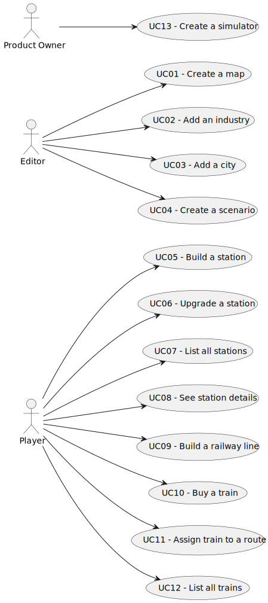

# Use Case Diagram (UCD)

**In the scope of this project, there is a direct relationship of _1 to 1_ between Use Cases (UC) and User Stories (US).**

However, be aware, this is a pedagogical simplification. On further projects and course units there may also exist _1 to N **and/or** N to 1_ relationships between UC and US.

**Insert below the Use Case Diagram in a SVG format**

**For each UC/US, it must be provided evidences of applying main activities of the software development process (requirements, analysis, design, tests and code). Gather those evidences on a separate file for each UC/US and set up a link as suggested below.**

# Use Cases / User Stories

| UC/US | Description                                     |                   
|:------|:------------------------------------------------|
| US001 | [Create a map](US01/US001-README.md)      |
| US002 | [Add an industry](US02/US002-README.md)   |
| US003 | [Add a city](US03/US003-README.md)        |
| US004 | [Create a scenario](US04/US004-README.md) |
| US005 | [Build a station](US05/US005-README.md)   | 
| US006 | [Upgrade a Station](US06/US006-README.md) |
| US007 | [List all Stations](US07/US007-README.md) |
| US009 | [Buy a Train](US09/US009-README.md)       |
| US010 | [Assign a Train to a Route](US10/US010-README.md)|
| US012 | [Create a Cargo Simulator](US12/US012-README.md)|