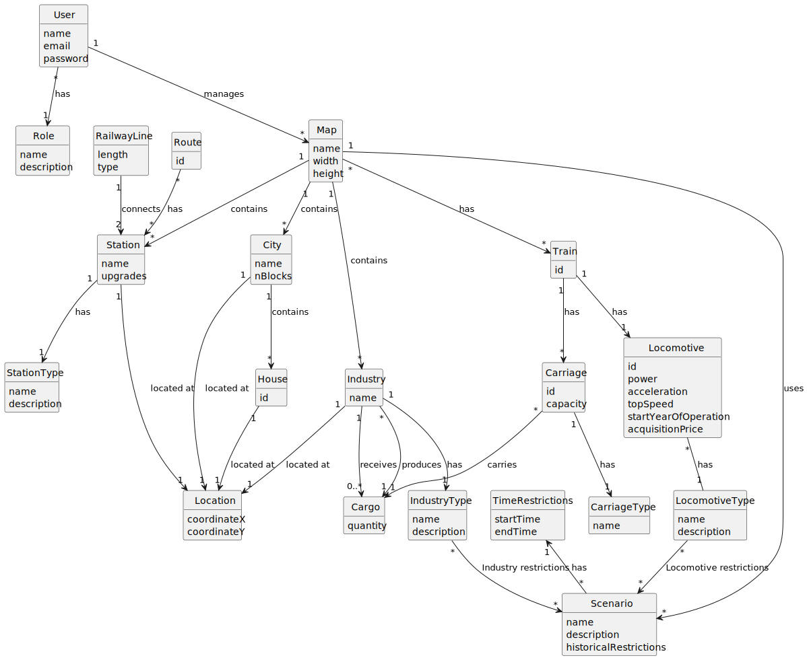

# OO Analysis

The construction process of the domain model is based on the client specifications, especially the nouns (for _concepts_) and verbs (for _relations_) used.

## Rationale to identify domain conceptual classes

To identify domain conceptual classes, start by making a list of candidate conceptual classes inspired by the list of categories suggested in the book "Applying UML and Patterns: An Introduction to Object-Oriented Analysis and Design and Iterative Development".

### _Conceptual Class Category List_

**Business Transactions**

* User
* Role
* Map
* Industry
* City
* House
* Scenario
* Station
* Building
* RailwayLine
* Locomotive
* Train
* Route
* Cargo
* LocomotiveType
* IndustryType
* StationType

---

**Transaction Line Items**

* Cargo
* Train
* Station
* Locomotive
* RailwayLine
* City
* Industry

---

**Product/Service related to a Transaction or Transaction Line Item**

* Cargo

---

**Transaction Records**

* No specific information is provided

---  

**Roles of People or Organizations**

* User

---

**Places**

* Station
* City
* Industry

---

**Noteworthy Events**

* Historical Restriction
* Time Restriction

---

**Physical Objects**

* Locomotive
* Train
* Carriage
* Cargo
* Railway Line

---

**Descriptions of Things**

* Role
* IndustryType
* StationType
* LocomotiveType
* Scenario

---

**Catalogs**

* LocomotiveType
* IndustryType
* StationType

---

**Containers**

* Map
* City
* Train

---

**Elements of Containers**

* Industry
* Station
* House
* Carriage
* Locomotive

---

**Organizations**

* No specific information is provided

---

**Other External/Collaborating Systems**

* No specific information is provided

---

**Records of finance, work, contracts, legal matters**

* No specific information is provided

---

**Financial Instruments**

* No specific information is provided

---

**Documents mentioned/ used to perform some work**

* No specific information is provided

---

## Rationale to identify associations between conceptual classes

An association is a relationship between instances of objects that indicates a relevant connection and that is worth of remembering, or it is derivable from the List of Common Associations:

* **_A_** is physically or logically part of **_B_**
* **_A_** is physically or logically contained in/on **_B_**
* **_A_** is a description for **_B_**
* **_A_** known/logged/recorded/reported/captured in **_B_**
* **_A_** uses or manages or owns **_B_**
* **_A_** is related with a transaction (item) of **_B_**
* etc.

| Concept (A)           | Association                                       | Concept (B)                                 |
|-----------------------|---------------------------------------------------|---------------------------------------------|
| User                  | Has                                               | Role                                        |
| User                  | Manages                                           | Map                                         |
| Scenario              | Uses                                              | Map                                           |
| Map                   | Contains                                          | City, Industry, Station              |
| Map                   | Has                                          | Train              |
| City                  | Contains                                          | House                                       |
| Train                 | Has                                               | Locomotive, Carriage                       |
| Locomotive            | Has                                               | LocomotiveType                             |
| RailwayLine           | Connects                                          | Station                                     |
| Route                 | Has                                               | Station                                     |
| Carriage              | Carries                                            | Cargo                                       |
| Industry              | Has                                               | IndustryType                               |
| Station               | Has                                               | StationType                                 |

## Domain Model

