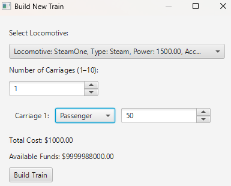

# User Manual

# Railroad Simulator App

### Instituto Superior de Engenharia do Porto

#### Laboratory/Project II - LEI

#### 1DP - GROUP 162

- Ricardo Silva (1231500)
- Francisco Primavera (1230840)
- Tiago Silva (1241707)
- Tiago Basto (1220798)

#### Sprint 3

#### **Date:** June 15th, 2025

---

## Table of Contents

- [Glossary](#glossary)
- [Introduction](#introduction)
- [System Requirements](#system-requirements)
- [System Overview](#system-overview)
- [Features](#features)
    - [Register a Skill | Human Resources Manager](#register-a-skill--human-resources-manager)
    
- [Troubleshooting](#troubleshooting)
- [Frequently Asked Questions](#frequently-asked-questions)

---

## Glossary

# Railway Simulation Concepts

**Terms, Expressions, and Acronyms (TEA) must be organized alphabetically.**

| **_TEA_** (EN)                | **_Description_** (EN)                                                                                                                                                                                                                                                                                                                       |
|:------------------------------|:---------------------------------------------------------------------------------------------------------------------------------------------------------------------------------------------------------------------------------------------------------------------------------------------------------------------------------------------|
| **Acceleration**              | The acceleration a given locomotive can reach.                                                                                                                                                                                                                                                                                               |
| **Acquisition Price**         | The price of which a given locomotive was bought for.                                                                                                                                                                                                                                                                                        |
| **Building Upgrade**          | Specific constructible add-ons for stations, categorized by function.                                                                                                                                                                                                                                                                        |
| **Carload**                   | A measure of freight quantity based on the amount that can be transported in a single railroad car. Often used in logistics and transportation industries to track and report shipment volumes.                                                                                                                                              |
| **Carriage**                  | Railway vehicles attached to a locomotive, designed to carry passengers or freight. Different carriages serve specific cargo types.                                                                                                                                                                                                          |
| **Carriage Type**             | The type of carriage, mostly based on what cargo it transports.                                                                                                                                                                                                                                                                              |
| **Capacity**                  | The maximum amount or volume that something can hold, contain, or produce. Capacity can refer to physical dimensions (e.g., the volume of a container), performance limits (e.g., the processing ability of a system), or the potential for use (e.g., seating capacity of a theater).                                                       |
| **Cargo**                     | Goods or passengers transported by trains within the railway network.                                                                                                                                                                                                                                                                        |
| **Coordinates**               | A pair of numerical values (X, Y) representing a specific location on map.                                                                                                                                                                                                                                                                   | 
| **City**                      | Urban settlements represented on the railway map. Cities generate passengers and mail while consuming manufactured goods.                                                                                                                                                                                                                    |
| **Description**               | A detailed account or explanation of a person, object, event, or concept, typically providing key characteristics, features, or attributes. Descriptions help to convey information clearly and may vary in detail depending on the context.                                                                                                 |
| **Demand**                    | Sum of all cargo required by connected industries/cities.                                                                                                                                                                                                                                                                                    |
| **Depot**                     | Basic infrastructure for low-traffic areas. (50k, 3×3 radius)                                                                                                                                                                                                                                                                                |
| **Editor**                    | A person who can create maps and scenarios that can be provided in a bundle with the game or sold separately.                                                                                                                                                                                                                                |
| **Element**                   | A static, interactable object placed on the map by the Editor. (e.g., City, Industry)                                                                                                                                                                                                                                                        |
| **Email**                     | A method of exchanging digital messages over the internet between users. Emails can contain text, attachments, and multimedia, and are sent through an email server using a unique email address as an identifier.                                                                                                                           |
| **End Time**                  | The date of which a given scenario of a given simulation ends.                                                                                                                                                                                                                                                                               |
| **Good**                      | A tangible item that is produced, transported, and consumed within the railway network.                                                                                                                                                                                                                                                      |
| **GitHub Repository**         | A version control system used to store project code and manage team collaboration.                                                                                                                                                                                                                                                           |
| **Height**                    | The measurement of the vertical dimension of an object or space, typically referring to how tall something is from its base to its top. Height is one of the primary dimensions used to describe the size or shape of an object, alongside width and length.                                                                                 |
| **Historical Restriction**    | Simulates real-world events (e.g., wars ↑ steel demand, pandemics ↓ passenger traffic). Port import/export rules are also set here.                                                                                                                                                                                                          |
| **House**                     | A building designed for people to live in, typically serving as a private residence. Houses can vary widely in size, style, and structure and may be occupied by a single family, multiple families, or individuals.                                                                                                                         |
| **Id**                        | Short for "identification," an ID is a unique identifier assigned to an individual, object, or system to distinguish it from others. IDs can take various forms, including numbers, codes, or documents (e.g., personal identification cards or digital user IDs), and are often used for authentication, access control, or record-keeping. |
| **Industry**                  | Economic entities that either produce raw materials, transform resources into finished products, or serve as hubs for import/export.                                                                                                                                                                                                         |
| **Industry Type**             | A classification of industries based on their economic function in the simulation. (e.g., Primary Sector, Transforming, Mixed)                                                                                                                                                                                                               |
| **Integrative Project**       | A software development project for simulating railway networks, requiring iterative development with Scrum methodology.                                                                                                                                                                                                                      |
| **Map**                       | A representation that organizes and displays relationships between elements, often used to show connections, locations, or structures. In different contexts, a map can refer to a geographical layout, a data structure (in computing), or a conceptual diagram linking ideas.                                                              |
| **Length**                    | The measurement of the longest dimension of an object or space, typically referring to the distance from one end to the other along its longest side. Length is a fundamental physical measurement used to describe the size, shape, and extent of an object, alongside width and height.                                                    |
| **Location**                  | A specific place or position, defined by coordinates.                                                                                                                                                                                                                                                                                        |
| **Locomotive**                | Self-propelled engines that generate the necessary force to move trains along railway lines. Locomotives can be steam-powered, diesel-powered, or electric.                                                                                                                                                                                  |
| **Locomotive Type**           | A classification of locomotives based on their power source, design, and intended use. Common types include steam, diesel, and electric locomotives, each suited for different operational needs such as freight hauling, passenger service, or shunting.                                                                                    |
| **Map Editor**                | A software tool that allows users to create and modify a geographical representation of the railway system, including cities, industries, and terrain features.                                                                                                                                                                              |
| **Minimal Viable Product**    | The initial version of the software with essential functionalities, developed incrementally over multiple sprints.                                                                                                                                                                                                                           |
| **Mixed Industry**            | Hybrid hubs like Ports that can import/export and sometimes transform cargo.                                                                                                                                                                                                                                                                 |
| **MVP**                       | Acronym for Minimal Viable Product.                                                                                                                                                                                                                                                                                                          |
| **Name**                      | A word or set of words by which a person, place, object, organization, or concept is known, identified, or referred to. Names serve as labels to distinguish entities from one another.                                                                                                                                                      |
| **Password**                  | A secret string of characters used to authenticate a user’s identity and grant access to a system, account, or service. Passwords are typically combined with a username or email for security purposes and are designed to be known only by the user.                                                                                       |
| **Player**                    | A person who wants to play a game; in advanced versions, a scenario can be played by multiple players simultaneously.                                                                                                                                                                                                                        |
| **Power**                     | The horsepower of a given locomotive.                                                                                                                                                                                                                                                                                                        |
| **PO**                        | Acronym for Product Owner.                                                                                                                                                                                                                                                                                                                   |
| **Primary Sector Industry**   | Raw resource producers (e.g., Coal Mine, Farm). Generate cargo for transformation.                                                                                                                                                                                                                                                           |
| **Product Owner**             | The person representing the organization that intends to develop the game.                                                                                                                                                                                                                                                                   |    
| **Quantity**                  | The numeric amount of something, in this project context, the amount of cargo. Can be measured in kg, litres, volume,etc..                                                                                                                                                                                                                   |
| **Railway**                   | A transportation system consisting of tracks, trains, stations, and supporting infrastructure used for the movement of passengers and goods.                                                                                                                                                                                                 |
| **Railway Line**              | Tracks that connect stations, facilitating the movement of trains. Railway lines can be single or double, and may be electrified to support electric locomotives.                                                                                                                                                                            |
| **Role**                      | A set of responsibilities, behaviors, and permissions assigned to a person or entity within a system, organization, or process. Roles define what actions a user can perform and what access they have.                                                                                                                                      |
| **Route**                     | Predefined path assigned to trains, consisting of a sequence of stations where trains stop to pick up or drop off cargo and passengers.                                                                                                                                                                                                      |
| **Scenario**                  | A detailed description of a possible situation or sequence of events, often used for planning, analysis, testing, or storytelling. Scenarios help anticipate outcomes, explore alternatives, or simulate real-world conditions.                                                                                                              |
| **Scenario Editor**           | A tool used to define constraints and conditions for a specific simulation, such as historical events, available locomotives, and industrial settings.                                                                                                                                                                                       |
| **Simulator**                 | Core system that executes the railway network simulation.                                                                                                                                                                                                                                                                                    |
| **Start year of operation**   | The year which a given locomotive started operating.                                                                                                                                                                                                                                                                                         |
| **Start time**                | The date of which a given scenario of a given simulation starts.                                                                                                                                                                                                                                                                             |
| **Station**                   | Facilities along railway lines where trains stop to load or unload cargo and passengers.                                                                                                                                                                                                                                                     |
| **Station(Station Type)**     | Standard hub for moderate cargo/passenger flow. (100k, 4×4 radius)                                                                                                                                                                                                                                                                           |
| **Station Upgrades**          | Modular buildings that enhance station capabilities                                                                                                                                                                                                                                                                                          |
| **Supply**                    | Sum of all cargo produced by industries within a station's Economic Radius.                                                                                                                                                                                                                                                                  |
| **Technological Restriction** | Limits available locomotives/industries.                                                                                                                                                                                                                                                                                                     |
| **Station Type**              | A classification of railway stations based on their function, size, and the services they offer. Common types include major terminals, regional hubs, commuter stations, and local stops, each serving different passenger needs and traffic volumes.                                                                                        |
| **Terminal**                  | High-capacity hub for dense networks. (200k, 5×5 radius)                                                                                                                                                                                                                                                                                     |
| **Test-Driven Development**   | A development approach required for the project, ensuring quality through automated tests before implementation.                                                                                                                                                                                                                             |
| **TDD**                       | Acronym for Test-Driven Development.                                                                                                                                                                                                                                                                                                         |
| **Time restriction**          | Bounds the simulation period (e.g., 1850–1900). Affects cargo demand curves and technology availability.                                                                                                                                                                                                                                     |
| **Transforming Industry**     | Process raw materials into goods (e.g., Steel Mill turns Iron + Coal into Steel).                                                                                                                                                                                                                                                            |
| **Top Speed**                 | The maximum speed a locomotive can reach.                                                                                                                                                                                                                                                                                                    |
| **Train**                     | Railway vehicles composed of locomotives and carriages, used for transporting goods and passengers along designated routes.                                                                                                                                                                                                                  |
| **Type**                      | A category or classification that groups similar items, objects, or concepts based on shared characteristics, attributes, or functions. "Type" is often used to differentiate between variations within a broader category, such as types of products, styles, or systems.                                                                   |
| **Upgrade**                   | The process of improving, enhancing, or replacing a system, component, or product with a newer or more advanced version. Upgrades are typically intended to increase performance, add features, or fix issues.                                                                                                                               |
| **User**                      | A person or entity that interacts with a system, service, application, or product. Users can be customers, clients, administrators, or any individuals engaging with a platform to achieve specific goals or tasks.                                                                                                                          |
| **Width**                     | The measurement of the extent of something from side to side, typically referring to the horizontal dimension of an object or space. Width is one of the fundamental dimensions used to describe the size or shape of an object, alongside length and height.                                                                                |

---

## Introduction

Simulation games, particularly railroad simulations, play a vital role in enhancing strategic thinking, spatial awareness, 
and decision-making skills. These games offer immersive environments where players manage complex systems involving 
transportation logistics, city planning, and economic growth. Railroad simulations, in particular, allow users to explore 
the challenges of designing efficient rail networks, optimizing routes, and balancing resources—all within a dynamic, 
evolving landscape. Beyond entertainment, they provide a meaningful way to understand the real-world importance of 
infrastructure planning and its impact on urban development and connectivity.

This user manual was designed as a guide to help users navigate and comprehend the functionalities of our simulator
effectively. Its purpose is to provide step-by-step instructions for users to operate the application in the easiest way
and efficiently.

The simulator provides a set of functionalities which are intuitive and easy-to-use for managing industries, railroad webs
and connections, managing funds and understanding how all these connected and / or are impacted with different scenarios.

The User Manual is divided into several parts, each one addressing a specific aspect of the application. The sections
for this sprint are as listed:

- **Glossary**, which contains a list of terms, expressions and acronyms used throughout the project followed by its
  description.

- **System requirements** which define the minimum requirements for the safe and stable use of the simulator.

- **System Overview**, which describes the main functionalities of the simulator. It includes an overall description
  of the product, including the objectives of the simulator, its structure, the reference to the main features, the
  representation of the diagram (Domain Model) that shows the system’s functionalities and the dependencies that exist
  between them. The system overview also includes a table with all the simulator's features and which users have access to
  each of them.

- **System Features**, listing the main features of the simulator. Each feature in this user manual corresponds to a
  user story in software development terminology, it means one “action” the user may perform on the simulator. For
  each feature, we provide guidance on how to utilize it effectively, including potential errors and how to address them
  for an improved user experience.

- **Troubleshooting** to identify and resolve issues/failures that may arise in the simulator's operation.

- **Frequently asked questions** to provide answers to the most common questions that users of the simulator may have.

This user manual aims to clarify user doubts and assist them in navigating the simulator swiftly and efficiently. The
goal is for users to fully take advantage of the simulator's features to enhance their knowledge on how to operate businesses,
manage funds, and the interactions / requisites an industry owner may have while also designing the routes to connect 
industries and cities, while taking into account various restrictions imposed by the scenario / map and according to the 
restrictions each locomotive / train may have.

---

## System Requirements

Since the simulator is not very large and does not require high processing power, the system requirements are not very
specific. Nonetheless, to ensure that the simulator runs and operates smoothly, please make sure that the computer running
the program meets the following minimum requirements:

### Hardware Requirements:

- **Processor:** Intel Core i3 or equivalent (very low CPU usage);
- **Memory (RAM):** 4GB or higher.
- **Storage:** 500MB;
- **Screen Resolution:** 1366 x 768 pixels.

### Software Requirements:

- **Operating System:** Ideally, Windows.
- **Other required software:** Java Runtime Environment (JRE) 17 or higher and GraphStream Software for the graph
  visualization.

### Network Requirements:

- No internet connection is required to run the simulator.
---

## System Overview

The main objective of this Java-built simulator is to provide an intuitive, enjoyable, experience while learning / understanding 
various use-cases and money / time / resource mananagement while having an engaging experience.

While using this simulator, users have at their disposal a set of functionalities that streamline the activities of a railroad
company owner, making the simulation, while ficticious, as real as possible, taking into account many factors, such as historical
events, time restrictions, etc.

Through a user-friendly interface, the system enables editors to create maps, scenarios, cities and indutries, which allows
the editor to define restrictions on a given scenario that will then be applied to a given map, ensuring the user that's 
playing a  given map, can experience the same map while facing different challenges based on the scenario that was selected 
for that game. Furthermore, the simulator also facilitates the creation of trains, stations and railway lines through functionalities 
that allow the registration of the player's locomotives, trains, as well as stations, encompassing different station types.

To better demonstrate how the simulation works, we have developed a diagram (Domain model) that shows the system's
functionalities and the dependencies that exist between them.


The simulator is structured with two different roles, each having access to different system features and functionalities.
The table below illustrates the features and responsibilities assigned to each user role, with an "X" indicating the
roles that can access a particular feature. Manager.

Note that, for the features involving mathematics (mdisc and matcp) the user does not need to be logged in the system to
use the feature.

| **Feature**                       | **Editor** | **Player** | 
|:----------------------------------|:-----------|:-----------|
| Login                             | x          | x          |
| Map Creation / Deletion           | x          |            |
| Industry Creation / Addition      | x          |            |
| City Creation / Addition          | x          | x          |
| Scenario Creation / Addition      | x          | x          |
| Station Creation                  |            | x          |
| Station Upgrade                   |            | x          |
| Owned Stations Listing            |            | x          |
| Railway Line Creation             |            | x          |
| Locomotive Acquisition            |            | x          |
| Train Creation / Assembling       |            | x          |
| Route Assignment to a given train |            | x          |
| Owned Trains Listing              |            | x          |
| Save Game                         |            | x          |
| Load Game                         |            | x          |
|                                   |            |            |

---

## Features

Firstly, upon opening the application, a menu will be presented to log in to the simulator.


The simulator allows the authentication of different types of users, each with different roles. For example, the "
Editor" role has access to some features that the role "Player" does not and vice-versa. This assumes the editor also has
a player account to check if the simulator is operating correctly given the changes the editor may or may not have done to
the simulator

Editor role menu:


Editor role has access to the menus for the map creation, map edition, and scenario creation. 

With this role, the user can manage everything related to the map, such as creating scenarios for a given map, creating 
and adding industries and cities.


Player role has access to the menus to start the simulation and choosing the scenario and map the simulator is going to 
run.

With this role, and to be seen further, the player will be able to actually play the simulator while it's running in real 
time


---

### Start Game | Player

After selecting the **“Start”** button on the main menu, the user will be redirected to the **Player Menu** interface, where they can interact with the game.

If there is no game currently loaded, the system should initialize a new game instance. This step typically includes setting up a **Map** and a **Scenario**.  
⚠️ *Note: This step is currently a placeholder and must be implemented.*

If a valid game already exists, the system immediately proceeds to the Player Menu.


---

### Save Game | Player

By clicking the **“Save Game”** button, the player can save the current state of their game.


In case of any technical error during the save operation (e.g., file permissions), the system will display an error message describing the issue.

---

### Load Game | Player

By clicking the **“Load Game”** button, the user can restore a previously saved game.

The system attempts to load the game from the file `savegame.dat`. If the file is found and properly deserialized, the 
loaded game replaces the current instance.


---

### Create Map | Editor

By selecting the **“Create map”** option from the editor menu, the user will be redirected to the map creation interface.


In this interface, the editor can define and configure a new map to be used in scenarios or simulations. The map creation tool provides fields and options for defining the layout, dimensions, and important map features.

After filling in the required fields, the user can confirm the operation, and the new map will be created and saved in the system.

---

### Edit Map | Editor

When the **“Edit map”** button is selected, the system redirects the user to the map editor interface.


The editor can select an existing map and modify its properties. This includes editing tiles, adjusting layout, or changing metadata associated with the map.

After performing the necessary changes, the user can save the updated map.

If no maps are available in the system, a message will inform the user accordingly.

---

### Create Scenario | Editor

By clicking the **“Create scenario”** button, the editor is redirected to the scenario creation interface.


In this screen, the user can create a scenario by assigning existing maps, configuring simulation parameters, and defining objectives or other scenario-specific attributes.

Once all information is entered and validated, the scenario is saved in the system and becomes available for use in the simulator.

If required information is missing or invalid, the system notifies the user before proceeding.

---

### Start Simulator | Player

The **“Start simulator”** button launches the game interface and transitions the user into simulation mode.


The user will be prompted to select a map to begin the simulation. Once a map is chosen, the simulation will initialize using the selected map and scenario data.

If no maps or scenarios are available, the system will display an appropriate warning message.

---

### Build Station | Simulator

By selecting the **“Build Station”** option, the user is redirected to a screen where they can create and place a new station on the map.


The user must input the station’s name and coordinates. After confirming, the station will be added to the simulation environment. The system will validate the input and show a confirmation or error message accordingly.

---

### Buy Locomotive | Simulator

When **“Buy Locomotive”** is selected, the user can purchase a locomotive to use in train construction.


The interface allows the selection of locomotive types with different characteristics. After confirmation, the locomotive is added to the inventory.

---

### View Stations | Simulator

This option opens a view showing all the stations currently created in the system.


The user can inspect station details such as name, location, and connected lines.

---

Inside the simulator we have multiple options that will be listed below, each one with a brief description of what it does and how to use it.

### Build Railway Line | Simulator

Choosing **“Build Railway Line”** enables the user to connect two or more stations with a new railway line.


The user selects the origin and destination stations, and optionally sets properties like travel time or cost. Upon confirmation, the line is built and visualized on the map.

---

### Assign Train to Route | Simulator

This feature allows the user to assign a built train to a predefined route.


The user selects an available train and a valid route. After confirmation, the train is linked to that route and becomes active in the simulation.

---

### List All Trains | Simulator

Clicking this option displays all trains currently created in the system.


The list includes details like locomotive type, assigned route (if any), and train status.

---

### Build Train | Simulator

With **“Build Train”**, the user can assemble a new train by selecting locomotives and wagons.



Once the components are chosen and the configuration is complete, the train is added to the system.

---

### Route Builder | Simulator

The **Route Builder** allows the creation of routes made up of sequentially connected railway lines.


The user selects stations to form the route path. After validation, the route is saved and available for train assignments.

---

# Verify Station Connectivity | Player

This functionality allows the Green Space Manager to analyze the connectivity of railway stations, either by **station types** or by **specific stations**, using the console interface. Additionally, the manager can display the station graph and view all connections between them.

To access this feature, run the `ConnectivityMain` application located in the `src` folder (`src/main/java/MDISC/US13/ConnectivityMain.java`).

Upon running, the following options will be presented to the user:


## 1. Check Connectivity by Station Type

* Select option 1 to verify whether all stations of certain types are connected.
* The program will ask for the path to the CSV file containing the station and line data.
* Then, choose whether to consider only electrified lines.
* Finally, select the station types to analyze (e.g., Train, Subway).
* If there are at least two stations of the selected types, the program checks whether they are connected and displays the result.


The matrix used for this analysis is printed, and a message indicates if the group is connected.

## 2. Check Connectivity by Station

* Select option 2 to manually select a start and end station.
* After importing the data and choosing the line type (electrified or not), the user selects both a **starting station** and an **ending station** from the list.
* The program will attempt to find a route between the two and display the full path if one exists.


If no path exists, a message will inform the user.

## 3. List All Station Connections

* Select option 3 to view all connections between stations.
* The system reads the CSV and prints the direct connections for each station.
* A visual graph of the network is also generated and shown in real-time.


---


# Maintenance System | Player

This functionality allows the **Maintenance Manager** to interact with the railway network via a console interface. The manager can **view the railway graph**, **check connectivity** (with or without electrified line filtering), and **generate optimal maintenance routes** based on the state of the network.

To access this feature, run the `MaintenanceMain` application located in the `src` folder (`src/main/java/MDISC/US14/MaintenanceMain.java`).

Upon execution, the following main menu is displayed:

2

---

## 1. View Network

- Select option **1** to visualize the entire railway network.
- The system loads station and line data from the `InputReader` and renders the graph using `GraphStream`.
- The color legend helps identify station types and line statuses:
  - 🟡 **Yellow lines**: Electrified tracks
  - 🟢 **Green nodes**: Standard stations
  - 🔵 **Blue nodes**: Terminal stations
  - 🔴 **Red nodes**: Depots

The graph is opened in a separate visualization window.

---

## 2. Check Connectivity

- Select option **2** to inspect whether the railway network is fully connected.
- The user must then choose between:
  1. Viewing all lines
  2. Viewing only electrified lines
- The **adjacency matrix** is printed to the console.
- A message is displayed indicating whether the graph is:


> This analysis helps the manager understand the structural integrity of the railway connections.

---

## 3. Maintenance Route

- Select option **3** to calculate a **complete maintenance route** across **all lines**.
- The system builds a route using the full network data and displays the resulting path.
- If no route is found, a message like the following is shown:
  

---

## 4. Maintenance Route (Electrified Lines Only)

- Select option **4** to generate a **maintenance route restricted to electrified tracks**.
- The system filters the graph to include only electrified lines and then computes a valid route.
- Results are displayed in the console just like in Option 3.


---

## 0. Exit

- Closes the maintenance program.

---

# Route Planner | Player

This feature allows a **Player** to calculate the **shortest route** between two stations, optionally passing through a set of **waypoints**. The system uses **Dijkstra's Algorithm** for pathfinding and provides both **textual and graphical visualization** of the route.

To access this feature, run the `ShortestPathMain` application located in the `src` folder (`src/main/java/MDISC/US13/ShortestPathMain.java`).

Upon execution, the following workflow is presented to the user:

---

## 1. Load Network Data

- The user is prompted to enter the **path to a CSV file** containing the metro network data.
- Data includes:
  - **Stations**
  - **Connections (Lines)** between stations
- If the file is successfully read, the message below is displayed:

---

## 2. Select Stations

- The user is shown a **list of all available stations** with their corresponding numbers.
- The user must then select:
- A **start station**
- An **end station**

---
- For each waypoint:
- The user selects from the list.
- The system ensures:
  - The waypoint is **different from the start or end station**
  - **No duplicate** waypoints are selected

---

## 4. Shortest Path Calculation

- The system calculates the shortest path using **Dijkstra’s Algorithm**:
- From **start** to **end**
- Passing through all waypoints in the **selected order**
- If a path is found:
- The **full path** is assembled and displayed
- The **total route distance** is computed and printed
- If no path is found:
- The following message is displayed:
  ```
  No valid maintenance route could be found.
  ```

---

## 5. Display Route Summary

The route is printed in a detailed format, showing:

- Each station in the path
- The **cumulative distance** traveled up to that station

---


## 6. Graphical Visualization

- The route is displayed visually using `GraphUI.Graph()`
- Nodes and edges representing the selected path are highlighted
- This helps the user better understand the path in the context of the full network

---

## 7. Repeat Prompt

After the route is calculated and displayed, the user is asked:

- Typing `yes` or `y` restarts the process
- Typing anything else exits the program

---

## Troubleshooting

> ### Issue 1:
>
> If when launching the simulator, an error occurs related to loading the map or scenario, try restarting the application. If the problem persists, ensure that a valid map and scenario were previously created and saved correctly.

---

> ### Issue 2:
>
> If the graph or map view does not display correctly, ensure your screen resolution is above the minimum supported 
> (1280x720). Low resolutions or high system scaling can distort layout elements. 
> In last case check if it didnt pop-up unnoticed and check your opened applications.

---

> ### Issue 3:
>
> If the graph or map view does not display correctly, ensure your screen resolution is above the minimum supported (1280x720). Low resolutions or high system scaling can distort layout elements.

---

> ### Issue 4:
>
> If the application freezes or responds slowly when assigning a route, it may be due to a high number of map elements. Wait a few seconds and avoid repeated clicks.

---

> ### Issue 5:
>
> If when attempting to save the map, an error occurs, make sure the application has permission to write to the filesystem. Try running it with administrator privileges or choosing a different location.

---

## Frequently Asked Questions

> **Q.1:** Can I build a station without selecting a map?
>
> **A.1:** No, you must first create or load a map before you can build stations. Stations need to be positioned on a valid map.

> **Q.2:** Can I have multiple maps created at once?
>
> **A.2:** Yes, you can create multiple maps, but only one can be active at a time for building and simulation purposes.

> **Q.3:** Can I assign a train to a route without having built a railway line?
>
> **A.3:** No, you need to build a railway line between stations before assigning any route to a train.

> **Q.4:** Does the application save my changes automatically?
>
> **A.4:** Yes, all changes like created stations, lines, trains, and routes are saved automatically in the data file.

> **Q.5:** Can I edit or delete a station after it is created?
>
> **A.5:** No, once a station is created and saved on the map, it cannot be edited or deleted.

> **Q.6:** Can I assign the same locomotive to more than one train?
>
> **A.6:** No, a locomotive can only belong to one train at a time.

> **Q.7:** How do I start the simulation?
>
> **A.7:** To start the simulation, you must first have a complete route built and assigned to at least one train with a locomotive.

> **Q.8:** Is it possible to reuse a route for multiple trains?
>
> **A.8:** Yes, the same route can be assigned to different trains, as long as they are available and the assignments make sense operationally.

> **Q.9:** Can I view all stations and lines created on the map?
>
> **A.9:** Yes, using the “View Stations” option you can list all the stations, and the map will show the connected lines.

> **Q.10:** Can I delete a map?
>
> **A.10:** Yes, but only maps that are not currently active can be deleted. Be cautious, as this action is irreversible.

> **Q.11:** What happens if I click "Start" without assigning any route?
>
> **A.11:** The simulation won’t run. You’ll receive a warning indicating that at least one valid route with an assigned train is required.

> **Q.12:** Can I build a train without buying a locomotive first?
>
> **A.12:** No, you need to purchase a locomotive before assembling a complete train.

> **Q.13:** Is there a limit to how many stations I can add to a map?
>
> **A.13:** There is no hard limit, but performance might decrease with very large maps and excessive elements.

> **Q.14:** Can I export simulation data or results?
>
> **A.14:** Yes, route analysis and simulation data are exported as .csv files and saved automatically in the system folder.

> **Q.15:** Can I undo an action, like removing a train or line?
>
> **A.15:** No, the system does not support undoing actions. Always confirm operations before finalizing them.

> **Q.16:** Do I need to connect all stations to start a simulation?
>
> **A.16:** No, but at least one valid connected path (route) must exist for simulation to begin.

> **Q.17:** Can two trains share the same path during simulation?
>
> **A.17:** Yes, but collisions or delays are not currently simulated. Each train runs its route independently.

> **Q.18:** What is shown in the Route Builder?
>
> **A.18:** The Route Builder allows you to define a sequence of stations for a route, based on the existing railway lines.

> **Q.19:** Can I manually move trains during the simulation?
>
> **A.19:** No, the movement of trains during simulation is automatic based on the assigned routes.

> **Q.20:** Where can I find the exported .csv and graph files?
>
> **A.20:** These files are saved in a designated export folder within the application directory, available even after closing the app.

