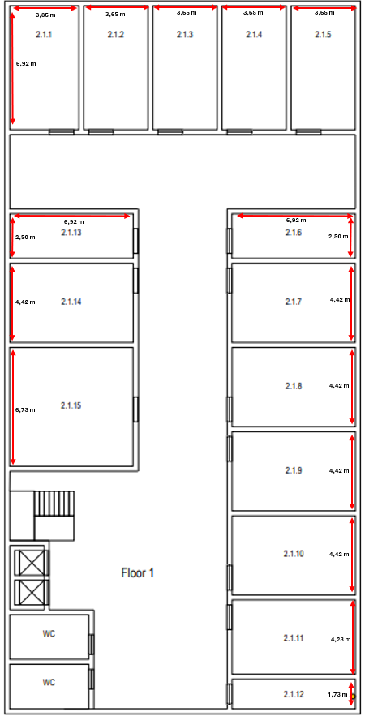

# Rcomp: Sprint1: Bulding 2
## Maria Pinho- 1220849

# General considerations 
## Cross-Connects

1. ### Definition and Location
- If not specified in the project requirements, the location of cross-connects should be negotiated with the client/owner.
- Whenever possible, they should be kept out of public reach.
- They may be dedicated rooms or shared with other uses, such as service storage.

2. ### Horizontal Cross-Connects (HC)
- Should be centrally located relative to the outlets they serve.
- No outlet should be more than 80 meters in a straight line from the HC.
- Cable length must not exceed 90 meters.
- Consolidation Points (CPs) may be created if needed.
- A cross-connect per floor is not mandatory—if there are only a few outlets, a single HC may serve multiple floors.

3. ### Intermediate Cross-Connects (IC)
- Each building requires an IC.
- The IC can be housed in the same room and rack as the HC for that floor.

4. ### Main Cross-Connect (MC)
- The MC must be housed in one of the buildings.
- It can share the same room and telecommunication enclosure as the IC in that building.

## Patch Panels
Each cable reaching a cross-connect it attached to an appropriate type (copper or fiber) patch panel, the number of patch panels needed at each cross-connect depends on the number of connections supported for each.
- Copper panels (24 or 48 connections, taking 1U or 2U respectively);
- Fiber panels (more vendor specific);

Patch panel models must be selected, and comfortingly, the number of patch panels required at each cross-connect is determined.

Because structured cabling infrastructure is supposed to bear future hardware upgrades and additions, an extra 100% over-dimensioning should be applied.

In engineering dimensioning, when some value is reached through calculations, then the commercially available solutions that supports that value must be selected.
Examples:
- If the telecommunications enclosure is housing a single 1U patch panel, then we add another 1U for
  the expected corresponding switch, making 2U, and an additional 100% over dimensioning, this will
  make 4U total. Commercially available telecommunications enclosures start at 6U, so we will use one of
  those.
- If the telecommunications enclosure is housing 2U of patch panels, then we add another 2U for the
  expected corresponding switches, making 4U, and an additional 100% over dimensioning, this will make
  8U. Commercially available size above 6U is usually 12U, so we will use one.

## Switches
- Each switch occupies the same space as the corresponding patch panels.

## Rack
- We use one for each HCC (horizontal cross connection).

# Building 2
# Floor 0- Ground Floor 

### Division areas and number of outlets
| Room Nº | Width(m) | Length(m) | Area(m^2) | Outlets | 
|:-------:|:--------:|:---------:|:---------:|:-------:|
|  2.0.1  |   3.27   |   8.27    |   27.04   |    6    | 
|  2.0.2  |   3.27   |   8.27    |   27.04   |    6    | 
|  2.0.3  |   3.27   |   5.77    |   18.87   |    4    | 
|  2.0.4  |   3.27   |   5.77    |   18.87   |    4    | 
|  2.0.5  |   4.81   |   10.58   |   50.89   |   12    | 
|  2.0.6  |   8.46   |   10.77   |   91.11   |    5    | 
|  2.0.7  |   8.46   |   8.46    |   91.11   |    5    | 
|  2.0.8  |   3.27   |   8.46    |   27.66   |    6    | 
|  2.0.9  |   3.27   |   8.46    |   27.66   |    6    | 
| 2.0.10  |   3.27   |   4.61    |   15.07   |    4    | 
| 2.0.11  |   3.27   |   3.65    |   11.93   |    0    |

### Outlets
 * To define the number of outlets for each room we used the structured cabling standards that specify a minimum of two outlets per work area,and also a ratio of two outlets for each 10 square meters of area.
 * Exceptions to this rule are found in rooms  2.0.6 and 2.0.7 that by order of the client only require 5 outlets each.
 * Also by order of the client room 2.0.11, restrooms, the entrance hall and the other shared areas don't require outlets except for an outlet added to the hall to connect to the access point.
 * Total Number of outlets:59

### Access Point
 * Considering that our floor dimensions are 40 x 20 meters and a access point has a 50 meters diameter coverage we only need one to give full LAN coverage to the floor.
 * Our access point is located in the hall.

### Consolidation Points
 * Because of the high number of outlets in the floor, three consolidation points were used to increase installation flexibility.
 * 1º CP covers: Rooms 2.0.1, 2.0.2, 2.0.3 and  2.0.4.
 * 2º CP covers: Rooms 2.0.5, 2.0.6 and the outlet in the hall.
 * 3º CP covers: Rooms 2.0.7, 2.0.8, 2.0.9 and 2.0.10.

### Cables
* For the cables we will need CAT 7 for the copper cables and optical fibre to connect the IC to the HC of each floor.
    * CAT 7 length for each room:
      * | Room Nº | Outlets |                     Cable Length(m)                     | 
        |:-------:|:-------:|:-------------------------------------------------------:|
        |  2.0.1  |    6    |        57.86+58.57+60.87+61.81+64.08+67.11=370.3        |
        |  2.0.2  |    6    |         54.6+55.3+57.6+58.54+60.81+63.84=350.69         |
        |  2.0.3  |    4    |              54.1+55.27+57.54+58.47=225.38              |
        |  2.0.4  |    4    |             57.87+58.50+60.81+61.74=238.92              |
        |  2.0.5  |   12    | 29.5+31.5+30+32+34.5+36.5+38.5+41+43.5+46+48.5+61.5=473 |
        |  2.0.6  |    5    |             33+30.5+30+33+35.5+37.5= 199.5              |
        |  2.0.7  |    5    |                  11+12.5+15+17.5+20=76                  |
        |  2.0.8  |    6    |                  10+13+16+10+13+16=78                   |
        |  2.0.9  |    6    |                13+16+19+13+15.5+18.5=95                 |
        | 2.0.10  |    4    |                   20+20.5+22.5+25=88                    |
        | 2.0.11  |    0    |                            0                            |
        |  Hall   |    1    |                          38.7                           |
      * Total CAT 7 length: 2234 m
    * The fiber cable required on this floor runs from the building's entrance to the Intermediate Cross-Connect (IC).
    * Optical Fiber length: 6.8 m     

### Cross-Connected
* On this floor, we will need an Intermediate Cross-Connect (IC) to serve the entire building, as well as a Horizontal Cross-Connect (HC) to serve this specific floor.
* The Intermediate Cross-Connect (IC) and the Horizontal Cross-Connect (HC) will be stored in Room 2.0.11 as requested by the client.

### Patch Panels
* On this floor we have 59 outlets, so we will need three patch panels with 24 ports (1U) of cooper.
* 2 patch panel 24 ports (fiber)

### Switches
* Since we need 59 ports on the patch panels, we will need the same number on the switches. Therefore, we will require three switches  with 24 ports (1U).
* Total Size: 5U

### Telecommunication Enclosures
* In order to allow for future expansion, we have doubled the total value of patch panels and switches: [5U +5U+]*2=20
* Therefore, we will need a rack with 36U.
* |   Material   | How much is needed? | How much do they take? |
  |:------------:|:-------------------:|:-----------------------|
  | Patch panels |          5          | 5 U                    |
  |   Switches   |          5          | 5 U                    |
  |     Rack     |          1          | 36 U                   |

# Floor 1

### Division areas and number of outlets
| Room Nº | Width(m) | Length(m) | Area(m^2) | Outlets | 
|:-------:|:--------:|:---------:|:---------:|:-------:|
|  2.1.1  |   3.85   |   6.92    |   26.64   |    6    | 
|  2.1.2  |   3.65   |   6.92    |   25.26   |    6    | 
|  2.1.3  |   3.65   |   6.92    |   25.26   |    6    | 
|  2.1.4  |   3.65   |   6.92    |   25.26   |    6    | 
|  2.1.5  |   3.65   |   6.92    |   25.26   |    6    | 
|  2.1.6  |   2.50   |   6.92    |   17.3    |    4    | 
|  2.1.7  |   4.42   |   6.92    |   30.59   |    8    | 
|  2.1.8  |   4.42   |   6.92    |   30.59   |    8    | 
|  2.1.9  |   4.42   |   6.92    |   30.59   |    8    | 
| 2.1.10  |   4.42   |   6.92    |   30.59   |    8    | 
| 2.1.11  |   4.23   |   6.92    |   29.27   |    6    |
| 2.1.12  |   1.73   |   6.92    |   13.15   |    0    |
| 2.1.13  |   2.50   |   6.92    |   17.3    |    4    |
| 2.1.14  |   4.42   |   6.92    |   30.59   |    8    |
| 2.1.15  |   6.73   |   6.92    |   46.57   |   10    |

### Outlets
* To define the number of outlets for each room we used the structured cabling standards that specify a minimum of two outlets per work area,and also a ratio of two outlets for each 10 square meters of area.
* By  order of the client room 2.0.11, restrooms, the entrance hall and the other shared areas don't require outlets except for an outlet added to the hall to connect to the access point.
* Total Number of outlets:95

### Access Point
* Considering that our floor dimensions are 40 x 20 meters and a access point has a 50 meters diameter coverage we only need one to give full LAN coverage to the floor.
* Our access point is located in the hall.

### Consolidation Points
* Because of the high number of outlets in the floor, five consolidation points were used to increase installation flexibility.
* 1º CP covers: Rooms 2.1.15, 2.1.14 and the outlet in the hall.
* 2º CP covers: Rooms 2.1.13, 2.1.1 , 2.1.2 and 2.1.3.
* 3º CP covers: Rooms 2.1.4, 2.1.5 and 2.1.6.
* 4º CP covers: Rooms 2.1.7 and 2.1.8.
* 5º CP covers: Rooms 2.1.9, 2.1.10 and 2.1.11.

### Cables
* For the cables we will need CAT 7 for the copper cables and optical fibre to connect the IC to the HC of each floor.
    * CAT 7 length for each room
    * | Room Nº | Outlets |                 Cable Length(m)                  |
      |:-------:|:-------:|:------------------------------------------------:|
      |  2.1.1  |    6    |         55.55+59.5+62+64.5+55+57=353.55          |
      |  2.1.2  |    6    |           52+54.5+56+55.70+58+58=334.2           |
      |  2.1.3  |    6    |           52+54.5+56+55.70+58+58=334.2           |
      |  2.1.4  |    6    |            45.37+47.73+49+44+46=232.1            |
      |  2.1.5  |    6    |            45.37+47.73+49+44+46=232.1            |
      |  2.1.6  |    4    |             29.3+31.3+28.5+30=119.1              |
      |  2.1.7  |    8    |    22.3+24.5+26+22.5+25+27+30+33+35+37 =282.3    |
      |  2.1.8  |    8    |    22.3+24.5+26+22.5+25+27+30+33+35+37=282.3     |
      |  2.1.9  |    8    |          12+16+18+12+14.2+16+18.5=106.7          |
      | 2.1.10  |    8    |          12+16+18+12+14.2+16+18.5=106.7          |
      | 2.1.11  |    6    |            16+18.5+20.5+23+16+18=112             |
      | 2.1.12  |    0    |                        0                         |
      | 2.1.13  |    4    |             71.5+74+70.5+72.5=288.5              |
      | 2.1.14  |    8    |       80+82.5+85+86.5+83+86+88.5+90=681.5        |
      | 2.1.15  |   10    | 85.73+88+90+79+81.5+83.5+80+82.5+85+86.5=841.73  |
      |  Hall   |    0    |                      93.65                       |
      * Total CAT 7 length: 4401 m
    * The fiber cable required on this floor runs from the Intermediate Cross-Connect (IC) located in the ground floor to the Horizontal Cross-Connect (HC) located in this floor.
    * Optical Fiber length: 3 m

### Cross-Connected
* On this floor, we will need a Horizontal Cross-Connect (HC) to serve this specific floor.
* The  Horizontal Cross-Connect (HC) will be stored in Room 2.0.12 as requested by the client.

### Patch Panels
* On this floor we have 95 outlets, so we will need four patch panels with 24 ports (1U) of cooper.
* 1 patch panel 24 ports (fiber)

### Switches
* Since we need 95 ports on the patch panels, we will need the same number on the switches. Therefore, we will require four switches  with 24 ports (1U).
* Total Size: 5U

### Telecommunication Enclosures
* In order to allow for future expansion, we have doubled the total value of patch panels and switches: [4U +4U]*2=16
* Therefore, we will need a rack with 36U.
* |   Material   | How much is needed? | How much do they take? |
    |:------------:|:-------------------:|:-----------------------|
  | Patch panels |          5          | 5 U                    |
  |   Switches   |          5          | 5 U                    |
  |     Rack     |          1          | 36 U                   |

# Building 2 inventory: 
|             Material             | How much is needed... (Floor 0) | How much is needed... (Floor 1) | How much is needed... (Total) | 
|:--------------------------------:|:-------------------------------:|:--------------------------------|:------------------------------|
|             Outlets              |               59                | 95                              | 154                           |
|     Main Cross-Connect (MCC)     |                0                | 0                               | 0                             | 
|  Horizontal Cross-Connect (HCC)  |                1                | 1                               | 2                             |
| Intermediate Cross-Connect (ICC) |                1                | 0                               | 1                             |  
|     Consolidation Point (CP)     |                3                | 5                               | 8                             | 
|        Access Point (AP)         |                1                | 1                               | 2                             |
|           Fiber cable            |              6.8 m              | 3 m                             | 9.80 m                        | 
|           Cooper cable           |             2234 m              | 4401 m                          | 6635 m                        |
|      Patch panels (cooper)       |            3 ---> 3U            | 4 ---> 4U                       | 7 ---> 7U                     |       
|       Patch panels (fiber)       |                2                | 1                               | 3                             |
|             Switches             |            5 ---> 5U            | 5 ---> 5U                       | 10 ---> 10U                   |
|               Rack               |             1 x 36U             | 1 x 36U                         | 2 x 36U                       |