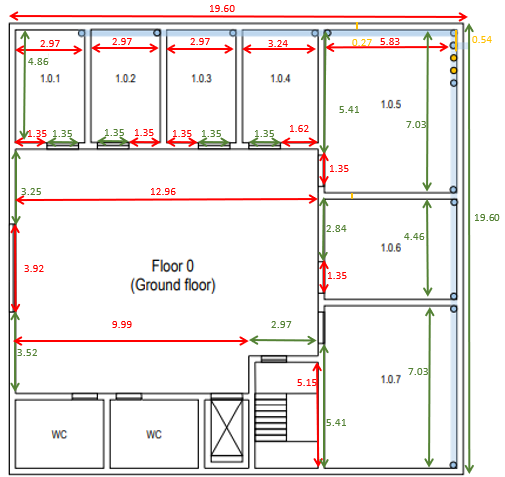

# RCOMP: Project 1  Sprint 1
### Student : Maria Francisca Branco 1230540

## Cross-Connects

1. ### Definition and Location
- If not specified in the project requirements, the location of cross-connects should be negotiated with the client/owner.
- Whenever possible, they should be kept out of public reach.
- They may be dedicated rooms or shared with other uses, such as service storage.

2. ### Horizontal Cross-Connects (HC)
- Should be centrally located relative to the outlets they serve.
- No outlet should be more than 80 meters in a straight line from the HC.
- Cable length must not exceed 90 meters.
- Consolidation Points (CPs) may be created if needed.
- A cross-connect per floor is not mandatory—if there are only a few outlets, a single HC may serve multiple floors.

3. ### Intermediate Cross-Connects (IC)
- Each building requires an IC.
- The IC can be housed in the same room and rack as the HC for that floor.

4. ### Main Cross-Connect (MC)
- The MC must be housed in one of the buildings.
- It can share the same room and telecommunication enclosure as the IC in that building.

## Patch Panels
Each cable reaching a cross-connect it attached to an appropriate type (copper or fiber) patch panel, the number of patch panels needed at each cross-connect depends on the number of connections supported for each.
- Copper panels (24 or 48 connections, taking 1U or 2U respectively);
- Fiber panels (more vendor specific);

Patch panel models must be selected, and comfortingly, the number of patch panels required at each cross-connect is determined.

Because structured cabling infrastructure is supposed to bear future hardware upgrades and additions, an extra 100% over-dimensioning should be applied.

In engineering dimensioning, when some value is reached through calculations, then the commercially available solutions that supports that value must be selected.
Examples:
- If the telecommunications enclosure is housing a single 1U patch panel, then we add another 1U for
  the expected corresponding switch, making 2U, and an additional 100% over dimensioning, this will
  make 4U total. Commercially available telecommunications enclosures start at 6U, so we will use one of
  those.
- If the telecommunications enclosure is housing 2U of patch panels, then we add another 2U for the
  expected corresponding switches, making 4U, and an additional 100% over dimensioning, this will make
  8U. Commercially available size above 6U is usually 12U, so we will use one.

## Switches
- Each switch occupies the same space as the corresponding patch panels.

## Rack
- We use one for each HCC (horizontal cross connection).

# Measurements

Building Backbone:

Floor 0:

Floor 1:

# **Building Backbone** #

### **Fiber cable** ###
Buildings must have power and redundancy. Redundancy is about creating a closed circuit to ensure that if one cable fails, the signal can follow another path.

Power:

|  Building   |           How much is needed...            |
|:-----------:|:------------------------------------------:|
|      1      |           33.68+33.33 = 67.01 m            |  
|      2      |           33.68+42.11 = 75.79 m            | 
|      3      |    33.68+42.11+184.21+29.47 = 289.47 m     |  
|      4      |  33.68+42.11+184.21+29.47+94.73 = 384.2 m  |  

Redundancy
184.21 * 2 + (29.47 + 94.73) * 2 = 616.82 m

Total: (67.01 + 75.79 + 289.47 + 384.20) + 616.82 = 816.47 + 616.82 = 1433.29 m 

### **Inventory** ###

|   Material   | How much is needed... |
|:------------:|:---------------------:|
| Fiber cable  |       1433.29 m       | 

# **Building 1** #
## **Floor 0** ##

### **Outlets** ###
| Room Nº | Width(m) | Length(m) | Area(m^2) | Outlets | Determining the number of outlets |
|:-------:|:--------:|:---------:|:---------:|:-------:|:----------------------------------|
|  1.0.1  |   2.97   |   4.86    |   14.43   |    4    | (14.43 / 10) = 2 ---> 2 * 2 = 4   |
|  1.0.2  |   2.97   |   4.86    |   14.43   |    4    | (14.43 / 10) = 2 ---> 2 * 2 = 4   |
|  1.0.3  |   2.97   |   4.86    |   14.43   |    4    | (14.43 / 10) = 2 ---> 2 * 2 = 4   |
|  1.0.4  |   3.24   |   4.86    |   15.75   |    4    | (15.75 / 10) = 2 ---> 2 * 2 = 4   |
|  1.0.5  |   5.83   |   7.03    |   40.98   |   10    | (40.98 / 10) = 5 ---> 5 * 2 = 10  |
|  1.0.6  |   5.83   |   4.46    |   26.00   |    6    | (26.00 / 10) = 3 ---> 3 * 2 = 6   |
|  1.0.7  |   5.83   |   7.03    |   40.98   |   10    | (40.98 / 10) = 5 ---> 5 * 2 = 10  |

`Note:`

`To determine the number of outlets, we consider the rule that for every 10m^2, there will be at least 2 outlets. To do this, divide the area value by 10. Round the result to a larger value. Then, multiply the value obtained by 2. The result will be the number of outlets for that division, according to this rule.`

`To calculate the area, multiply the length by the width.`

|  Material   | How much is needed... |
|:-----------:|:---------------------:|
|   Outlets   |          42           |

### **Cross Connection** ###

|             Material             | How much is needed... |                                                                                               Why?                                                                                                |
|:--------------------------------:|:---------------------:|:-------------------------------------------------------------------------------------------------------------------------------------------------------------------------------------------------:|
|     Main Cross-Connect (MCC)     |           0           |                                                                            The MCC will be located in the datacenter.                                                                             |
|  Horizontal Cross-Connect (HCC)  |           1           |                                                                              Only 1 HCC is required for each floor.                                                                               |  
| Intermediate Cross-Connect (ICC) |           0           |                                                                     As the building is relatively small, IC is not necessary.                                                                     |   
|     Consolidation Point (CP)     |           2           | I defined that 1 CP will be connected to 24 outlets. Since I have 42 outlets in total, I will only need 2 CP. There is space left to connect 6 new outlets in the future if the number increases. |   
|        Access Point (AP)         |           0           |                                     As the building is small, I thought it would be best to just place one AP and it will be in the center on the top floor.                                      |   

### **Patch Panels** ###

Floor 0:
1 patch panel 24 ports to HCC (fiber)
1 patch panel 24 ports to each CP (cooper)

Total:
- 1 patch panel 24 ports (fiber)
- 2 patch panels 24 ports (cooper)

### **Switch** ###

- 3 switches

### **Rack** ###

Floor 0:
- 1 patch panel 24 ports (fiber) ----> 1U
switch: 1U
- 2 patch panels 24 ports (cooper) ----> 2U
switch: 2U

total: 6U

- 6U for active equipment
Total: 12U ----> 24U (oversize 100%) ----> 24U (commercial value)

|       Material        | How much is needed? |
|:---------------------:|:-------------------:|
| Patch panels (fiber)  |          1          |
| Patch panels (cooper) |          2          |
|       Switches        |          3          |
|         Rack          |         24U         |
### **Fiber cable** ###

For this floor, I will consider:
a) cable that connects the MC (floor 1) to the HCC (floor 0);

The cable will go down 1 meter until it reaches the ground floor, and will go down to the HCC which is 1 meter from the ground.

1 + (4 - 1) = 4m

|  Material   | How much is needed... |
|:-----------:|:---------------------:|
| Fiber cable |          4 m          |
 
### **Cooper cable** ###

Considering the following numbering of outlets:

`Remembering that the CP in division 1.0.4 serves the following outlets: all in division 1.0.1, 1.0.2, 1.0.3 and 1.0.4. In addition to these, it also serves the others in division 1.0.5: 1 to 7, inclusive.
While the CP in division 1.0.7 serves the other outlets, that is, all in divisions 1.0.6 and 1.0.7, and outlets 8 to 10, inclusive, in division 1.0.5.`

Room 1.0.1:
- Outlet 1: 0.27 * 2 + 5.83 + 0.27 + 3.24 + 0.27 + 2.97 + 0.27 + 2.97 + 0.27 + 2.97 + (4.86 / 3) = 21.22
- Outlet 2: 0.27 * 2 + 5.83 + 0.27 + 3.24 + 0.27 + 2.97 + 0.27 + 2.97 + 0.27 + 2.97 + (4.86 / 3) * 2 = 22.84
- Outlet 3: 0.27 * 2 + 5.83 + 0.27 + 3.24 + 0.27 + 2.97 + 0.27 + 2.97 + 0.27 + (2.97 / 2) = 18.12
- Outlet 4: 0.27 * 2 + 5.83 + 0.27 + 3.24 + 0.27 + 2.97 + 0.27 + 2.97 + 0.27 + (4.86 / 2) = 19.06
- Total: 21.22 + 22.84 + 18.12 + 19.06 = 81.24 m

Room 1.0.2:
- Outlet 1: 0.27 * 2 + 5.83 + 0.27 + 3.24 + 0.27 + 2.97 + 0.27 + 2.97 + (4.86 / 3) = 17.98
- Outlet 2: 0.27 * 2 + 5.83 + 0.27 + 3.24 + 0.27 + 2.97 + 0.27 + 2.97 + (4.86 / 3) * 2 = 19.6
- Outlet 3: 0.27 * 2 + 5.83 + 0.27 + 3.24 + 0.27 + 2.97 + 0.27 + 2.97 + (2.97 / 2) = 17.85
- Outlet 4: 0.27 * 2 + 5.83 + 0.27 + 3.24 + 0.27 + 2.97 + 0.27 + (4.86 / 2) = 15.82
- Total: 17.98 + 19.6 + 17.85 + 15.82 = 71.25 m

Room 1.0.3:
- Outlet 1: 0.27 * 2 + 5.83 + 0.27 + 3.24 + 0.27 + 2.97 + (4.86 / 3) = 14.74
- Outlet 2: 0.27 * 2 + 5.83 + 0.27 + 3.24 + 0.27 + 2.97 + (4.86 / 3) * 2 = 16.36
- Outlet 3: 0.27 * 2 + 5.83 + 0.27 + 3.24 + 0.27 + (2.97 / 2) = 11.64
- Outlet 4: 0.27 * 2 + 5.83 + 0.27 + 3.24 + 0.27 + (4.86 / 2) = 12.58
- Total: 14.74 + 16.36 + 11.64 + 12.58 = 55.32 m

Room 1.0.4:
- Outlet 1: 0.27 * 2 + 5.83 + 0.27 + 3.24 + (4.86 / 3) = 11.5
- Outlet 2: 0.27 * 2 + 5.83 + 0.27 + 3.24 + (4.86 / 3) * 2 = 13.12
- Outlet 3: 0.27 * 2 + 5.83 + 0.27 + 3.24 + (3.24 / 2) = 11.50
- Outlet 4: 0.27 * 2 + 5.83 + 0.27 + 3.24 + 3.24 + (4.86 / 2) = 15.55
- Total: 11.5 + 13.12 + 11.50 + 15.55 = 51.62 m

Room 1.0.5:
- Outlet 1: 0.27 * 2 + 5.83 + 0.27 + 3.24 + 3.24 + 0.27 + (5.41 / 3) * 2 = 17.00
- Outlet 2: 0.27 * 2 + 5.83 + 0.27 + 3.24 + 3.24 + 0.27 + (5.41 / 3) = 15.20
- Outlet 3: 0.27 * 2 + 5.83 + 0.27 + 3.24 + 3.24 + 0.27 + (5.83 / 3) = 15.34
- Outlet 4: 0.27 * 2 + 5.83 + 0.27 + 3.24 + 3.24 + 0.27 + (5.83 / 3) * 2 = 17.28
- Outlet 5: 0.27 * 2 + 5.83 + 0.27 + 3.24 + 3.24 + 0.27 + 5.83 + (4.86 / 3) = 21.65
- Outlet 6: 0.27 * 2 + 5.83 + 0.27 + 3.24 + 3.24 + 0.27 + 5.83 + (4.86 / 3) * 2 = 22.46
- Outlet 7: 0.27 * 2 + 5.83 + 0.27 + 3.24 + 3.24 + 0.27 + 5.83 + (4.86 / 3) * 2 + (5.83 / 2) = 25.38
- Outlet 8: (7.03 - 0.27 * 2) + 0.27 + 4.46 + 0.27 + 0.27 + 4.46 + 0.27 + (7.03 / 4) = 18.25
- Outlet 9: (7.03 - 0.27 * 2) + 0.27 + 4.46 + 0.27 + 0.27 + 4.46 + 0.27 + (5.83 / 3) = 18.44
- Outlet 10: (7.03 - 0.27 * 2) + 0.27 + 4.46 + 0.27 + 0.27 + 4.46 + 0.27 + (5.83 / 3) * 2 = 20.38
- Total: 17.00 + 15.20 + 15.34 + 17.28 + 21.65 + 22.46 + 25.38 + 18.25 + 18.44 + 20.38 = 191.38 m

Room 1.0.6:
- Outlet 1: (7.03 - 0.27 * 2) + 0.27 + 4.46 + 0.27 + 0.27 + 4.46 + (5.83 / 3) * 2 = 20.11
- Outlet 2: (7.03 - 0.27 * 2) + 0.27 + 4.46 + 0.27 + 0.27 + 4.46 + (5.83 / 3) = 18.17
- Outlet 3: (7.03 - 0.27 * 2) + 0.27 + 4.46 + 0.27 + 0.27 + (4.46 / 3) * 2 = 14.74
- Outlet 4: (7.03 - 0.27 * 2) + 0.27 + 4.46 + 0.27 + 0.27 + (4.46 / 3) = 13.25
- Outlet 5: (7.03 - 0.27 * 2) + 0.27 + 4.46 + 0.27 + 0.27 + (5.83 / 3) = 13.71
- Outlet 6: (7.03 - 0.27 * 2) + 0.27 + 4.46 + 0.27 + 0.27 + (5.83 / 3) * 2 = 15.65
- Total: 20.11 + 18.17 + 14.74 + 13.25 + 13.71 + 15.65 = 95.63 m

Room 1.0.7:
- Outlet 1: 7.03 - 0.27 * 2 + 0.27 + 4.46 + 0.27 + (5.83 / 3) * 2 = 15.38
- Outlet 2: 7.03 - 0.27 * 2 + 0.27 + 4.46 + 0.27 + (5.83 / 3) = 13.44
- Outlet 3: 7.03 - 0.27 * 2 + 0.27 + 4.46 + 0.27 + (7.03 / 4) = 13.25
- Outlet 4: 7.03 - 0.27 * 2 + 0.27 + 4.46 + 0.27 + (7.03 / 2) = 15.01
- Outlet 5: 7.03 - 0.27 * 2 + 0.27 + 4.46 + 0.27 + (7.03 / 2) + (5.83 / 2) = 17.92
- Outlet 6: 7.03 - 0.27 * 2 + 0.27 + 4.46 + 0.27 + (7.03 / 2) * 3 = 22.04
- Outlet 7: 7.03 - 0.27 * 2 + 0.27 + 4.46 + 0.27 + 7.03 + (5.83 / 3) = 20.47
- Outlet 8: 7.03 - 0.27 * 2 + 0.27 + 4.46 + 0.27 + 7.03 + (5.83 / 3) * 2 = 22.41
- Outlet 9: 7.03 - 0.27 * 2 + 0.27 + 4.46 + 0.27 + 7.03 + 5.83 + (5.15 / 2) = 26.93
- Outlet 10: 7.03 - 0.27 * 2 + 0.27 + 4.46 + 0.27 + 7.03 + 5.83 + 5.15 = 29.5
- Total: 15.38 + 13.44 + 13.25 + 15.01 + 17.92 + 22.04 + 20.47 +22.41 + 26.93 + 29.5 = 196.35 m

| Room Nº | How much is needed... |
|:-------:|:---------------------:|
|  1.0.1  |        81.24 m        |
|  1.0.2  |        71.25 m        |
|  1.0.3  |        55.32 m        |
|  1.0.4  |        51.62 m        |
|  1.0.5  |       191.38 m        |
|  1.0.6  |        95.63 m        |
|  1.0.7  |       196.35 m        |

|   Material   | How much is needed... |
|:------------:|:---------------------:|
| Cooper cable |       742.79 m        |

## **Floor 1** ##

### **Outlets** ###
| Room Nº | Width(m) | Length(m) | Area(m^2) | Outlets | Determining the number of outlets |
|:-------:|:--------:|:---------:|:---------:|:-------:|:----------------------------------|
|  1.1.1  |   3.51   |   7.03    |   24.86   |    6    | (24.86 / 10) = 3 ---> 3 * 2 = 6   |
|  1.1.2  |   3.51   |   7.03    |   24.86   |    6    | (24.86 / 10) = 3 ---> 3 * 2 = 6   |
|  1.1.3  |  11.50   |   7.03    |   80.85   |    0    | 0                                 |
|  1.1.4  |   5.83   |   4.46    |   26.00   |    6    | (26.00 / 10) = 3 ---> 3 * 2 = 6   |
|  1.1.5  |   5.83   |   7.03    |   40.98   |   10    | (40.98 / 10) = 5 ---> 5 * 2 = 10  |

`Note:`

`The datacenter (Room 1.1.3) does not need outlets!`

`To determine the number of outlets, we consider the rule that for every 10m^2, there will be at least 2 outlets. To do this, divide the area value by 10. Round the result to a larger value. Then, multiply the value obtained by 2. The result will be the number of outlets for that division, according to this rule.`

`To calculate the area, multiply the length by the width.`

`As the access point is located in the center of the plant, an outlet for this device is necessary.`

|  Material   | How much is needed... |
|:-----------:|:---------------------:|
|   Outlets   |      28 + 1 = 29      |

### **Cross Connection** ###

|             Material             | How much is needed... |                                                                                                Why?                                                                                                |
|:--------------------------------:|:---------------------:|:--------------------------------------------------------------------------------------------------------------------------------------------------------------------------------------------------:|
|     Main Cross-Connect (MCC)     |           1           |                                                                                     Located in the datacenter.                                                                                     |
|  Horizontal Cross-Connect (HCC)  |           1           |                                                                               Only 1 HCC is required for each floor.                                                                               |  
| Intermediate Cross-Connect (ICC) |           0           |                                                                     As the building is relatively small, IC is not necessary.                                                                      |   
|     Consolidation Point (CP)     |           2           | I defined that 1 CP will be connected to 24 outlets. Since I have 29 outlets in total, I will only need 2 CP. There is space left to connect 19 new outlets in the future if the number increases. |   
|        Access Point (AP)         |           1           |                                                        Located in the center of the floor so the signal radius covers the entire building.                                                         |   

### **Patch Panels** ###

Floor 1:
1 patch panel 24 ports to HCC (fiber)
1 patch panel 24 ports to MCC (fiber)
1 patch panel 24 ports to each CP (cooper)

Total:
- 2 patch panel 24 ports (fiber)
- 2 patch panels 24 ports (cooper)

### **Switch** ###

Total:
- 4 switches

### **Rack** ###

Floor 1:
- 2 patch panel 24 ports (fiber) ----> 2U
switch: 2U
- 2 patch panels 24 ports (cooper) ----> 2U
switch: 2U

total: 8U

- 8U for active equipment
Total: 16U ----> 32U (oversize 100%) ----> 36U (commercial value)

|       Material        | How much is needed? |
|:---------------------:|:-------------------:|
| Patch panels (fiber)  |          2          |
| Patch panels (cooper) |          2          |
|       Switches        |          4          |
|         Rack          |         36U         |

### **Fiber cable** ###

For this floor, I will consider:
a) cable that arrives from outside and goes to the MC;
b) cable that connects the MC to the HCC on the same floor;

a)

The wire crosses floor 0, that is, the length is equal to the height of the same floor. In this case, we are talking about 4m.
After reaching the 1st floor, the wire will connect to the MC which I located 1m from the floor. Therefore, 4m + 1m = 5m.

For this wire I need 5m.

b)

I decided that the distance from MC to HCC is 20 cm. But if for some reason in the future you need to move these two devices, we will consider a length of 50 cm.

Total: 5m + 50cm = 5.50m

|  Material   | How much is needed... |
|:-----------:|:---------------------:|
| Fiber cable |        5.50 m         |

### **Cooper cable** ###

Considering the following numbering of outlets:

`It is worth remembering that the CP in division 1.1.2 serves the following outlets: all in divisions 1.1.1 and 1.1.2.
The rest of the outlets are served by the CP which is in division 1.1.4.`

Room 1.1.1:
- Outlet 1: 0.27 * 2 + 11.50 + 0.27 + 3.51 + 0.27 + 3.51 + (7.03 / 4) * 3 = 24.88
- Outlet 2: 0.27 * 2 + 11.50 + 0.27 + 3.51 + 0.27 + 3.51 + (7.03 / 2) = 23.12
- Outlet 3: 0.27 * 2 + 11.50 + 0.27 + 3.51 + 0.27 + 3.51 + (7.03 / 4) = 21.36
- Outlet 4: 0.27 * 2 + 11.50 + 0.27 + 3.51 + 0.27 + (7.03 / 4) * 3 = 21.37
- Outlet 5: 0.27 * 2 + 11.50 + 0.27 + 3.51 + 0.27 + (7.03 / 2) = 19.61
- Outlet 6: 0.27 * 2 + 11.50 + 0.27 + 3.51 + 0.27 + (7.03 / 4) = 17.85
- Total: 24.88 + 23.12 + 21.36 + 21.37 + 19.61 + 17.85 = 128.19 m

Room 1.1.2:
- Outlet 1: 0.27 * 2 + 11.50 + 0.27 + 3.51 + (7.03 / 4) * 3 = 21.10
- Outlet 2: 0.27 * 2 + 11.50 + 0.27 + 3.51 + (7.03 / 2) = 19.34
- Outlet 3: 0.27 * 2 + 11.50 + 0.27 + 3.51 + (7.03 / 4) = 17.58
- Outlet 4: 0.27 * 2 + 11.50 + 0.27 + (7.03 / 4) * 3 = 17.59
- Outlet 5: 0.27 * 2 + 11.50 + 0.27 + (7.03 / 2) =  15.83
- Outlet 6: 0.27 * 2 + 11.50 + 0.27 + (7.03 / 4) = 14.07
- Total: 21.10 + 19.34 + 17.58 + 17.59 + 15.83 + 14.07 = 105.51 m

Room 1.1.3:
- 0

Room 1.1.4:
- Outlet 1: (7.03 - 0.27 * 2) + 0.27 + (5.83 / 3) * 2 = 10.65
- Outlet 2: (7.03 - 0.27 * 2) + 0.27 + (5.83 / 3) = 8.71
- Outlet 3: (7.03 - 0.27 * 2) + 0.27 + (4.46 / 3) = 8.25
- Outlet 4: (7.03 - 0.27 * 2) + 0.27 + (4.46 / 3) * 2 = 9.74
- Outlet 5: (7.03 - 0.27 * 2) + 0.27 + 4.46 + (5.83 / 3) = 13.17
- Outlet 6: (7.03 - 0.27 * 2) + 0.27 + 4.46 + (5.83 / 3) * 2 = 15.11
- Total: 10.65 + 8.71 + 8.25 + 9.74 + 13.17 + 15.11 = 65.63 m

Room 1.1.5:
- Outlet 1: (7.03 - 0.27 * 2) + 0.27 + 4.46 + 0.27 + (5.83 / 3) * 2 = 15.38
- Outlet 2: (7.03 - 0.27 * 2) + 0.27 + 4.46 + 0.27 + (5.83 / 3) = 13.44
- Outlet 3: (7.03 - 0.27 * 2) + 0.27 + 4.46 + 0.27 + (7.03 / 4) = 13.25
- Outlet 4: (7.03 - 0.27 * 2) + 0.27 + 4.46 + 0.27 + (7.03 / 2) = 15.01
- Outlet 5: (7.03 - 0.27 * 2) + 0.27 + 4.46 + 0.27 + (7.03 / 2) + (5.83 / 2) = 17.92
- Outlet 6: (7.03 - 0.27 * 2) + 0.27 + 4.46 + 0.27 + (7.03 / 4) * 3 = 16.77
- Outlet 7: (7.03 - 0.27 * 2) + 0.27 + 4.46 + 0.27 + 7.03 + (5.83 / 3) = 20.47
- Outlet 8: (7.03 - 0.27 * 2) + 0.27 + 4.46 + 0.27 + 7.03 + (5.83 / 3) * 2 = 22.41
- Outlet 9: (7.03 - 0.27 * 2) + 0.27 + 4.46 + 0.27 + 7.03 + 5.83 + (7.03 / 3) = 26.70
- Outlet 10: (7.03 - 0.27 * 2) + 0.27 + 4.46 + 0.27 + 7.03 + 5.83 + (7.03 / 3) * 2 = 29.04
- Total: 15.38 + 13.44 + 13.25 + 15.01 + 17.92 + 16.77 + 20.47 + 22.41 + 26.70 + 29.04 = 190.39 m

Extra:
- Outlet 1: (7.03 - 0.27 * 2) + 0.27 + 5.83 + 0.27 + 2.97 = 15.83
- Total: 15.83 m

| Room Nº | How much is needed... (m) |
|:-------:|:-------------------------:|
|  1.0.1  |          128.19           |
|  1.0.2  |          105.51           |
|  1.0.3  |             0             |
|  1.0.4  |           65.63           |
|  1.0.5  |          190.39           |
|  Extra  |           15.83           |

|   Material   | How much is needed... (m) |
|:------------:|:-------------------------:|
| Cooper cable |          505.55           |

|   Material   | How much is needed? | How much do they take? |
|:------------:|:-------------------:|:-----------------------|
| Patch panels |          2          | 2 U                    |
|   Switches   |          2          | 2 U                    |
|     Rack     |          1          | 12 U                   |

|       Material        | How much is needed? |
|:---------------------:|:-------------------:|
| Patch panels (fiber)  |          3          |
| Patch panels (cooper) |          4          |
|         Rack          |      12U / 18U      |

# Overall building inventory: #
|             Material             | How much is needed... (Floor 0) | How much is needed... (Floor 1) | How much is needed... (Total) | 
|:--------------------------------:|:-------------------------------:|:--------------------------------|:------------------------------|
|             Outlets              |               42                | 29                              | 71                            |
|     Main Cross-Connect (MCC)     |                0                | 1                               | 1                             | 
|  Horizontal Cross-Connect (HCC)  |                1                | 1                               | 2                             |
| Intermediate Cross-Connect (ICC) |                0                | 0                               | 0                             |  
|     Consolidation Point (CP)     |                2                | 2                               | 4                             | 
|        Access Point (AP)         |                0                | 1                               | 1                             |
|           Fiber cable            |               4 m               | 5.50 m                          | 9.50 m                        | 
|           Cooper cable           |             742.79              | 505.55                          | 1248.34                       |
|       Patch panels (fiber)       |                1                | 2                               | 3                             |   
|      Patch panels (cooper)       |                2                | 2                               | 4                             |
|             Switches             |                3                | 4                               | 7                             |
|               Rack               |             1 x 24U             | 1 x 36U                         | 1 x 24U ; 1 x 36U             |