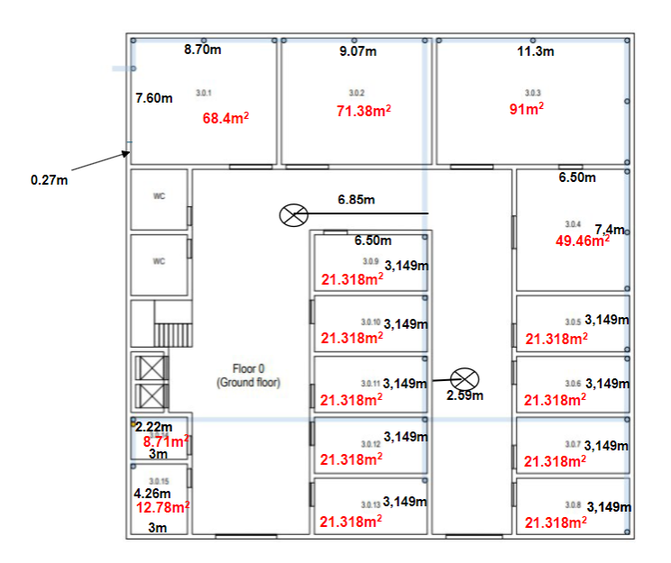
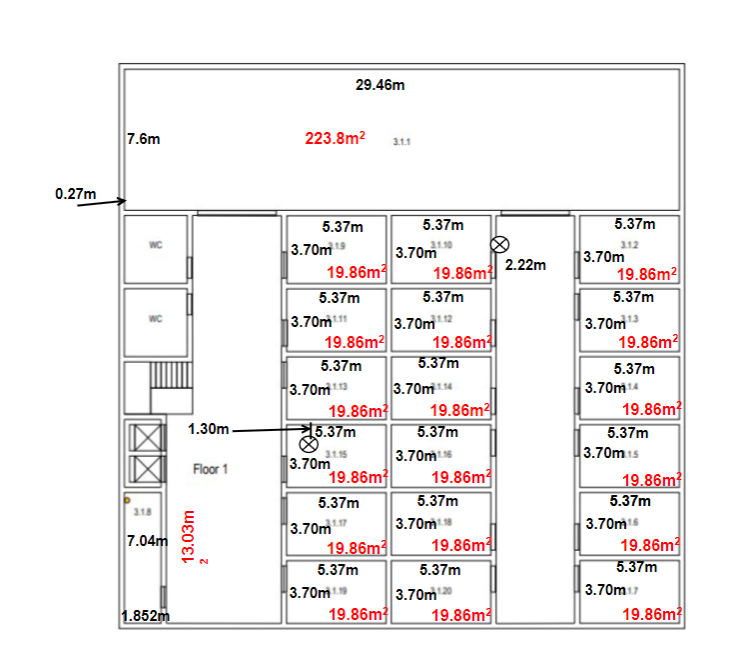
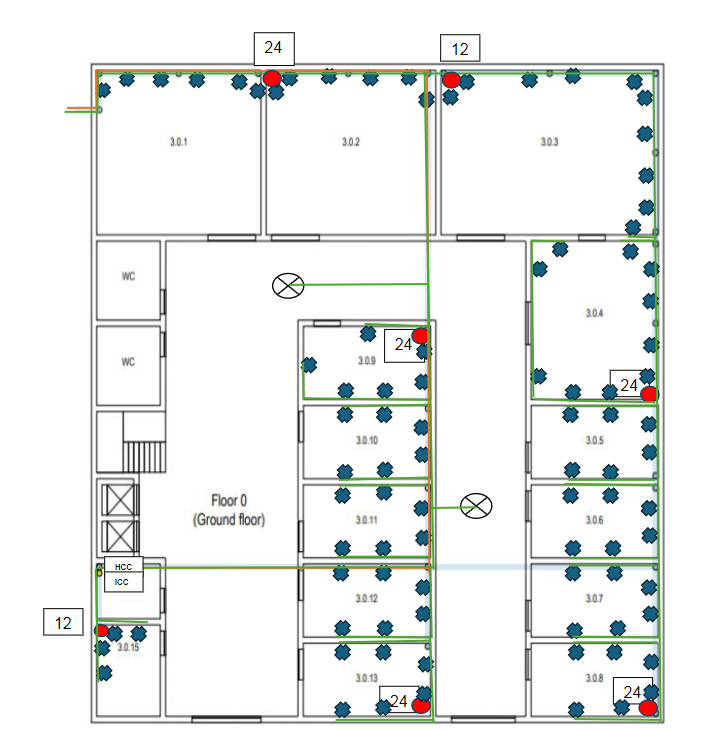
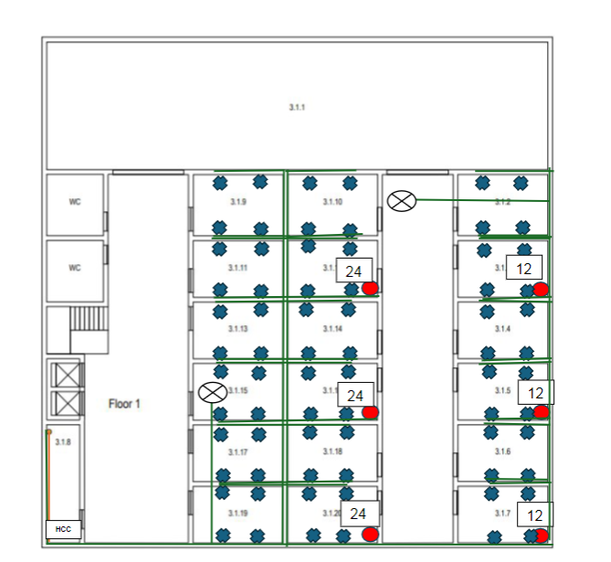

# RCOMP: Project 1  Sprint 1
### Student : Afonso Sousa

## Cross-Connects

1. ### Definition and Location
- If not specified in the project requirements, the location of cross-connects should be negotiated with the client/owner.
- Whenever possible, they should be kept out of public reach.
- They may be dedicated rooms or shared with other uses, such as service storage.

2. ### Horizontal Cross-Connects (HCC)
- Should be centrally located relative to the outlets they serve.
- No outlet should be more than 80 meters in a straight line from the HC.
- Cable length must not exceed 90 meters.
- Consolidation Points (CPs) may be created if needed.
- A cross-connect per floor is not mandatory—if there are only a few outlets, a single HC may serve multiple floors.

3. ### Intermediate Cross-Connects (ICC)
- Each building requires an IC.
- The IC can be housed in the same room and rack as the HCC for that floor.

4. ### Main Cross-Connect (MCC)
- The MCC must be housed in one of the buildings.
- It can share the same room and telecommunication enclosure as the IC in that building.

## Patch Panels
Each cable reaching a cross-connect it attached to an appropriate type (copper or fiber) patch panel, the number of patch panels needed at each cross-connect depends on the number of connections supported for each.
- Copper panels (24 or 48 connections, taking 1U or 2U respectively);
- Fiber panels (more vendor specific);

Patch panel models must be selected, and comfortingly, the number of patch panels required at each cross-connect is determined.

Because structured cabling infrastructure is supposed to bear future hardware upgrades and additions, an extra 100% over-dimensioning should be applied.

In engineering dimensioning, when some value is reached through calculations, then the commercially available solutions that supports that value must be selected.
Examples:
- If the telecommunications enclosure is housing a single 1U patch panel, then we add another 1U for
  the expected corresponding switch, making 2U, and an additional 100% over dimensioning, this will
  make 4U total. Commercially available telecommunications enclosures start at 6U, so we will use one of
  those.
- If the telecommunications enclosure is housing 2U of patch panels, then we add another 2U for the
  expected corresponding switches, making 4U, and an additional 100% over dimensioning, this will make
  8U. Commercially available size above 6U is usually 12U, so we will use one.

## Switches
- Each switch occupies the same space as the corresponding patch panels.

## Rack
- We use one for each HCC (horizontal cross connection).

# Measurements

Floor 0:

Floor 1:

# **Building 3** #
## **Floor 0** ##

### **Outlets** ###
| Room Nº | Width(m) | Length(m) | Area(m^2) | Outlets | Determining the number of outlets               |
|:-------:|:--------:|:---------:|:---------:|:-------:|:------------------------------------------------|
|  3.0.1  |   8.70   |   7.60    |   68.4    |    6    | Two for each cable passaway ---> (3 * 2 = 6)    |
|  3.0.2  |   7.07   |   7.60    |   71.38   |    6    | Two for each cable passaway ---> (3 * 2 = 6)    |
|  3.0.3  |   11.3   |   7.60    |    91     |   10    | Two for each cable passaway ---> (5 * 2 = 10)   |
|  3.0.4  |   6.50   |   7.40    |   49.96   |   10    | Outets per Area Ratio : (40-50) -> 10           |
|  3.0.5  |   6.50   |   3.149   |  21.318   |    6    | Outets per Area Ratio : (20-30) -> 6            |
|  3.0.6  |   6.50   |   3.149   |  21.318   |    6    | Outets per Area Ratio : (20-30) -> 6            |
|  3.0.7  |   6.50   |   3.149   |  21.318   |    6    | Outets per Area Ratio : (20-30) -> 6            |
|  3.0.8  |   6.50   |   3.149   |  21.318   |    6    | Outets per Area Ratio : (20-30) -> 6            |
|  3.0.9  |   6.50   |   3.149   |  21.318   |    6    | Outets per Area Ratio : (20-30) -> 6            |
| 3.0.10  |   6.50   |   3.149   |  21.318   |    6    | Outets per Area Ratio : (20-30) -> 6            |
| 3.0.11  |   6.50   |   3.149   |  21.318   |    6    | Outets per Area Ratio : (20-30) -> 6            |
| 3.0.12  |   6.50   |   3.149   |  21.318   |    6    | Outets per Area Ratio : (20-30) -> 6            |
| 3.0.13  |   6.50   |   3.149   |  21.318   |    6    | Outets per Area Ratio : (20-30) -> 6            |
| 3.0.14  |    3     |   2.22    |   8.175   |    0    | No need for outlets since its an equipment room |
| 3.0.15  |    3     |   4.26    |   12.78   |    4    | Outets per Area Ratio : (10-20) -> 4            |

`Note:`

`To determine the number of outlets, we consider the rule that for every 10m^2, there will be at least 2 outlets. To do this, divide the area value by 10. Round the result to a larger value. Then, multiply the value obtained by 2. The result will be the number of outlets for that division, according to this rule.`

`To calculate the area, multiply the length by the width.`

|  Material   | How much is needed... |
|:-----------:|:---------------------:|
|   Outlets   |          90           |

### **Cross Connection** ###

|             Material             | How much is needed... |                                                                                 Why?                                                                                  |
|:--------------------------------:|:---------------------:|:---------------------------------------------------------------------------------------------------------------------------------------------------------------------:|
|     Main Cross-Connect (MCC)     |           0           |                                                        The MCC will be located in the datacenter (Building 1)                                                         |
|  Horizontal Cross-Connect (HCC)  |           2           |                                                                Only 1 HCC is required for each floor.                                                                 |  
| Intermediate Cross-Connect (ICC) |           1           |                                                     As the building is not relatively small, IC may be necessary.                                                     |   
|     Consolidation Point (CP)     |           7           |       I decided to have this many CP in the building because there are alot of network outlets and we need to cover all of  them using CP with 12 and 24 ports        |   
|        Access Point (AP)         |           2           | Since the building have more than 25m radius, one AP cant cover the entire building, so we put two for each floor and in opposite positions to not exist interference |   

### **Patch Panels/ Switches** ###

- Considering the use of a 12-port or 24-port patch panel:

HCC - Patch Panel of 12 ports
ICC - Patch Panel of 12 ports

`Number of patch panels for each room with a CP:`
Considering a patch panel's port count directly corresponds to the number of outlets it can handle.

Room 3.0.2: 12 outlets (24 port patch panel)
Room 3.0.3: 10 outlets (12 port patch panel)
Room 3.0.4: 16 outlets (24 port patch panel)
Room 3.0.8: 18 outlets (24 port patch panel)
Room 3.0.9: 12 outlets (24 port patch panel)
Room 3.0.13: 18 outlets (24 port patch panel)
Room 3.0.15: 4 outlets (12 port patch panel)

|   Material   |           How much is needed?           | How much do they take? |
|:------------:|:---------------------------------------:|:-----------------------|
| Patch panels | 4x 12p_patchpanel and 5x 24p_patchpanel | 4U+5U = 9U             |
|   Switches   |               9U switches               | 9U                     |
|     Rack     |        18U (oversize 100% = 36)         | 36U                    |

### **Fiber cable** ###

For this floor, I will consider:
a) cable that connects the HCC (floor 1) to the HCC (floor 0);

The cable will go down 4m (height between floor 0 and 1):

4m

b) cable that comes from outside to ICC (since they are on the same position).

1+1+9.5+12.4+9.5 = 33.4m
(33.4*5)/2.7 = 61.85m  [Considering the scale that exits (2.7cm -- 5m)]

Total Fiber cable calculation : 61.85m + 4m + 1m(height of the ICC) = 66.85m

|  Material   | How much is needed... |
|:-----------:|:---------------------:|
| Fiber cable |        66.85m         |

### **Cooper cable** ###

Considering the following numbering of outlets:

`Remembering that the CP in division 3.0.2 serves the following outlets: all in division 3.0.1, 3.0.2. The CP in division 3.0.3 serves the following outlets: all in division 3.0.3. 
The CP in division 3.0.4 serves the following outlets: all in division 3.0.4, 3.0.5. The CP in division 3.0.8 serves the following outlets: all in division 3.0.6, 3.0.7, 3.0.8. 
The CP in division 3.0.9 serves the following outlets: all in division 3.0.9, 3.0.10. The CP in division 3.0.13 serves the following outlets: all in division 3.0.11, 3.0.12,3.0.13.
The CP in division 3.0.15 serves the following outlets: all in division 3.0.15.`

`The format of the calculations are:  
 Step 1 : Calculate the amount of cable needed with a ruler
 Step 2 : Sum all the amount for one outlet and then convert it to the correct scaling
 Format : (([Distance from the HCC to the corresponding CP] + [Distance from that CP to the corresponding outlet])*5)/ 2.7`

`We are considering the number of the outlet from the left to the right and from the one closer to the highest height to the lowest height`
Room 3.0.1:
- Outlet 1: (((9.5+12.4+4.8)+(4.7+0.5))*5)/2.7 = 59.074m
- Outlet 2: (((9.5+12.4+4.8)+(4.6))*5)/2.7 = 57.962m
- Outlet 3: (((9.5+12.4+4.8)+(3.3))*5)/2.7 = 55.555m
- Outlet 4: (((9.5+12.4+4.8)+(2.3))*5)/2.7 = 53.703m
- Outlet 5: (((9.5+12.4+4.8)+(0.9))*5)/2.7 = 51.111m
- Outlet 6: (((9.5+12.4+4.8)+(0.4+0.1))*5)/2.7 = 50.370m
- Total: 59.074m + 57.962m + 55.555m + 53.703m + 51.111m+ 50.370m = 327.775m

Room 3.0.2:
- Outlet 1: (((9.5+12.4+4.8)+(0.3))*5)/2.7 = 50.370m
- Outlet 2: (((9.5+12.4+4.8)+(0.3))*5)/2.7 = 50.000m
- Outlet 3: (((9.5+12.4+4.8)+(1.8))*5)/2.7 = 52.777m
- Outlet 4: (((9.5+12.4+4.8)+(2.4))*5)/2.7 = 53.888m
- Outlet 5: (((9.5+12.4+4.8)+(4.2))*5)/2.7 = 57.222m
- Outlet 6: (((9.5+12.4+4.8)+(4.6+0.5))*5)/2.7 = 58.888m
- Total: 50.370m + 50.000m + 52.777m + 53.888m + 57.222m + 58.888m = 323.145m

Room 3.0.3:
- Outlet 1: (((9.5+12.4+0.5)+(0.5))*5)/2.7 = 42.407m
- Outlet 2: (((9.5+12.4+0.5)+(0.5))*5)/2.7 = 42.407m
- Outlet 3: (((9.5+12.4+0.5)+(2.1))*5)/2.7 = 45.370m
- Outlet 4: (((9.5+12.4+0.5)+(3.6))*5)/2.7 = 48.148m
- Outlet 5: (((9.5+12.4+0.5)+(5.7))*5)/2.7 = 52.037m
- Outlet 6: (((9.5+12.4+0.5)+(6.2+0.5))*5)/2.7 = 53.888m
- Outlet 7: (((9.5+12.4+0.5)+(6.2+1.5))*5)/2.7 = 55.740m
- Outlet 8: (((9.5+12.4+0.5)+(6.2+2.5))*5)/2.7 = 57.592m
- Outlet 9: (((9.5+12.4+0.5)+(6.2+3.5))*5)/2.7 = 59.444m
- Outlet 10: (((9.5+12.4+0.5)+(6.2+4.1+0.5))*5)/2.7 = 61.481m
- Total: 42.407m + 42.407m + 45.370m + 48.148m + 52.037m + 53.888m + 55.740m + 57.592m + 59.444m +61.481m = 518.915m

Room 3.0.4:
- Outlet 1: (((9.5+12.4+6.1+8.3)+(3.6+3.5))*5)/2.7 = 80.370m
- Outlet 2: (((9.5+12.4+6.1+8.3)+(3.6+0.3))*5)/2.7 = 74.444m
- Outlet 3: (((9.5+12.4+6.1+8.3)+(3.6+4+0.5))*5)/2.7 = 82.222m
- Outlet 4: (((9.5+12.4+6.1+8.3)+(2.6))*5)/2.7 = 72.037m
- Outlet 5: (((9.5+12.4+6.1+8.3)+(1.6))*5)/2.7 = 70.185m
- Outlet 6: (((9.5+12.4+6.1+8.3)+(4+0.5))*5)/2.7 = 75.555m
- Outlet 7: (((9.5+12.4+6.1+8.3)+(3.6))*5)/2.7 = 73.888m
- Outlet 8: (((9.5+12.4+6.1+8.3)+(2.6))*5)/2.7 = 72.037m
- Outlet 9: (((9.5+12.4+6.1+8.3)+(1.6))*5)/2.7 = 70.185m
- Outlet 10: (((9.5+12.4+6.1+8.3)+(0.5))*5)/2.7 = 68.148m
- Total: 80.370m + 74.444m + 82.222m + 72.037m + 70.185m + 75.555m + 73.888m + 72.037m + 70.185m + 68.148m = 698.071m

Room 3.0.5:
- Outlet 1: (((9.5+12.4+6.1+8.3)+(2.6))*5)/2.7 = 72.037m
- Outlet 2: (((9.5+12.4+6.1+8.3)+(2.6+2))*5)/2.7 = 75.740m
- Outlet 3: (((9.5+12.4+6.1+8.3)+(1.6))*5)/2.7 = 70.185m
- Outlet 4: (((9.5+12.4+6.1+8.3)+(1.6+2))*5)/2.7 = 73.888m
- Outlet 5: (((9.5+12.4+6.1+8.3)+(0.5))*5)/2.7 = 68.148m
- Outlet 6: (((9.5+12.4+6.1+8.3)+(1.5))*5)/2.7 = 70.000m
- Total: 72.037m + 75.740m + 70.185m + 73.888m + 68.148m + 70.000m = 430.998m

Room 3.0.6:
- Outlet 1: (((9.5+12.4+6.1+16.2)+(7.9+2.6))*5)/2.7 = 101.296m
- Outlet 2: (((9.5+12.4+6.1+16.2)+(6+2.6))*5)/2.7 = 97.777m
- Outlet 3: (((9.5+12.4+6.1+16.2)+(7.9+1.6))*5)/2.7 = 99.444m
- Outlet 4: (((9.5+12.4+6.1+16.2)+(6+1.6))*5)/2.7 = 95.925m
- Outlet 5: (((9.5+12.4+6.1+16.2)+(5.4))*5)/2.7 = 91.851m
- Outlet 6: ((9.5+12.4+6.1+16.2)+(4.4))*5)/2.7 = 90.000m
- Total: 101.296m + 97.777m + 99.444m + 95.925m + 91.851m + 90.000m = 576.293m

Room 3.0.7:
- Outlet 1: (((9.5+12.4+6.1+16.2)+(3.6+2.6))*5)/2.7 = 93.33m 
- Outlet 2: (((9.5+12.4+6.1+16.2)+(2+2.6))*5)/2.7 = 90.370m
- Outlet 3: (((9.5+12.4+6.1+16.2)+(3.6+1.6))*5)/2.7 = 91.481m
- Outlet 4: (((9.5+12.4+6.1+16.2)+(2+1.6))*5)/2.7 = 88.518m
- Outlet 5: (((9.5+12.4+6.1+16.2)+(3.4))*5)/2.7 = 88.148m
- Outlet 6: (((9.5+12.4+6.1+16.2)+(2.4))*5)/2.7 = 86.296m
- Total: 93.33m + 90.370m + 91.481m + 88.518m + 88.148m + 86.296m = 537.141m

Room 3.0.8:
- Outlet 1: (((9.5+12.4+6.1+16.2)+(1.7+2.6))*5)/2.7 = 89.814m
- Outlet 2: (((9.5+12.4+6.1+16.2)+(2.6))*5)/2.7 = 86.666m
- Outlet 3: (((9.5+12.4+6.1+16.2)+(1.7+1.6))*5)/2.7 = 87.962m
- Outlet 4: (((9.5+12.4+6.1+16.2)+(1.6))*5)/2.7 = 84.814m
- Outlet 5: (((9.5+12.4+6.1+16.2)+(1.5))*5)/2.7 = 84.629m
- Outlet 6: (((9.5+12.4+6.1+16.2)+(0.5))*5)/2.7 = 82.777m
- Total: 89.814m + 86.666m + 87.962m + 84.814m + 84.629m + 82.777m = 516.662m

Room 3.0.9:
- Outlet 1: (((9.5+6)+(1.8+3.6+1))*5)/2.7 = 40.555m
- Outlet 2: (((9.5+6)+(1.8+2.6))*5)/2.7 = 36.851m
- Outlet 3: (((9.5+6)+(1.6))*5)/2.7 = 31.666m
- Outlet 4: (((9.5+6)+(1.8+1.6))*5)/2.7 = 35.000m
- Outlet 5: (((9.5+6)+(0.5))*5)/2.7 = 29.629m
- Outlet 6: (((9.5+6)+(1.5))*5)/2.7 = 31.481m
- Total: 40.555m + 36.851m + 31.666m + 35.000m + 29.629m + 31.481m = 205.182m

Room 3.0.10:
- Outlet 1: (((9.5+6)+(1.8+2.6))*5)/2.7 = 36.851m
- Outlet 2: (((9.5+6)+(3.6+2.6))*5)/2.7 = 40.185m
- Outlet 3: (((9.5+6)+(1.8+1.6))*5)/2.7 = 35.000m
- Outlet 4: (((9.5+6)+(3.6+1.6))*5)/2.7 = 38.333m
- Outlet 5: (((9.5+6)+(2.5))*5)/2.7 = 33.333m
- Outlet 6: (((9.5+6)+(3.5))*5)/2.7 = 35.185m
- Total: 36.851m + 40.185m + 35.000m + 38.333m + 33.333m + 35.185m = 218.887m

Room 3.0.11:
- Outlet 1: (((9.5+3.8)+(5.4+2.6))*5)/2.7 = 39.444m
- Outlet 2: (((9.5+3.8)+(3.6+2.6))*5)/2.7 = 36.111m
- Outlet 3: (((9.5+3.8)+(5.4+1.6))*5)/2.7 = 37.592m
- Outlet 4: (((9.5+3.8)+(3.6+1.6))*5)/2.7 = 34.259m
- Outlet 5: (((9.5+3.8)+(5.3))*5)/2.7 = 34.444m
- Outlet 6: (((9.5+3.8)+(4.3))*5)/2.7 = 32.592m
- Total: 39.444m + 36.111m + 37.592m + 34.259m + 34.444m + 32.592m = 214.442m

Room 3.0.12:
- Outlet 1: (((9.5+3.8)+(3.6+2.6))*5)/2.7 = 36.111m
- Outlet 2: (((9.5+3.8)+(1.8+2.6))*5)/2.7 = 32.777m
- Outlet 3: (((9.5+3.8)+(3.6+1.6))*5)/2.7 = 34.259m
- Outlet 4: (((9.5+3.8)+(1.8+1.6))*5)/2.7 = 30.925m
- Outlet 5: (((9.5+3.8)+(3.3))*5)/2.7 = 30.740m
- Outlet 6: (((9.5+3.8)+(2.3))*5)/2.7 = 28.888m
- Total: 36.111m + 32.777m + 34.259m + 30.925m + 30.740m + 28.888m = 193.700m

Room 3.0.13:
- Outlet 1: (((9.5+3.8)+(1.8+2.6))*5)/2.7 = 32.777m
- Outlet 2: (((9.5+3.8)+(2.6))*5)/2.7 = 29.444m
- Outlet 3: (((9.5+3.8)+(1.8+1.6))*5)/2.7 = 30.925m
- Outlet 4: (((9.5+3.8)+(1.6))*5)/2.7 = 27.592m
- Outlet 5: (((9.5+3.8)+(1.5))*5)/2.7 = 27.407m
- Outlet 6: (((9.5+3.8)+(0.5))*5)/2.7 = 25.555m
- Total: 32.777m + 29.444m + 30.925m + 27.592m + 27.407m + 25.555m = 173.700m

Room 3.0.14:

- Total: 0m (since we don't have outlets here)

Room 3.0.15:
- Outlet 1: (((3.8)+(1.8))*5)/2.7 = 10.370m
- Outlet 2: (((3.8)+(1.3))*5)/2.7 = 9.444m
- Outlet 3: (((3.8)+(2.3+0.5))*5)/2.7 = 12.222m
- Outlet 4: (((3.8)+(2.3+1))*5)/2.7 = 13.148m
- Total: 10.370m + 9.444m + 12.222m + 13.148m = 45.184m

| Room Nº | How much is needed... |
|:-------:|:---------------------:|
|  3.0.1  |       327.775m        |
|  3.0.2  |       323.145m        |
|  3.0.3  |       518.915m        |
|  3.0.4  |       698.071m        |
|  3.0.5  |       430.998m        |
|  3.0.6  |       576.293m        |
|  3.0.7  |       537.141m        |
|  3.0.8  |       516.662m        |
|  3.0.9  |       205.182m        |
| 3.0.10  |       218.887m        |
| 3.0.11  |       214.442m        |
| 3.0.12  |       193.700m        |
| 3.0.13  |       173.700m        |
| 3.0.14  |          0m           |
| 3.0.15  |        45.184m        |

|   Material   | How much is needed for rooms... |
|:------------:|:-------------------------------:|
| Cooper cable |            4877.395m            |

`Now we take in consideration the amount of copper cable needed in order to fill the acess points, calculations above:`
`We are going to sum all the distance between all the CP to each acess point in order to calculate how much copper we need in order to cover that distance`
`The format of the calculations are:  
 Step 1 : Calculate the amount of cable needed with a ruler
 Step 2 : Sum all the amount for one acess point and then convert it to the correct scaling
 Format : (([Distance from the CP to the corresponding AP]*5)/ 2.7`

`We are considering the number of the acess point and consolidation points are from the left to the right and one closer to the highest height to the lowest height`

Distance From CP 1 to Access Point 1:
- Total: ((3.8+9.6+6.8+3.7)*5)/2.7 = 44.259m

Distance From CP 2 to Access Point 1:
- Total: ((4.2+5.4+3.7)*5)/2.7 = 24.629m

Distance From CP 3 to Access Point 1:
- Total: ((1+3.7)*5)/2.7 = 8.703m

Distance From CP 4 to Acess Point 1:
- Total: ((10.7+3.7)*5)/2.7 = 26.666m

Distance From CP 5 to Access Point 1:
- Total: ((0.5+5.4+3.7)*5)/2.7 = 17.777m

Distance From CP 6 to Access Point 1:
- Total: ((8.3+6.7+5.4+3.7)*5)/2.7 = 44.629m

Distance From CP 7 to Access Point 1:
- Total: ((8+8.3+6.7+5.4+3.7)*5)/2.7 = 59.444m

Distance From CP 1 to Access Point 2:
- Total: ((3.8+9.6+1.5+1.5)*5)/2.7 = 30.370m

Distance From CP 2 to Access Point 2:
- Total: ((4.2+10.8+1.5)*5)/2.7 = 30.555m

Distance From CP 3 to Access Point 2:
- Total: ((4.8+1.5)*5)/2.7 = 11.666m

Distance From CP 4 to Access Point 2:
- Total: ((5.3+1.5)*5)/2.7 = 12.592m

Distance From CP 5 to Access Point 2:
- Total: ((0.5+10.8+1.5)*5)/2.7 = 23.703m

Distance From CP 6 to Access Point 2:
- Total: ((8.3+6.3+10.8+1.5)*5)/2.7 = 49.814m

Distance From CP 7 to Access Point 2:
- Total: ((8+8.3+6.3+10.8+1.5)*5)/2.7 = 64.629m

| Acess Point Nº | CP Nº | How much is needed... |
|:--------------:|:-----:|:---------------------:|
|       1        |   1   |        44.259m        |
|       1        |   2   |        24.629m        |
|       1        |   3   |        8.703m         |
|       1        |   4   |        26.666m        |
|       1        |   5   |        17.777m        |
|       1        |   6   |        44.629m        |
|       1        |   7   |        59.444m        |
|       2        |   1   |        30.370m        |
|       2        |   2   |        30.555m        |
|       2        |   3   |        11.666m        |
|       2        |   4   |        12.592m        |
|       2        |   5   |        23.703m        |
|       2        |   6   |        49.814m        |
|       2        |   7   |        64.629m        |

Total distance from all the CP to all AP : 44.259m + 24.629m + 8.703m + 26.666m + 17.777m + 44.629m + 59.444m + 30.370m + 30.555m + 11.666m + 12.592m + 23.703m + 49.814m + 64.629m = 438.397m

|   Material   | How much is needed for rooms... |
|:------------:|---------------------------------|
| Cooper cable |        438.397m                 |  

Total distance of copper cable on all building :

Total : 4877.395m+438.397m = 5325.792m

|   Material   | How much is needed for rooms... |
|:------------:|:-------------------------------:|
| Cooper cable |            5325.792m            |     

## **Floor 1** ##

### **Outlets** ###
| Room Nº | Width(m) | Length(m) | Area(m^2) | Outlets | Determining the number of outlets                                     |
|:-------:|:--------:|:---------:|:---------:|:-------:|:----------------------------------------------------------------------|
|  3.1.1  |  29.46   |    7.6    |   223.8   |    0    | No need for outlets on this room                                      |
|  3.1.2  |   5.37   |   3.70    |   19.86   |    4    | (19.86 / 10) = 1.86 ---> 2 * 2 = 4                                    |
|  3.1.3  |   5.37   |   3.70    |   19.86   |    4    | (19.86 / 10) = 1.86 ---> 2 * 2 = 4                                    |
|  3.1.4  |   5.37   |   3.70    |   19.86   |    4    | (19.86 / 10) = 1.86 ---> 2 * 2 = 4                                    |
|  3.1.5  |   5.37   |   3.70    |   19.86   |    4    | (19.86 / 10) = 1.86 ---> 2 * 2 = 4                                    |
|  3.1.6  |   5.37   |   3.70    |   19.86   |    4    | (19.86 / 10) = 1.86 ---> 2 * 2 = 4                                    |
|  3.1.7  |   5.37   |   3.70    |   19.86   |    4    | (19.86 / 10) = 1.86 ---> 2 * 2 = 4                                    |
|  3.1.8  |  1.852   |   7.04    |   13.03   |    4    | No need for outlets on this room                                      |
|  3.1.9  |   5.37   |   3.70    |   19.86   |    4    | (19.86 / 10) = 1.86 ---> 2 * 2 = 4                                    |
| 3.1.10  |   5.37   |   3.70    |   19.86   |    4    | (19.86 / 10) = 1.86 ---> 2 * 2 = 4                                    |
| 3.1.11  |   5.37   |   3.70    |   19.86   |    4    | (19.86 / 10) = 1.86 ---> 2 * 2 = 4                                    |
| 3.1.12  |   5.37   |   3.70    |   19.86   |    4    | (19.86 / 10) = 1.86 ---> 2 * 2 = 4                                    |
| 3.1.13  |   5.37   |   3.70    |   19.86   |    4    | (19.86 / 10) = 1.86 ---> 2 * 2 = 4                                    |
| 3.1.14  |   5.37   |   3.70    |   19.86   |    4    | (19.86 / 10) = 1.86 ---> 2 * 2 = 4                                    |
| 3.1.15  |   5.37   |   3.70    |   19.86   |    4    | (19.86 / 10) = 1.86 ---> 2 * 2 = 4                                    |
| 3.1.16  |   5.37   |   3.70    |   19.86   |    4    | (19.86 / 10) = 1.86 ---> 2 * 2 = 4                                    |
| 3.1.17  |   5.37   |   3.70    |   19.86   |    4    | (19.86 / 10) = 1.86 ---> 2 * 2 = 4                                    |
| 3.1.18  |   5.37   |   3.70    |   19.86   |    4    | (19.86 / 10) = 1.86 ---> 2 * 2 = 4                                    |
| 3.1.19  |   5.37   |   3.70    |   19.86   |    4    | (19.86 / 10) = 1.86 ---> 2 * 2 = 4                                    |
| 3.1.20  |   5.37   |   3.70    |   19.86   |    4    | (19.86 / 10) = 1.86 ---> 2 * 2 = 4                                    |

`Note:`

`The datacenter (Room 3.1.1 and 3.1.8) does not need outlets!`

`To determine the number of outlets, we consider the rule that for every 10m^2, there will be at least 2 outlets. To do this, divide the area value by 10. Round the result to a larger value. Then, multiply the value obtained by 2. The result will be the number of outlets for that division, according to this rule.`

`To calculate the area, multiply the length by the width.`

`As the access point is located in the center of the plant, an outlet for this device is necessary.`

|  Material   | How much is needed... |
|:-----------:|:---------------------:|
|   Outlets   |          72           |

### **Cross Connection** ###

|             Material             | How much is needed... |                                                            Why?                                                            |
|:--------------------------------:|:---------------------:|:--------------------------------------------------------------------------------------------------------------------------:|
|     Main Cross-Connect (MCC)     |           0           |                                       Does not need a MCC (since its on building 1)                                        |
|  Horizontal Cross-Connect (HCC)  |           1           |                                           Only 1 HCC is required for each floor.                                           |  
| Intermediate Cross-Connect (ICC) |           0           |                                                Already have one at floor 0                                                 |   
|     Consolidation Point (CP)     |           6           | Since we have a big number of outlets (72) i defined 3 outlets of 24 ports and 3 outlets of 12 ports to cover all the area |   
|        Access Point (AP)         |           2           |        Located at completely opposite position of the floor 0 since the building has more than 25m length and width         |   

### **Patch Panels/ Switches** ###

### **Patch Panels/ Switches** ###

- Considering the use of a 12-port or 24-port patch panel:

HCC - Patch Panel of 12 ports

`Number of patch panels for each room with a CP:`
Considering a patch panel's port count directly corresponds to the number of outlets it can handle.

Room 3.1.3: 8 outlets (12 port patch panel)
Room 3.1.5: 8 outlets (12 port patch panel)
Room 3.1.7: 8 outlets (12 port patch panel)
Room 3.1.12: 16 outlets (24 port patch panel)
Room 3.1.16: 16 outlets (24 port patch panel)
Room 3.1.20: 16 outlets (24 port patch panel)

|   Material   |           How much is needed?           | How much do they take?             |
|:------------:|:---------------------------------------:|:-----------------------------------|
| Patch panels | 4x 12p_patchpanel and 3x 24p_patchpanel | 4U+3U = 7U                         |
|   Switches   |               7U switches               | 7U                                 |
|     Rack     |        14U (oversize 100% = 28)         | 36U (28U is not commercially sold) |

### **Fiber cable** ###

For this floor, I will consider:
a) cable that arrives from the floor 0 to the HCC

The wire crosses floor 0, that is, the length is equal to the height of the same floor. In this case, we are talking about 4m.
After reaching the 1st floor, the wire will connect to the HCC which I located in room 3.1.8 at the corner (7m) and 1m for the height of the HCC

7m + 1m = 8m

|  Material   | How much is needed... |
|:-----------:|:---------------------:|
| Fiber cable |          8m           |

### **Cooper cable** ###

Considering the following numbering of outlets:

`Remembering that the CP in division 3.1.3 serves the following outlets: all in division 3.1.2, 3.1.3. The CP in division 3.1.5 serves the following outlets: all in division 3.1.4, 3.1.5. 
The CP in division 3.1.7 serves the following outlets: all in division 3.1.6, 3.1.7. The CP in division 3.1.12 serves the following outlets: all in division 3.1.9, 3.1.10, 3.1.11, 3.1.12. 
The CP in division 3.1.16 serves the following outlets: all in division 3.1.13, 3.1.14, 3.1.15, 3.1.16. The CP in division 3.1.20 serves the following outlets: all in division 3.1.17, 3.1.18, 3.1.19, 3.1.20.
`

`The format of the calculations are:  
 Step 1 : Calculate the amount of cable needed with a ruler
 Step 2 : Sum all the amount for one outlet and then convert it to the correct scaling
 Format : (([Distance from the HCC to the corresponding CP] + [Distance from that CP to the corresponding outlet])*5)/ 2.7`

`We are considering the number of the outlet from the left to the right and from the one closer to the highest height to the lowest height`

Room 3.0.1:

-Total : 0m (since we don't have outlets here)

Room 3.1.2:
- Outlet 1: (((16.3+8)+(4+2.2))*5)/2.7 = 56.481m
- Outlet 2: (((16.3+8)+(2+2.2))*5)/2.7 = 52.777m
- Outlet 3: (((16.3+8)+(4+1.2))*5)/2.7 = 54.629m
- Outlet 4: (((16.3+8)+(2+1.2))*5)/2.7 = 50.925m
- Total = 56.481m + 52.777m + 54.629m + 50.925m = 214.812m

Room 3.1.3:
- Outlet 1: (((16.3+8)+(2+2.2))*5)/2.7 = 52.777m
- Outlet 2: (((16.3+8)+(2.2))*5)/2.7 = 49.074m
- Outlet 3: (((16.3+8)+(2+1.2))*5)/2.7 = 50.925m
- Outlet 4: (((16.3+8)+(1.2))*5)/2.7 = 47.222m
- Total = 52.777m + 49.074m + 50.925m + 47.222m = 200.998m

Room 3.1.4:
- Outlet 1: (((16.3+4)+(4+2.2))*5)/2.7 = 49.074m
- Outlet 2: (((16.3+4)+(2+2.2))*5)/2.7 = 45.370m
- Outlet 3: (((16.3+4)+(4+1.2))*5)/2.7 = 47.222m
- Outlet 4: (((16.3+4)+(2+1.2))*5)/2.7 = 43.518m
- Total = 49.074m + 45.370m + 47.222m + 43.518m = 185.184m

Room 3.1.5:
- Outlet 1: (((16.3+4)+(2+2.2))*5)/2.7 = 45.370m
- Outlet 2: (((16.3+4)+(2.2))*5)/2.7 = 41.666m
- Outlet 3: (((16.3+4)+(2+1.2))*5)/2.7 = 43.518m
- Outlet 4: (((16.3+4)+(1.2))*5)/2.7 = 39.814m
- Total = 45.370m + 41.666m + 43.518m + 39.814m = 170.368m

Room 3.1.6:
- Outlet 1: (((16.3)+(4+2.2))*5)/2.7 = 41.666m
- Outlet 2: (((16.3)+(2+2.2))*5)/2.7 = 37.962m
- Outlet 3: (((16.3)+(4+1.2))*5)/2.7 = 39.814m 
- Outlet 4: (((16.3)+(2+1.2))*5)/2.7 = 36.111m 
- Total = 41.666m + 37.962m + 39.814m + 36.111m = 155.553m

Room 3.1.7:
- Outlet 1: (((16.3)+(2+2.2))*5)/2.7 = 37.962m
- Outlet 2: (((16.3)+(2.2))*5)/2.7 = 34.259m
- Outlet 3: (((16.3)+(2+1.2))*5)/2.7 = 36.111m
- Outlet 4: (((16.3)+(1.2))*5)/2.7 = 32.407m
- Total = 37.962m + 34.259m + 36.111m + 32.407m = 140.739m

Room 3.1.8:

- Total = 0m (since we don't have any outlets here)

Room 3.1.9:
- Outlet 1: (((7.7+8+2.9)+(2.9+4+2.2))*5)/2.7 = 51.296m
- Outlet 2: (((7.7+8+2.9)+(2.9+2+2.2))*5)/2.7 = 47.592m
- Outlet 3: (((7.7+8+2.9)+(2.9+4+1.2))*5)/2.7 = 49.444m
- Outlet 4: (((7.7+8+2.9)+(2.9+2+1.2))*5)/2.7 = 45.740m
- Total = 51.296m + 47.592m + 49.444m + 45.740m = 194.072m

Room 3.1.10:
- Outlet 1: (((7.7+8+2.9)+(2.9+4+1.2))*5)/2.7 = 49.444m
- Outlet 2: (((7.7+8+2.9)+(2.9+2+1.2))*5)/2.7 = 45.740m
- Outlet 3: (((7.7+8+2.9)+(2.9+4+2.2))*5)/2.7 = 51.296m
- Outlet 4: (((7.7+8+2.9)+(2.9+2+2.2))*5)/2.7 = 47.592m
- Total = 49.444m + 45.740m + 51.296m + 47.592m = 194.072m

Room 3.1.11:
- Outlet 1: (((7.7+8+2.9)+(2.9+2+2.2))*5)/2.7 = 47.592m
- Outlet 2: (((7.7+8+2.9)+(2.9+2.2))*5)/2.7 = 43.888m
- Outlet 3: (((7.7+8+2.9)+(2.9+2+1.2))*5)/2.7 = 45.740m
- Outlet 4: (((7.7+8+2.9)+(2.9+1.2))*5)/2.7 =42.037m
- Total = 47.592m + 43.888m + 45.740m + 42.037m = 179.257m

Room 3.1.12:
- Outlet 1: (((7.7+8+2.9)+(2.9+2+1.2))*5)/2.7 = 45.740m
- Outlet 2: (((7.7+8+2.9)+(2.9+1.2))*5)/2.7 =42.037m
- Outlet 3: (((7.7+8+2.9)+(2.9+2+2.2))*5)/2.7 = 47.592m
- Outlet 4: (((7.7+8+2.9)+(2.9+2.2))*5)/2.7 = 43.888m
- Total = 45.740m + 42.037m + 47.592m + 43.888m = 179.257m

Room 3.1.13:
- Outlet 1: (((7.7+4+2.9)+(2.9+4+2.2))*5)/2.7 = 43.888m
- Outlet 2: (((7.7+4+2.9)+(2.9+2+2.2))*5)/2.7 = 40.185m
- Outlet 3: (((7.7+4+2.9)+(2.9+4+1.2))*5)/2.7 = 42.037m
- Outlet 4: (((7.7+4+2.9)+(2.9+2+1.2))*5)/2.7 = 38.333m
- Total = 43.888m + 40.185m + 42.037m + 38.333m = 164.443m

Room 3.1.14:
- Outlet 1: (((7.7+4+2.9)+(2.9+4+1.2))*5)/2.7 = 42.037m
- Outlet 2: (((7.7+4+2.9)+(2.9+2+1.2))*5)/2.7 = 38.333m
- Outlet 3: (((7.7+4+2.9)+(2.9+4+2.2))*5)/2.7 = 43.888m
- Outlet 4: (((7.7+4+2.9)+(2.9+2+2.2))*5)/2.7 = 40.185m
- Total = 42.037m + 38.333m + 43.888m + 40.185m = 164.443m

Room 3.1.15:
- Outlet 1: (((7.7+4+2.9)+(2.9+2+2.2))*5)/2.7 = 40.185m
- Outlet 2: (((7.7+4+2.9)+(2.9+2.2))*5)/2.7 = 36.481m
- Outlet 3: (((7.7+4+2.9)+(2.9+2+1.2))*5)/2.7 = 38.333m
- Outlet 4: (((7.7+4+2.9)+(2.9+1.2))*5)/2.7 = 34.629m
- Total = 40.185m + 36.481m + 38.333m + 34.629m = 149.628m

Room 3.1.16:
- Outlet 1: (((7.7+4+2.9)+(2.9+2+1.2))*5)/2.7 = 38.333m
- Outlet 2: (((7.7+4+2.9)+(2.9+2.2))*5)/2.7 = 36.481m
- Outlet 3: (((7.7+4+2.9)+(2.9+2+2.2))*5)/2.7 = 40.185m
- Outlet 4: (((7.7+4+2.9)+(2.9+1.2))*5)/2.7 = 34.629m
- Total = 38.333m + 36.481m + 40.185m + 34.629m = 149.628m

Room 3.1.17:
- Outlet 1: (((10.6)+(2.9+4+2.2))*5)/2.7 = 36.481m
- Outlet 2: (((10.6)+(2.9+2+2.2))*5)/2.7 = 32.777m
- Outlet 3: (((10.6)+(2.9+4+1.2))*5)/2.7 = 34.629m
- Outlet 4: (((10.6)+(2.9+2+1.2))*5)/2.7 = 30.925m
- Total = 36.481m + 32.777m + 34.629m + 30.925m = 134.812m

Room 3.1.18:
- Outlet 1: (((10.6)+(2.9+4+1.2))*5)/2.7 = 34.629m
- Outlet 2: (((10.6)+(2.9+2+1.2))*5)/2.7 = 30.925m
- Outlet 3: (((10.6)+(2.9+4+2.2))*5)/2.7 = 36.481m
- Outlet 4: (((10.6)+(2.9+2+2.2))*5)/2.7 = 32.777m
- Total = 34.629m + 30.925m + 36.481m + 32.777m = 134.812m

Room 3.1.19:
- Outlet 1: (((10.6)+(2.9+2+2.2))*5)/2.7 = 32.777m
- Outlet 2: (((10.6)+(2.9+2.2))*5)/2.7 = 29.074m
- Outlet 3: (((10.6)+(2.9+2+1.2))*5)/2.7 = 30.925m
- Outlet 4: (((10.6)+(2.9+1.2))*5)/2.7 = 27.222m
- Total = 32.777m + 29.074m + 30.925m + 27.222m = 120.998m

Room 3.1.20:
- Outlet 1: (((10.6)+(2.9+2+1.2))*5)/2.7 = 30.925m
- Outlet 2: (((10.6)+(2.9+1.2))*5)/2.7 = 27.222m
- Outlet 3: (((10.6)+(2.9+2+2.2))*5)/2.7 = 32.777m
- Outlet 4: (((10.6)+(2.9+2.2))*5)/2.7 = 29.074m
- Total = 30.925m + 27.222m + 32.777m + 29.074m = 120.998m

| Room Nº |    How much is needed... (m)    |
|:-------:|:-------------------------------:|
|  3.0.1  |                0                |
|  3.0.2  |             214.812             |
|  3.0.3  |             200.998             |
|  3.0.4  |             185.184             |
|  3.0.5  |             170.368             |
|  3.0.6  |             155.553             |
|  3.0.7  |             140.739             |
|  3.0.8  |                0                |
|  3.0.9  |             194.072             |
| 3.0.10  |             194.072             |
| 3.0.11  |             179.257             |
| 3.0.12  |             179.257             |
| 3.0.13  |             164.443             |
| 3.0.14  |             164.443             |
| 3.0.15  |             149.628             |
| 3.0.16  |             149.628             |
| 3.0.17  |             134.812             |
| 3.0.18  |             134.812             |
| 3.0.19  |             120.998             |
| 3.0.20  |             120.998             |

Total amount needed for all outlets : 214.812m + 200.998m + 185.184m + 170.368m + 155.553m + 140.739m + 194.072m + 194.072m + 179.257m + 179.257m + 164.443m + 164.443m + 149.628m + 149.628m + 134.812m + 134.812m + 120.998m + 120.998m = 3299.674m

|   Material   | How much is needed... (m) |
|:------------:|:-------------------------:|
| Cooper cable |         3299.674          |

`Now we take in consideration the amount of copper cable needed in order to fill the acess points, calculations above:`
`We are going to sum all the distance between all the CP to each acess point in order to calculate how much copper we need in order to cover that distance`
`The format of the calculations are:  
 Step 1 : Calculate the amount of cable needed with a ruler
 Step 2 : Sum all the amount for one acess point and then convert it to the correct scaling
 Format : (([Distance from the CP to the corresponding AP]*5)/ 2.7`

`We are considering the number of the acess point and consolidation points are from the left to the right and one closer to the highest height to the lowest height`

Distance From CP 1 to Access Point 1:
- Total: ((2.9+8+2.5+5.3)*5)/2.7 = 34.629m

Distance From CP 2 to Access Point 1:
- Total: ((2.9+4+2.5+5.3)*5)/2.7 = 27.222m

Distance From CP 3 to Access Point 1:
- Total: ((5.1+5.3)*5)/2.7 = 19.259m

Distance From CP 4 to Access Point 1:
- Total: ((8+11.2+5.3)*5)/2.7 = 45.370m

Distance From CP 5 to Access Point 1:
- Total: ((4+11.2+5.3)*5)/2.7 = 37.962m

Distance From CP 6 to Access Point 1:
- Total: ((11.2+5.3)*5)/2.7 = 30.555m

Distance From CP 1 to Access Point 2:
- Total: ((2.9+8+8.5+11+5.4)*5)/2.7 = 66.296m

Distance From CP 2 to Access Point 2:
- Total: ((2.9+4+8.5+11+5.4)*5)/2.7 = 58.888m

Distance From CP 3 to Access Point 2:
- Total: ((2.9+8.5+11+5.4)*5)/2.7 = 51.481m

Distance From CP 4 to Access Point 2:
- Total: ((3+5.3)*5)/2.7 = 15.370m

Distance From CP 5 to Access Point 2:
- Total: ((7+5.3)*5)/2.7 = 22.777m

Distance From CP 6 to Access Point 2:
- Total: ((11+5.3)*5)/2.7 = 30.185m

| Acess Point Nº | CP Nº | How much is needed... |
|:--------------:|:-----:|:---------------------:|
|       1        |   1   |        34.629m        |
|       1        |   2   |        27.222m        |
|       1        |   3   |        19.259m        |
|       1        |   4   |        45.370m        |
|       1        |   5   |        37.962m        |
|       1        |   6   |        30.555m        |
|       2        |   1   |        66.296m        |
|       2        |   2   |        58.888m        |
|       2        |   3   |        51.481m        |
|       2        |   4   |        15.370m        |
|       2        |   5   |        22.777m        |
|       2        |   6   |        30.185m        |

Total distance from all the CP to all AP : 34.629m + 27.222m + 19.259m + 45.370m + 37.962m + 30.555m + 66.296m + 58.888m + 51.481m + 15.370m + 22.777m + 30.185m = 463.394m

|   Material   | How much is needed for rooms... |
|:------------:|:-------------------------------:|
| Cooper cable |            463.394m             |  

Total distance of copper cable on all building :

Total : 3299.674m+ 463.394m = 3763.068m

|   Material   | How much is needed for rooms... |
|:------------:|:-------------------------------:|
| Cooper cable |            3763.068m            |    

# Overall building inventory: #
|             Material             |                  How much is needed... (Floor 0)                  |                  How much is needed... (Floor 1)                  | How much is needed... (Total) | 
|:--------------------------------:|:-----------------------------------------------------------------:|:-----------------------------------------------------------------:|:-----------------------------:|
|             Outlets              |                                90                                 |                                72                                 |              162              |
|     Main Cross-Connect (MCC)     |                                 0                                 |                                 0                                 |               0               | 
|  Horizontal Cross-Connect (HCC)  |                                 1                                 |                                 1                                 |               2               |
| Intermediate Cross-Connect (ICC) |                                 1                                 |                                 0                                 |               1               |  
|     Consolidation Point (CP)     |                                 7                                 |                                 6                                 |              13               | 
|        Access Point (AP)         |                                 2                                 |                                 2                                 |               4               |
|           Fiber cable            |                              66.85m                               |                                8m                                 |            74.85m             | 
|           Cooper cable           |                             5325.792m                             |                             3763.068m                             |           9088.860m           |
|           Patch panels           | 4x 12p_patchpanel(2 of fiber, 2 of copper)  and 5x 24p_patchpanel | 4x 12p_patchpanel (2 of fiber, 2 of copper) and 3x 24p_patchpanel |              16U              |                 
|             Switches             |                                7U                                 |                                9U                                 |              16U              |
|               Rack               |                              1 x 36U                              |                              1 x 36U                              |           2 x 36U             |