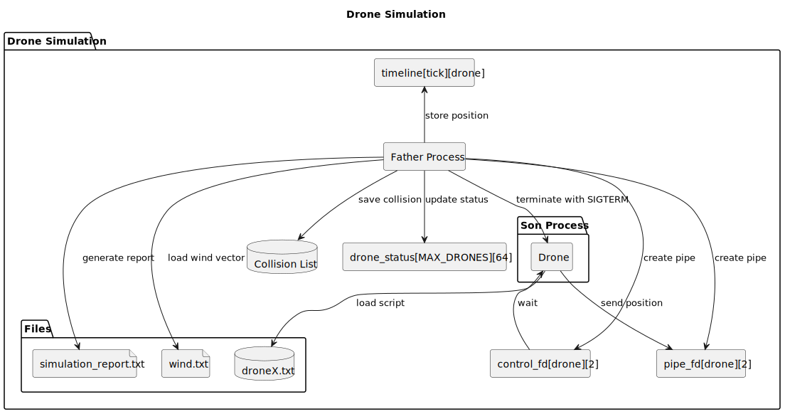

SCOMP - Sprint 2 Report
==============================
# 📦 Diagrama de Componentes da Solução

# Script de movimento exemplo

    .12 .20 .05 5
    .50 .76 .81 10
    .62 .17 .45 6
    .87 .44 .38 8
    .83 .02 .35 5
    .62 .35 .29 6
    .87 .84 .06 5
    .81 .27 .41 8
    .83 .89 .18 10
    .58 .49 .60 2

# Descrição da abordagem seguida em cada US

### US261. Initiate simulation for a figure

Esta parte do código inicia a simulação de uma figura composta por vários drones.
Cada drone é tratado como um processo separado e executa uma trajetória previamente definida.
O processo principal organiza a simulação em etapas de tempo (ticks), capta as posições dos drones, e armazena esses dados em uma matriz para uso posterior (como verificação de colisões e geração do relatório).
Isto é, o objetivo desta funcionalidade é permitir a simulação da movimentação coordenada dos drones antes da execução real da figura.

Optou-se por criar um script auxiliar que gera automaticamente 5 ficheiros .txt, simulando o movimento de 5 drones com posições aleatórias.

AC1 : O componente foi implementado em C com uso de processos, pipes e sinais.
Utiliza chamadas como fork(), pipe(), read(), write(), kill() e signal() para comunicação e controlo entre processos.

AC2 : O sistema cria um novo processo para cada drone da figura. Para cada drone (0 a 4) (pelos ficheiros de teste) , o processo principal executa um fork(). O processo filho resultante simula exclusivamente esse drone.
Esta acceptance criteria foi  implementada com o uso de fork() para a criação dos drones.

AC3 : Para cada drone é criado um pipe(). O drone escreve as suas posições no pipe. O processo principal lê os dados de todos os drones pelos respetivos pipes. 

AC4 : As posições são armazenadas numa matriz 2D: timeline[tick][drone_id]. 
Essa estrutura permite acompanhar facilmente o histórico da simulação por drone e por tick (unidade de tempo).
    
### US262. Capture and process drone movements 

- A simulação é dividida em dois grandes blocos:
  - **Drones (processos filhos)** — leem os seus movimentos de ficheiros `.txt` e enviam ao processo principal.
  - **Processo Principal (pai)** — recolhe os dados de todos os drones e processa as informações a cada tick.

- O uso de processos filhos + pipes simula a comunicação entre unidades autónomas (drones) e um centro de controlo (main).

- Optou-se por criar um simples script que gerasse 5 ficheiros `.txt` com valores aleatórios para os drones de forma a simular a movimentação dos mesmos.

- O funcionamento da US passa essencialmente pela comunicação entre processo pai (simulador) e processos filhos (drones), através de pipes.

- Para cada drone (de 0 a 4):
  - Cria um pipe (canal de comunicação) entre processo filho (drone) e pai (main).
  - Executa `fork()`:
    - Processo filho: executa a função `simulate_drone(i)`.
    - Processo pai: guarda o `pid`, e fecha o lado de escrita do pipe (só vai ler).

- Cada processo filho:
  - Abre o ficheiro `drone{id+1}.txt`, que contém as posições e velocidades do drone.
  - Lê linha a linha e envia essas posições para o processo principal via pipe.
  - Após cada envio, faz um `sleep(1)` para simular o passar do tempo.
  - Quando termina o ficheiro ou chega a `MAX_TICKS`, termina o processo (`exit(0)`).

- Para cada `tick` (0 a 9):
  - O processo pai espera uma mensagem de cada drone ativo (via `read()` do pipe).
  - Regista a posição lida na matriz `timeline[tick][drone_id]`.
  - Verifica colisões entre este drone e os anteriores no mesmo tick:
    - Se duas posições forem muito próximas, considera-se colisão.
  - Imprime a posição de cada drone e avisa se houve colisão.

- Depois de todos os ticks:
  - O processo pai espera que todos os drones terminem usando `waitpid()`.
  - Imprime “Simulation complete.”.

### US263. Detect drone collisions in real time

Esta funcionalidade consiste em detetar colisões de drones em tempo real durante a simulação. Para isso, as posições dos drones a cada tick são continuamente monitorizadas.

Consideramos a simulação como o processo pai e os drones como os processos filhos.

- A cada tick, o processo pai recebe as posições de todos os drones ativos.

- Com base nessas posições, compara todos os pares de drones, de forma a detetar se existem drones que ocupam a mesma posição (ou muito próxima).

- No caso de ser detetada uma colisão:

  - A colisão é registada na estrutura collision_list, com o tick, os IDs dos drones envolvidos e as respetivas coordenadas.

  - É exibida uma mensagem no terminal com os IDs dos drones que colidiram e a posição da colisão.

  - O processo pai envia um sinal SIGUSR1 aos processos filhos envolvidos.

  - O número total de colisões (collision_count) é incrementado.

- Cada processo filho tem um handler configurado para o sinal SIGUSR1.

  - Ao receber o sinal, bloqueia temporariamente os outros sinais, imprime uma mensagem a indicar que colidiu e termina imediatamente.

- Foi estabelecido um limite máximo de colsiões, COLLISION_LIMIT. 

  - Este serve para interromper a simulação no caso do número de colisões atingir esse valor. 
  
  - Nesse caso, o processo pai envia um sinal (SIGTERM) a todos os processos filhos que ainda se encontrem ativos.

  - Ao receberem o sinal, todos os drones terminam de forma segura.

  - Após isto, o processo pai termina a simulação.

### US264. Synchronize drone execution with a time step
Nesta user story implementou-se uma sincronização determinística entre o processo principal (pai) e os processos dos drones (filhos), garantindo que a simulação avança tick a tick e que nenhum drone se adianta no tempo.

- Para cumprir o critério de que a simulação deve progredir passo a passo, foi criado um pipe de controlo (control_fd) por drone. O processo principal escreve um byte neste pipe no início de cada tick.

- Cada drone fica bloqueado em read(control_fd[i][0]), aguardando este sinal de autorização. Só após o sinal é que o drone envia a posição correspondente ao tick atual.

- Isto garante que cada drone envia a sua posição apenas quando autorizado, satisfazendo o critério de que os drones devem enviar atualizações em intervalos definidos.

- O processo principal espera receber todas as posições do tick atual antes de continuar.
Só depois de receber as posições de todos os drones ativos, é que avança para o tick seguinte, cumprindo o critério de que todos os dados de um tick devem ser processados antes de continuar.

### US265. Generate a simulation report

  - Para cada tick , verifica se dois drones estão na mesma posição (colisão).

  - Quando ocorre uma colisão, atualiza o estado dos dois drones envolvidos para "Terminated after collision".

  - Regista a colisão na estrutura collision_list, guardando o ID do drone, o tick e a posição da colisão.

  - Se o número de colisões atingir COLLISION_LIMIT, interrompe a simulação.

  - Todos os drones ainda ativos com estado "Completed" são atualizados para "Terminated due to max collisions".

  - Após o fim da simulação, cria o ficheiro simulation_report.txt.

  - O relatório contém:

    - Número total de drones.

     - Estado final de cada drone.

     - Lista de colisões ocorridas (tick , ID e posição).

     - Validação da simulação: "PASSED" se não houver colisões, "FAILED" caso contrário.

### US266. Integrate environmental influences into simulation

Objetivo: Tornar a simulação mais realista ao simular o efeito do vento nos movimentos dos drones.

- Ao ser invocada a função get_wind_effect(tick):

  - Geradas pequenas variações nas posições. Isto representa o vento a afetar os drones.

- Cada drone irá ajustar a sua posição com base no vento e irá enviar as novas posições ao processo pai.

- Foi criado um ficheiro chamado wind.txt com informações sobre o vento.

  - Em caso de algum erro no ficheiro wind.txt: a simulação considera o vento nulo.

  - Nova posição = posição lida do ficheiro + efeito do vento

- O processo pai continua a funcionar como antes (funciona tal como sem esta implementação), mas agora utiliza as posições influenciadas pelo ambiente.

# Autoavaliação (0 – 100 %)

#### 1220849- Maria Pinho - 80
#### 1230540 Maria Branco - 80
#### 1230978 Afonso Sousa - 80
#### 1231500 Ricardo Silva - 85
#### 1221363 Davide Freitas - 75

