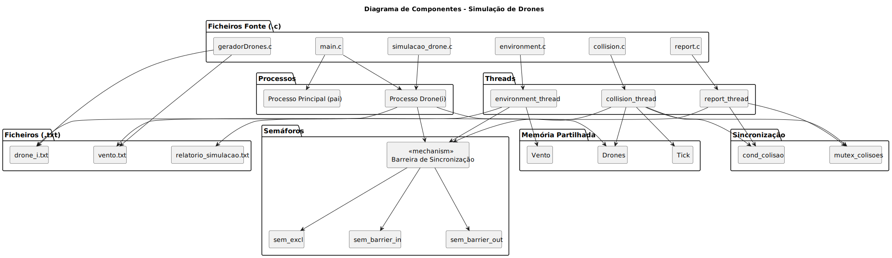

SCOMP - Sprint 3 Report
==============================
#  Diagrama de Componentes da Solução

# Script de movimento de um Drone
Este ficheiro descreve a trajetória de um drone ao longo do tempo na simulação.
 * A primeira linha indica a posição inicial do drone nas coordenadas x y z.
 * As linhas seguintes representam o deslocamento que o drone deverá aplicar a cada instante (tick) da simulação.

    5 1 2
    0 7 13
    6 2 4
    -2 0 9
    9 4 1
    -1 2 1

# Script do vento
Este ficheiro contém a influência do vento ao longo da simulação.
 * Cada linha corresponde ao vetor do vento (vx vy vz) aplicado globalmente a todos os drones num determinado tick.

    0 -2 0
    1 0 -3
    0 0 1
    1 1 -2
    0 -2 0

# Descrição da abordagem seguida em cada US

### US361. Initialize hybrid simulation environment with shared memory
 *  Criação do espaço de memória partilhada com shm_open, ftruncate e mmap.
 *  Definição da estrutura shared_memory contendo drones, tick e vento.
 *  Declaração e criação dos semáforos (sem_excl, sem_barrier_in, sem_barrier_out) com sem_open 
 *  Separação modular das funcionalidades por ficheiros fonte (.c), para maior organização.
 *  Criação de métodos auxiliares para gerar ficheiros de input (drone_i.txt, vento.txt).
 *  Lógica de posicionamento inicial e cálculo da posição atual dos drones ao longo da simulação.

### US362. Implement function-specific threads in the parent process

 * Criação das três threads principais:

    * collision_thread – deteta colisões entre drones.

    * report_thread – gera e escreve o relatório de simulação.

    * environment_thread – atualiza os vetores de vento.

    
### US363. Notify report thread via condition variables upon collision
 * Implementação de pthread_cond_t cond_colisao e pthread_mutex_t mutex_colisoes.

 * A collision_thread deteta uma colisão e notifica a report_thread via pthread_cond_signal.

 * A report_thread espera com pthread_cond_wait até receber uma notificação para escrever o evento no relatório.

### US364. Enforce step-by-step simulation synchronization
 * Implementação de uma barreira com semáforos (sem_barrier_in, sem_barrier_out).

 * Todos os participantes (drones + threads) chamam a função barreira() em cada tick.

 * O contador assegura que todos chegaram à barreira antes de continuar.

 * Garante execução sincronizada por ciclos (ticks).

### US365. Generate and store final simulation report
 * A report_thread escreve continuamente para o ficheiro relatorio_simulacao.txt.

 * Registo das colisões: inclui tick, IDs dos drones e coordenadas da colisão.

 * Escrita protegida por mutex_colisoes para evitar condições de corrida.

 * O relatório é gerado em tempo real e finalizado corretamente no fim da simulação.

### US366. Integrate environmental influences into simulation
 *  Criação do ficheiro vento.txt com os vetores de vento para cada tick.

 * A environment_thread lê os valores do ficheiro e atualiza a secção de vento na memória partilhada.

 * Os valores de vento influenciam o movimento dos drones, tornando a simulação mais realista.

 * O vetor de vento é aplicado a cada tick, sincronizado com a barreira.

# Autoavaliação (0 – 100 %)

#### 1220849 Maria Pinho - 85%
#### 1230540 Maria Branco - 75%
#### 1230978 Afonso Sousa - 75% 
#### 1231500 Ricardo Silva - 70%
#### 1221363 Davide Freitas - 70%