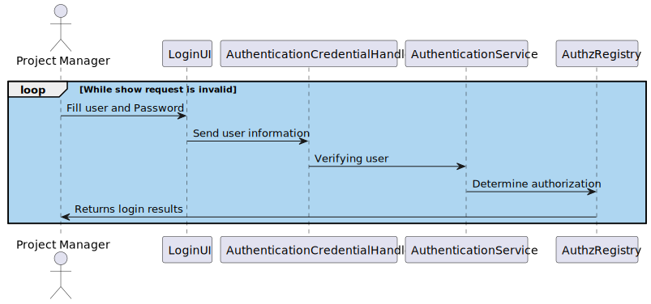

US210 - Authentication and authorization
==============================
---
# Analysis

---

## Business Rules

    - This use case handles the Authentication and authorization of all users at the beginning of the program.
    - All users must be authenticated before accessing any protected resource.
    - Users must have the correct role to access specific features or perform certain actions.

## Acceptance Criteria

    -Users must be able to log in with a valid username and password.
    -Unauthorized users must be denied access to protected features.
    -Logged-in users must only see the features they are authorized to access (based on roles).
    -After login, the user context must remain active until explicit logout or session timeout.

# Design

---

## Domain
 - AuthenticationCredentialHandler
 - AuthenticationService
 - AuthzRegistry

## UI 

---

    @Override
	protected boolean doShow() {
		var attempt = 1;
		while (attempt <= maxAttempts) {
			final String userName = Console.readNonEmptyLine("Username:", "Please provide a username");
			final String password = Console.readLine("Password:");

			if (credentialHandler.authenticated(userName, password, onlyWithThis)) {
				return true;
			}
			System.out.printf("Wrong username or password. You have %d attempts left.%n%n»»»»»»»»»%n",
					maxAttempts - attempt);
			attempt++;
		}
		System.out.println("Sorry, we are unable to authenticate you. Please contact your system admnistrator.");
		return false;
	}

## Sequence Diagram

---

