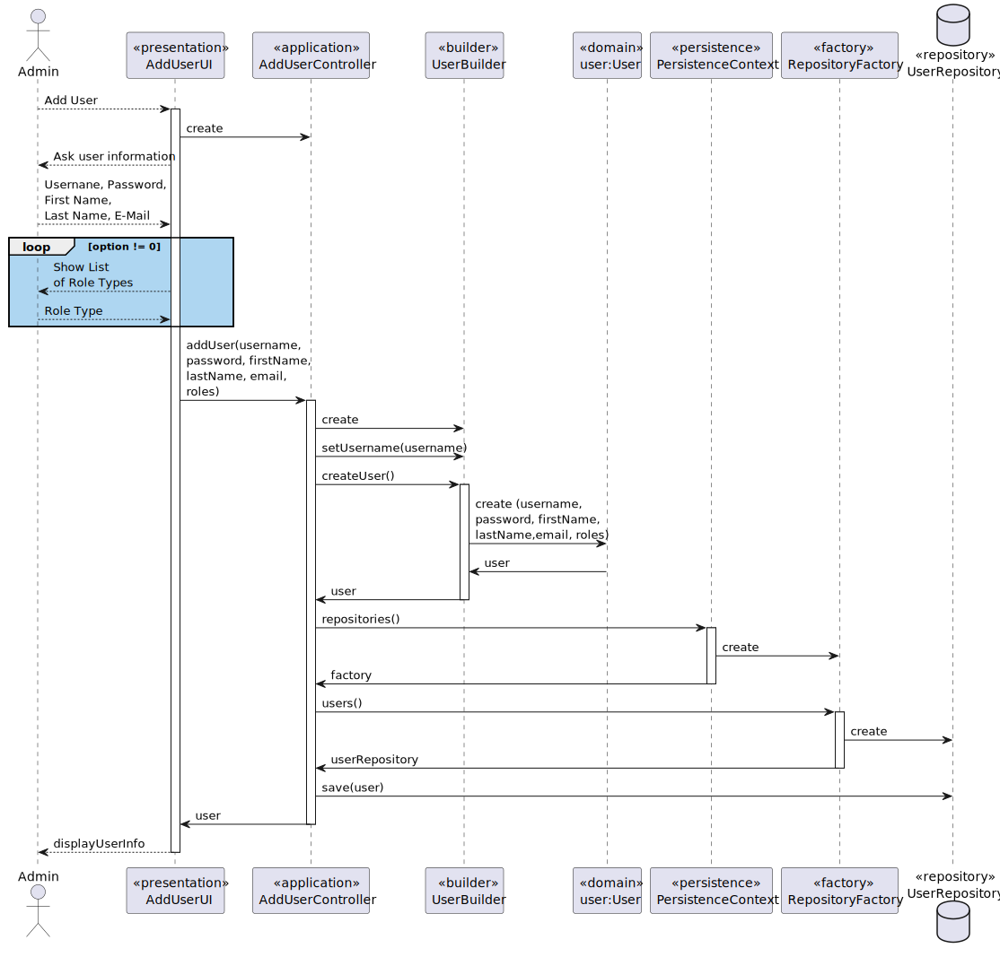

US211 Register users
==============================
---
# Analysis

---

## Business Rules

    - Only an Admin can register Users.
    - The system must validate all fields.
    - The user email must have the domain @showdrone.com.
    - Usernames must be unique and follow the allowed character format (no spaces).

## Acceptance Criteria

    - Admin is authenticated and authorized to register users.
    - User is stored in the system upon successful registration.

# Design

---

## Domain
 
    public class ShodroneUser implements AggregateRoot<PhoneNumber> {

    private static final long serialVersionUID = 1L;

    @Version
    private Long version;

    @EmbeddedId
    private PhoneNumber phoneNumber;

    @OneToOne(optional = false)
    private SystemUser systemUser;

## UI 

---

     @Override
    protected boolean doShow() {
        // FIXME avoid duplication with SignUpUI. reuse UserDataWidget from
        // UtenteApp
        final String username = promptUsername();
        final String password = promptPassword();
        final String firstName = promptName("First Name");
        final String lastName = promptName("Last Name");
        final String email = promptEmail();
        final String phone = promptPhone();
        System.out.println("\nChoose a Role for the new user:");
        final Set<Role> roleTypes = new HashSet<>();
        boolean show;
        do {
            show = showRoles(roleTypes);
        } while (!show);

        try {
            final SystemUser systemUser = theController.addUser(username, password, firstName, lastName, email, roleTypes);
            assert systemUser != null;

            final var phoneNumber = new PhoneNumber(phone);
            final var shodroneUser = new ShodroneUser(systemUser, phoneNumber);
            PersistenceContext.repositories().shodroneUsers().save(shodroneUser);
        } catch (@SuppressWarnings("unused") final IntegrityViolationException e) {
            System.out.println("That username is already in use.");
        }

        return false;
    }

## Application

    public class AddUserController {

    public SystemUser addUser(final String username, final String password, final String firstName,
                              final String lastName,
                              final String email, final Set<Role> roles, final Calendar createdOn) {
        authz.ensureAuthenticatedUserHasAnyOf(Roles.ADMIN);

        return userSvc.registerNewUser(username, password, firstName, lastName, email, roles,
                createdOn);
    }

## Sequence Diagram

---

