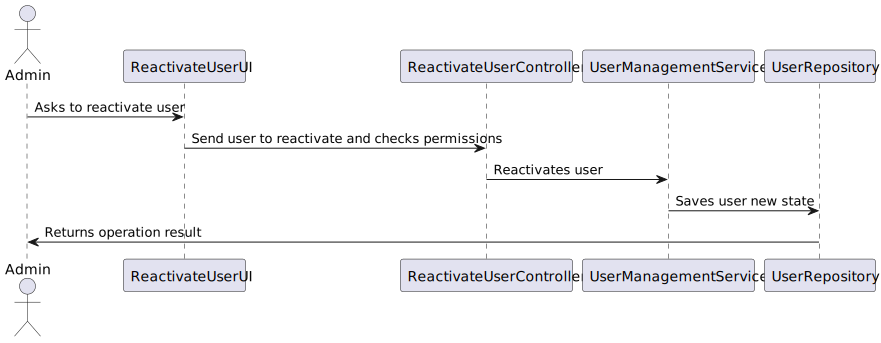

US212 Disable/enable users
==============================
---
# Analysis

---

## Business Rules

    - Only an Admin is allowed to enable or disable system users.
    - The action can only be applied to existing users.
   
## Acceptance Criteria

    - Admin is authenticated and authorized to manage user status.    
    - Admin can view a list of users and their current status (active/inactive).
    - Admin can choose to disable or enable a user.
    - Once disabled, the user can no longer log into the system.

# Design

---

## Domain
 
    public class SystemUser implements AggregateRoot<Username>, DTOable<GeneralDTO>, Visitable<GeneralDTO>, Serializable {
    private static final long serialVersionUID = 1L;
    @Version
    private Long version;
    @EmbeddedId
    private Username username;
    private Password password;
    private Name name;
    @Column(
        unique = true
    )
    private EmailAddress email;
    @OneToOne(
        cascade = {CascadeType.ALL},
        optional = false,
        fetch = FetchType.EAGER
    )
    private RoleSet roles;
    @Temporal(TemporalType.DATE)
    private Calendar createdOn;
    private boolean active;

## UI 

---
    @Override
    protected boolean doShow() {
    final List<SystemUser> list = new ArrayList<>();
    final Iterable<SystemUser> iterable = this.theController.activeUsers();
    if (!iterable.iterator().hasNext()) {
    System.out.println("There is no registered User");
    } else {
    var cont = 1;
    System.out.println("SELECT User to deactivate\n");
    // TODO use select widget, see, ChangeDishTypeUI
    System.out.printf("%-6s%-10s%-30s%-30s%n", "Nº:", "Username", "Firstname", "Lastname");
    for (final SystemUser user : iterable) {
    list.add(user);
    System.out.printf("%-6d%-10s%-30s%-30s%n", cont, user.username(),
    user.name().firstName(),
    user.name().lastName());
    cont++;
    }
    final var option = Console.readInteger("Enter user nº to deactivate or 0 to finish ");
    if (option == 0) {
    System.out.println("No user selected");
    } else {
    try {
    this.theController.deactivateUser(list.get(option - 1));
    } catch (@SuppressWarnings("unused") final ConcurrencyException ex) {
    System.out
    .println(
    "WARNING: That entity has already been changed or deleted since you last read it");
    }
    }
    }
    return true;
    }

     @Override
    protected boolean doShow() {
        final List<SystemUser> list = new ArrayList<>();
        final Iterable<SystemUser> iterable = controller.inactiveUsers();

        if (!iterable.iterator().hasNext()) {
            System.out.println("There are no inactive users.");
        } else {
            int cont = 1;
            System.out.println("SELECT User to reactivate\n");
            System.out.printf("%-6s%-10s%-30s%-30s%n", "Nº:", "Username", "Firstname", "Lastname");

            for (final SystemUser user : iterable) {
                list.add(user);
                System.out.printf("%-6d%-10s%-30s%-30s%n", cont, user.username(),
                        user.name().firstName(), user.name().lastName());
                cont++;
            }

            final int option = Console.readInteger("Enter user nº to reactivate or 0 to cancel ");
            if (option == 0) {
                System.out.println("No user selected.");
            } else {
                controller.activateUser(list.get(option - 1));
                System.out.println("User successfully reactivated.");
            }
        }
        return true;
    }

## Application

    public class DeactivateUserController {

    private final AuthorizationService authz = AuthzRegistry.authorizationService();
    private final UserManagementService userSvc = AuthzRegistry.userService();

    public Iterable<SystemUser> activeUsers() {
        authz.ensureAuthenticatedUserHasAnyOf(Roles.ADMIN);

        return userSvc.activeUsers();
    }

    public void deactivateUser(final SystemUser user) {
        authz.ensureAuthenticatedUserHasAnyOf(Roles.ADMIN);

        userSvc.deactivateUser(user);
    }
    }

    @UseCaseController
    public class ReactivateUserController {
    
        private final AuthorizationService authz = AuthzRegistry.authorizationService();
        private final UserManagementService userSvc = AuthzRegistry.userService();
    
        public Iterable<SystemUser> inactiveUsers() {
            authz.ensureAuthenticatedUserHasAnyOf(Roles.ADMIN);
            return userSvc.deactivatedUsers();
        }
    
        public void activateUser(final SystemUser user) {
            authz.ensureAuthenticatedUserHasAnyOf(Roles.ADMIN);
            userSvc.activateUser(user);
        }
    }

## Sequence Diagram

---

