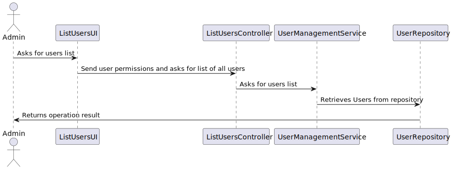

US213 List users
==============================
---
# Analysis

---

## Business Rules

    - Only an Admin is authorized to list system users.
    - The list must include all existing users, regardless of their active/inactive status.
   
## Acceptance Criteria

    - Admin is authenticated and authorized to access user information.
    - Admin can retrieve and view a complete list of registered users.
    - Each user entry in the list shows key information, including account status.

# Design

---

## Domain
 
    public class SystemUser implements AggregateRoot<Username>, DTOable<GeneralDTO>, Visitable<GeneralDTO>, Serializable {
    private static final long serialVersionUID = 1L;
    @Version
    private Long version;
    @EmbeddedId
    private Username username;
    private Password password;
    private Name name;
    @Column(
        unique = true
    )
    private EmailAddress email;
    @OneToOne(
        cascade = {CascadeType.ALL},
        optional = false,
        fetch = FetchType.EAGER
    )
    private RoleSet roles;
    @Temporal(TemporalType.DATE)
    private Calendar createdOn;
    private boolean active;

## UI 

---
    public class ListUsersUI extends AbstractListUI<SystemUser> {
    private final ListUsersController theController = new ListUsersController();

    @Override
    public String headline() {
        return "List Users";
    }

    @Override
    protected String emptyMessage() {
        return "No data.";
    }

    @Override
    protected Iterable<SystemUser> elements() {
        return theController.allUsers();
    }

    @Override
    protected Visitor<SystemUser> elementPrinter() {
        return new SystemUserPrinter();
    }

    @Override
    protected String elementName() {
        return "User";
    }

    @Override
    protected String listHeader() {
        return String.format(
                "%-16s%-26s%-24s%-34s%-12s%-18s",
                "USERNAME", "F. NAME", "L. NAME", "EMAIL", "STATUS", "PHONE"
        );
    }

     

## Application

    @UseCaseController
    public class ListUsersController {

    private final AuthorizationService authz = AuthzRegistry.authorizationService();
    private final UserManagementService userSvc = AuthzRegistry.userService();

    public Iterable<SystemUser> allUsers() {
        authz.ensureAuthenticatedUserHasAnyOf(Roles.ADMIN);

        return userSvc.allUsers();
    }

    public Optional<SystemUser> find(final Username u) {
        return userSvc.userOfIdentity(u);
    }
}

## Sequence Diagram

---

