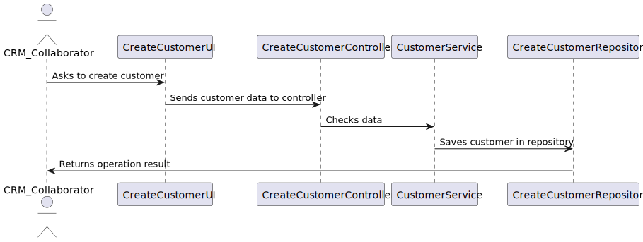

US220 Register customer 
==============================
---
# Analysis

---

## Business Rules

    - Only CRM Collaborators are authorized to register customers.
    - Each customer must have a unique VAT number.
   
## Acceptance Criteria

    - The system validates that the VAT number does not already exist.
    - The system allows selecting one user as representative.
    - Once confirmed, the customer is persisted to the repository.

# Design

---

## Domain
 
    public class Customer implements AggregateRoot<Long>, Serializable {
    @Id
    @GeneratedValue(strategy = GenerationType.IDENTITY)
    private Long id;
    private static final long serialVersionUID = 1L;

    private VatNumber vatNumber;

    @Column(nullable = false)
    private String companyName;

    private CustomerStatus status;

    private CustomerPriority priority;

    // NOVO ATRIBUTO
    @ManyToMany(fetch = FetchType.LAZY)
    @JoinTable(name = "T_CUSTOMER_REPRESENTATIVES",
            joinColumns = @JoinColumn(name = "customer_vat"),
            inverseJoinColumns = @JoinColumn(name = "user_username"))
    private Set<SystemUser> representatives = new HashSet<>();

## UI 

---
    @Override
    protected boolean doShow() {
        try {
            VatNumber vat = askVatNumber();
            String company = askCompanyName();
            CustomerStatus status = askStatus();
            if (status == null) return false;

            CustomerPriority priority = askPriority();
            if (priority == null) return false;

            Set<SystemUser> representatives = selectRepresentatives();
            if (representatives == null) return false;

            controller.addCustomer(vat, company, status, priority, representatives);
            System.out.println("Customer successfully registered.");
            
            return true;

        } catch (Exception e) {
            System.out.println("An unexpected error occurred: " + e.getMessage());
            e.printStackTrace(); // ou logar se tiver logger
            return false;
        }
    }

## Application

    public class CreateCustomerController {
    private final AuthorizationService authz;
    private final CustomerService service;
    public CreateCustomerController(final AuthorizationService authz, final CustomerRepository repo) {
    this.authz = authz;
    this.service = new CustomerService(repo);
    }
    public void addCustomer(final VatNumber vatNumber, final String companyName, final CustomerStatus status,
    final CustomerPriority priority, final Set<SystemUser> representatives) {
    authz.ensureAuthenticatedUserHasAnyOf(Roles.CRM_COLLABORATOR);
    service.registerCustomer(vatNumber,companyName,status,priority,representatives);
    }
    public Iterable<Customer> allUsers() {
    authz.ensureAuthenticatedUserHasAnyOf(Roles.CRM_COLLABORATOR);
    
            return service.allUsers();
        }
    }

## Sequence Diagram

---

