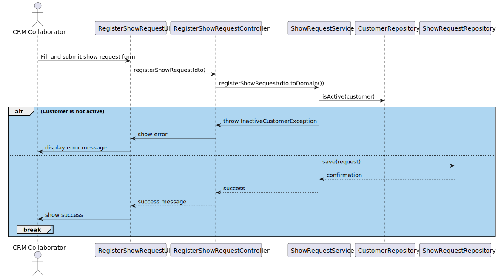

US230 – Show Request
==============================
---
# Analysis

---

## Business Rules

    - This use case handles the creation of a new Show Request by a CRM Collaborator, involving customers, figures, and exclusivity preferences.
    It is the entry point for new business from clients.

## Acceptance Criteria

    -Only CRM Collaborators can register a show request.
    -A show request can only be submitted for active customers.
    -VIP customers are prioritized over Regular customers.
    -If the customer does not exist in the system, it must be registered first (by a CRM Manager).
    -Custom figure requests trigger a design assignment by a CRM Manager.

# Design

---

## Domain

Entity: ShowRequestCategory

   

Interface: ShowRequestRepository

    

Domain Service: ShowRequestService

  

## Application

---

Controller: ShowRequestController

    

## UI (CLI/Backoffice)

---

    Menu Option: "Register new Show Request"
    Form Inputs:
    Customer (selected from active list)
    Location
    Date/Time
    Duration
    Tentative number of drones
    Description (upload or text)
    Figure selection: catalog and/or new custom figures

    Exclusivity flags
    -Error Messages:
    "Customer must be active"
    "Required fields missing"   
    "Show request creation failed"

## Testing

---

Unit Tests

    -Create show request with valid data 
    -Create request for inactive customer 
    -Missing mandatory field (e.g., duration) 
    -Include both catalog and custom figures 
    -Register show with exclusivity for VIP 
    -Repository Test
    - Validate persistence with in-memory DB

## Sequence Diagram

---

