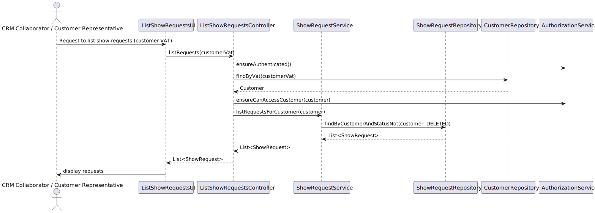

US235 – List Show Requests of Client
==============================
---
# Analysis

    -The CRM team and customers need to access a list of all show requests submitted by a specific client. This functionality enables the CRM Collaborator to manage follow-ups and show progression, while ensuring transparency for VIP or priority clients. 
    Customers should only see their own requests. Filters and sorting by date/status may be helpful.
---

## Business Rules

    -Only CRM Collaborators, CRM Managers, and the Client's Authorized Representatives can view show requests.
    -A client can only see their own show requests.
    -Show requests are linked to a valid, active customer.
    -Requests in status "Deleted" must not be displayed.
    -VIP customers should be able to see their prioritized show requests first (optional sorting).
    -CRM users can see requests from all clients.

## Acceptance Criteria

    -A CRM Collaborator or Manager can retrieve all show requests from any active client.
    -A Customer Representative can only view requests related to their organization.
    -The list must exclude requests marked as "Deleted".
    -The list can be filtered by request status (e.g., Pending, Validated, In Production).
    -The list can be sorted by request date (descending by default).
    -Appropriate error messages are shown if no requests are found or access is denied.

# Design

---

## Domain

Entity: ShowRequestCategory

Interface: ShowRequestRepository

Domain Service: ShowRequestService

## Application

---

Controller: ListShowRequestsController

## UI (CLI/Backoffice)

---

    - Command in the menu: "List client show requests"
    - Input: Customer VAT or pre-filled (if logged in as client)
    - Output: Paginated or tabular display of requests
    - Sorting: Default by most recent; optional by status/date
    - Filtering: Optional filter by status
    - Error messages shown for duplicate entries.

## Testing

---

Unit Tests

    -Customer with no requests 
    -Customer with several requests 
    -Inactive customer 
    -Non-authorized user 
    -Repository Test
    -Validate persistence with in-memory DB

## Sequence Diagram

---

