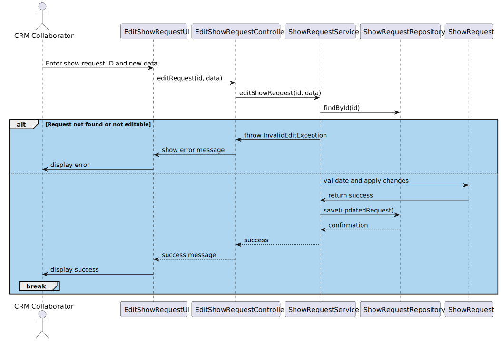

US236 – Edit a show request
==============================
---
# Analysis
    -A CRM Collaborator should be able to edit show requests that have not yet been accepted or canceled. Only editable fields may be changed.
    -This functionality ensures request details remain accurate before entering production.
---

## Business Rules

    -Only CRM Collaborators can edit show requests.
    -Only show requests in "Created" or "Pending" state can be edited.
    -Editable fields include:
    Place
    Time
    Tentative number of drones
    Duration
    Show Keyword (document)

    Exclusivity requirements
    -All modifications must be logged in the request history.
    -Customer must be "Active" for the edit to be allowed.

## Acceptance Criteria

    -A show request can be updated if it is in the proper state and the customer is active.
    -Attempting to edit a non-editable request results in an error.
    -History is updated with each successful edit.
    -Changes are persisted and reflected when listing the request.

# Design

---

## Domain

Entity: ShowRequest

   

Interface: ShowRequestRepository

    

Domain Service: ShowRequestService

  

## Application

---

Controller: EditShowRequestController

    

## UI (CLI/Backoffice)

---

    -Option in menu: "Edit Show Request"
    -Fields shown for update: place, time, number of drones, duration, exclusivity, show Keyword
    -Error messages shown when editing non-editable requests or if customer is inactive

## Testing

---

Unit Tests

    -Edit valid show request
    -Edit canceled or accepted request 
    -Edit for inactive customer
    -Ensure all changes are persisted
    -Repository Test
    - Validate persistence with in-memory DB

## Sequence Diagram

---

