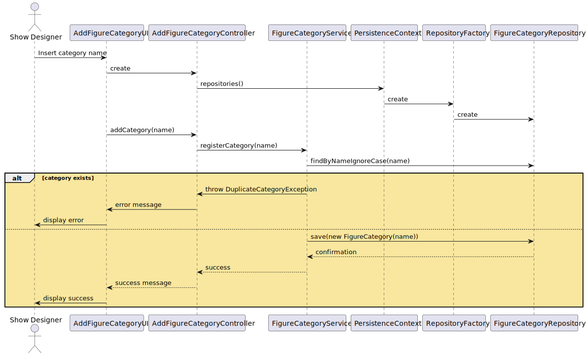

US245 – Add Figure Category
==============================
---
# Analysis

---

## Business Rules

    - The category name is mandatory and must be unique, ignoring case sensitivity.
    - Only users with the Show Designer role are allowed to add a new category.
    - A newly created category must be active by default.

## Acceptance Criteria

    - A category is successfully added if the provided name does not exist, ignoring case.
    - If a category with the same name (case-insensitive match) already exists, an error message is shown.
    - The category must be available to be assigned to new figures.

# Design

---

## Domain

Entity: FigureCategory

    - Represents a figure category with a unique identifier, name, and active/inactive state.
    - Main methods:
        - `deactivate()`: Deactivates the category.
        - `activate()`: Activates the category.
        - `rename(String newName)`: Renames the category.
        - `sameAs(Object other)`: Compares two categories ignoring case sensitivity.

Repository: FigureCategoryRepository

    - Main methods:
        - `findByNameIgnoreCase(String name)`: Finds a category by name, ignoring case.
        - `findMaxId()`: Returns the highest existing ID.
        - `findByActive()`: Returns all active categories.

Domain Service: FigureCategoryService

    - Main methods:
        - `registerCategory(String name)`: Registers a new category.
        - `editCategory(String oldName, String newName)`: Edits the name of an existing category.
        - `listAllCategories()`: Lists all categories.
        - `toggleCategoryActivation(String oldName)`: Activates or deactivates a category.

Identifier: FigureCategoryID

    - Represents the unique identifier of a category.
    - Main methods:
        - `valueOf(Integer id)`: Creates a new identifier.
        - `toInteger()`: Returns the integer value of the identifier.

## Application

---

Controller: AddFigureCategoryController

    - Responsible for adding a new figure category.
    - Ensures the user has the required role before performing the operation.

## User Interface (CLI/Backoffice)

---

    - Menu command: "Add new figure category".
    - Input: Single field for the category name.
    - Error messages displayed for duplicate entries.

## Testing

---

Unit Tests

    - Add a new unique category → Success.
    - Add a category with an already existing name (case-insensitive) → Fail with error message.
    - Verify the category is created as active by default.
    - Test activation/deactivation of a category.
    - Test renaming a category.

## Sequence Diagram

---

## Domain-Driven Design (DDD)

---

