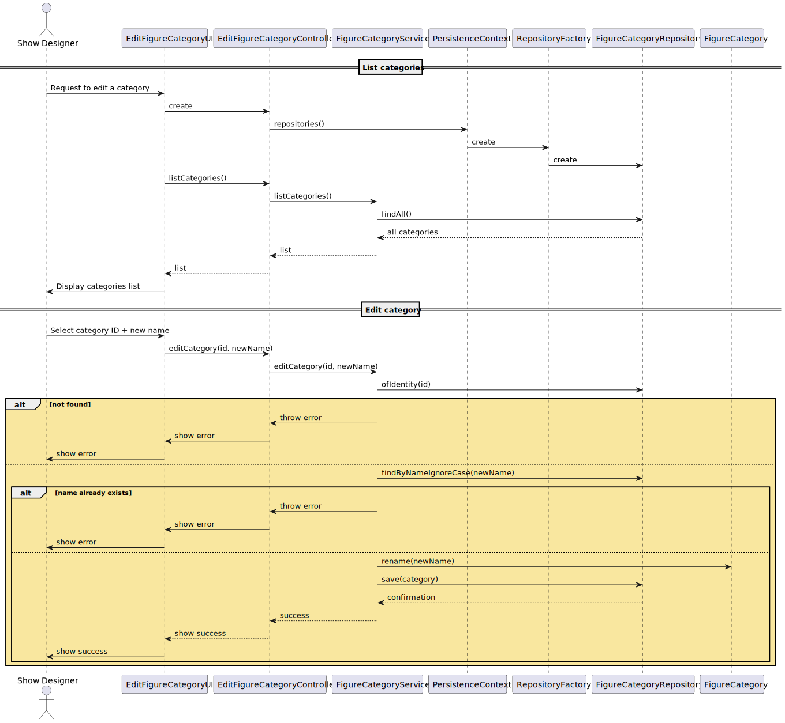
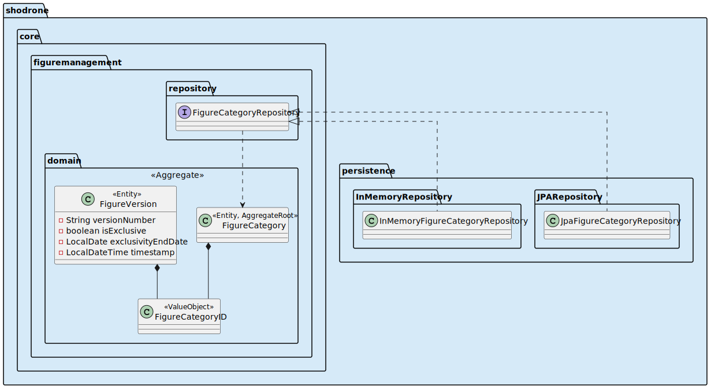

US246 – Edit Figure Category
==============================
---
# Analysis

---

## Business Rules

    - Only users with the Show Designer role are allowed to edit a figure category.
    - Active and Inactive categories may be edited. 

## Acceptance Criteria

    - A category is updated successfully if it exists and the new name is unique (case-insensitive).
    - If the new name already exists (case-insensitive match) → error message.
    - If the category does not exist → error message.
    - If the new name is blank → error message.

# Design

---

## Domain

Entity: FigureCategory

    public void rename(String newName) {
    if (newName == null || newName.trim().isEmpty())
        throw new IllegalArgumentException("New name cannot be empty.");
    this.name = newName.trim();
    }

Interface: FigureCategoryRepository

    Optional<FigureCategory> findByNameIgnoreCase(String name);
    Integer findMaxId();

Domain Service: FigureManagementService

    public void editCategory(String oldName, String newName) {
    final FigureCategory category = categoryRepository.findByNameIgnoreCase(oldName)
        .orElseThrow(() -> new IllegalArgumentException("Category not found"));

    if (categoryRepository.findByNameIgnoreCase(newName)
            .filter(c -> !c.identity().equals(category.identity())).isPresent()) {
        throw new IllegalArgumentException("A category with this name already exists.");
    }

    category.rename(newName);
    categoryRepository.save(category);
}

## Application

---

Controller: EditFigureCategoryController

    public void editCategory(String oldName, String newName) {
    authz.ensureAuthenticatedUserHasAnyOf(Roles.SHOW_DESIGNER, Roles.ADMIN);
    service.editCategory(oldName, newName);
    }
    
    public Iterable<FigureCategory> listAllCategories() {
    authz.ensureAuthenticatedUserHasAnyOf(Roles.SHOW_DESIGNER, Roles.ADMIN);
    return service.listAllCategories();
    }

## UI (CLI/Backoffice)

---

    - Command in the menu: "Edit figure category"
    - Shows all existing categories with ID and status.
    - Prompts user to enter the ID of the category to edit or the new name.
    - Displays success or error messages accordingly.

## Testing

---

Unit Tests

    - Edit active category with valid new name → Success
    - Edit with existing name (case-insensitive) → Fail
    - Edit with blank name → Fail
    - Edit non-existent category → Fail

## Sequence Diagram

---

## Domain-Driven Design (DDD)

---

