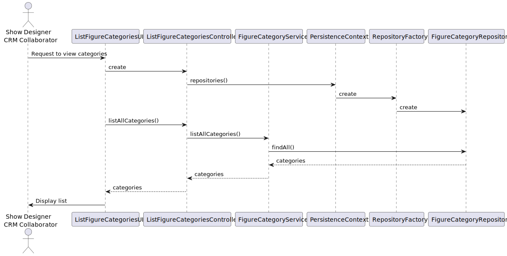
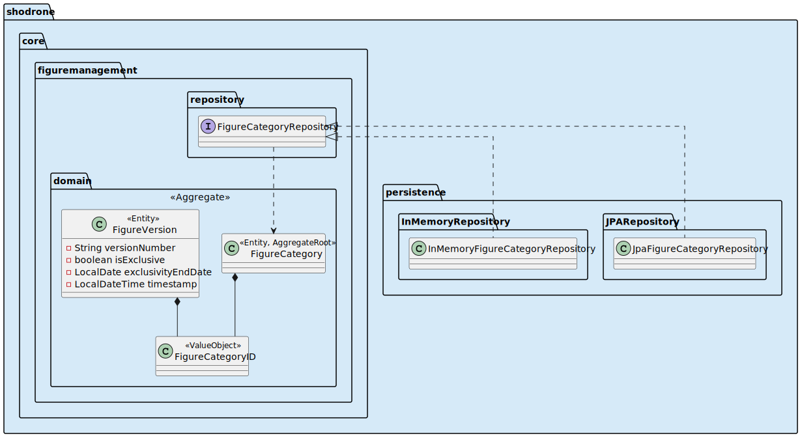

US247 – List Figure Categories
==============================
---
# Analysis

---

## Business Rules

    - Both users with roles Show Designer and CRM Collaborator can view the figure category catalogue.
    - The system must present: The category name and the status (Active or Inactive).
    - All categories must be visible (no filtering).

## Acceptance Criteria

    - The list includes all categories.
    - Each category shows: Name and status (Active/Inactive)
    - No filtering is applied.
    - The list is shown without errors.
    - Access is limited to allowed roles.

# Design

---

## Domain

Entity: FigureCategory

    public String name() { return name; }
    public boolean isActive() { return active; }

Interface: FigureCategoryRepository

    Iterable<FigureCategory> findAll();

Domain Service: FigureManagementService

    public Iterable<FigureCategory> listAllCategories() {
    return categoryRepository.findAll();
    }

## Application

---

Controller: ListFigureCategoriesController

    public class ListFigureCategoriesController {
    private final AuthorizationService authz;
    private final FigureCategoryService service;

    private static final Set<Role> ALLOWED_ROLES = Set.of(Roles.SHOW_DESIGNER, Roles.CRM_COLLABORATOR);

    public ListFigureCategoriesController(AuthorizationService authz, FigureCategoryRepository repo) {
        this.authz = authz;
        this.service = new FigureCategoryService(repo);
    }

    public Iterable<FigureCategory> listAllCategories() {
        authz.ensureAuthenticatedUserHasAnyOf(ALLOWED_ROLES);
        return service.listAllCategories();
    }
}

## UI (CLI/Backoffice)

---

    - Command in menu: "List Figure Categories"
    - Output: ID, Name and Status (Active/Inactive)
    - Error message if repository fails or user lacks permissions.

## Testing

---

Unit Tests

    - User with allowed role → categories listed
    - User without role → access denied
    - Repository returns list → correctly formatted output
    - Empty repository → handled gracefully (e.g., “No categories found.”)

## Sequence Diagram

---

## Domain-Driven Design (DDD)

---

