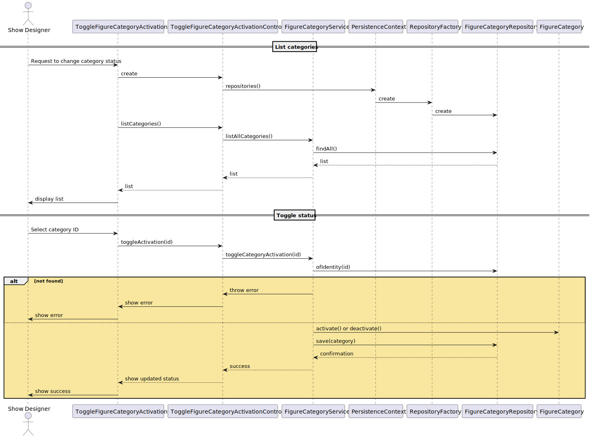

US248 – Activate/Deactivate Figure Category
==============================
---
# Analysis

---

## Business Rules

    - Only users with the role Show Designer can activate or deactivate a category.
    - Activating a category allows it to be used in new figures.
    - Deactivating a category prevents it from being used in new figures.
    - A category's active state can be toggled at any time.
    - The status change must be persisted.

## Acceptance Criteria

    - A user can activate or deactivate an existing category.
    - If the category does not exist → error.
    - If the status is already the requested one → no change, optionally notify.
    - A deactivated category cannot be assigned to new figures (enforced in figure creation).

# Design

---

## Domain

Entity: FigureCategory

    public void activate() {
    this.active = true;
    }

    public void deactivate() {
    this.active = false;
    }

Interface: FigureCategoryRepository

    Optional<FigureCategory> ofIdentity(Long id);

Domain Service: FigureManagementService

    public FigureCategory toggleCategoryActivation(Long id) {
    final FigureCategory category = categoryRepository.ofIdentity(id)
        .orElseThrow(() -> new IllegalArgumentException("Category not found."));

    if (category.isActive()) {
        category.deactivate();
    } else {
        category.activate();
    }

    return categoryRepository.save(category);
    }
    

## Application

---

Controller: ToggleFigureCategoryController

    public class ToggleFigureCategoryController {
    private final AuthorizationService authz;
    private final FigureCategoryService service;

    public ToggleFigureCategoryController(AuthorizationService authz, FigureCategoryRepository repo) {
        this.authz = authz;
        this.service = new FigureCategoryService(repo);
    }

    public FigureCategory toggleActivation(String name) {
        authz.ensureAuthenticatedUserHasAnyOf(Roles.SHOW_DESIGNER, Roles.ADMIN);
        return service.toggleCategoryActivation(name);
    }

    public Iterable<FigureCategory> listAllCategories() {
        authz.ensureAuthenticatedUserHasAnyOf(Roles.SHOW_DESIGNER, Roles.ADMIN);
        return service.listAllCategories();
    }
}

## UI (CLI/Backoffice)

---

    - Command in menu: "Activate/Deactivate Category"
    - Lists all categories with ID and status.
    - User selects one to toggle.
    - Output: updated status.

## Testing

---

Unit Tests

    - Toggle active → becomes inactive
    - Toggle inactive → becomes active
    - Toggle non-existing category → error
    - Toggle without permission → error

## Sequence Diagram

---

## Domain-Driven Design (DDD)

---

