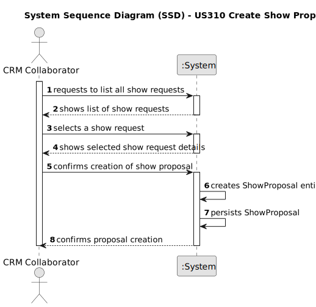

# US 310 Create Show Proposal

## 1. Requirements Engineering

### 1.1. User Story Description
  As CRM Collaborator I want to start the process for creating a show proposal so that we can reply to the customer. 
  
  The show proposal includes the total number of drones to be used in the show. Currently, all figures in a show must use all drones.
  
  The show proposal must follow a predefined template.

### 1.2. Customer Specifications and Clarifications 

**From the specifications document:**

  Whenever new figures have to be created, the CRM Manager assigns each request to a Show Designer that, based on the show request, designs the new figures and add them to the system. The CRM Collaborator is then able to generate a show proposal with the figures the customer desires. If the customer accepts the proposal, the CRM Collaborator updates the status of the request and the
  proposal, and it goes into production.

**From the client clarifications:**
      
Pergunta:
      
      Boa tarde,
      Já que nao existe status para o show request é correto assumir que o show proposal será creado apartir da informaçao presente no show request com alteraçães, ou não, do CRM Collaborator.
      Outra duvida, era se o show proposal teria, ao contrario do show request, status?
      Cumprimentos.

Resposta:

      Boa tarde,
      Concordo que a Show Proposal poderá ter estado.
      Cumprimentos,
      Angelo Martins

Pergunta:

      Boa noite,
      Queria apenas validar uma solução que estamos a ter.
      Só é permitido criar uma show proposal se já existe um show request em sistema?

Resposta:

      Boa tarde,
      Uma show proposal resulta de um show request. Acho que está mais do que claro no documento dos requisitos.
      Só uma nota: não se fazem perguntas ao cliente "só para confirmar". Está-se a fazer o cliente perder tempo.
      Cumprimentos,
      Angelo Martins

### 1.3. Acceptance Criteria

 * The system must list all available show requests.

 * The CRM collaborator must be able to select a show request from the list.

 * Upon selection, a show proposal must be created.

 * The system must display a success message after the proposal is created.

 * If no show requests are available, the system must notify the user accordingly.

### 1.4. Found out Dependencies

  * Dependencies on user story 230 Show request

### 1.5 Input and Output Data

**Input Data:**

 * Number corresponding to the selected show request

**Output Data:**

 * Display of available show requests in the console.

 * Confirmation message indicating successful creation of the show proposal.

### 1.6. System Sequence Diagram (SSD)

