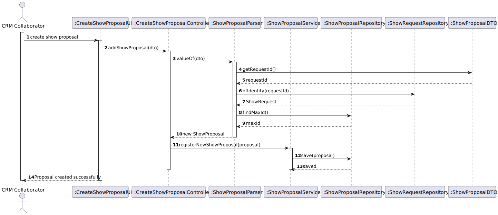
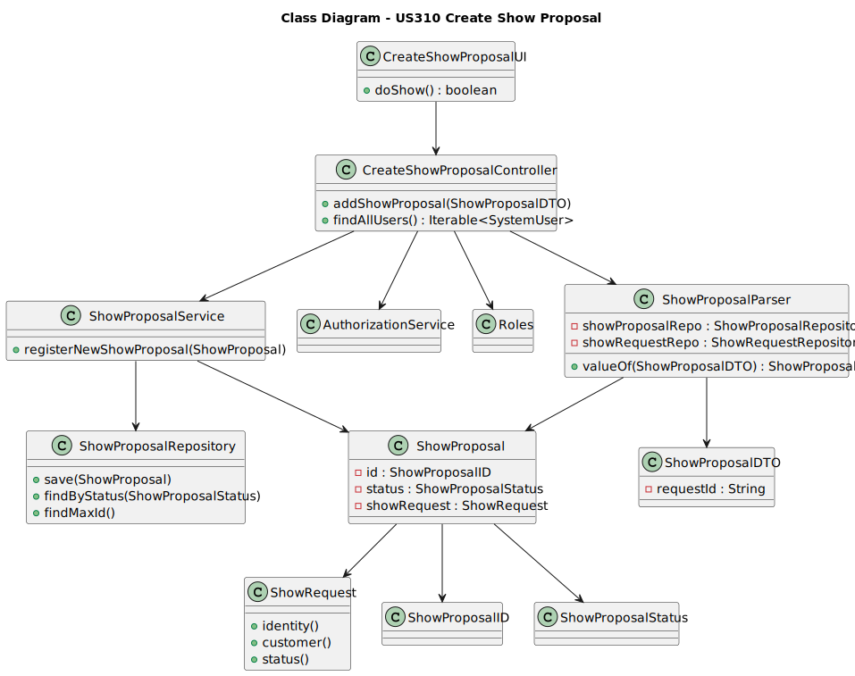

# US 310 Create Show Proposal

## 3. Design - User Story Realization

### 3.1. Rationale

| Interaction ID | Question: Which class is responsible for...                  | Answer                         | Justification (with patterns)                                                                                    |
|----------------| ------------------------------------------------------------ | ------------------------------ |------------------------------------------------------------------------------------------------------------------|
| Step 1         | ... interacting with the actor?                              | `CreateShowProposalUI`         | **Pure Fabrication**: Created to handle user input and display output.                                           |
| Step 2         | ... coordinating the application logic?                      | `CreateShowProposalController` | **Controller**: Coordinates the request, invokes business logic and separates concerns from UI and domain logic. |
| Step 3         | ... implementing the core logic to register a show proposal? | `ShowProposalService`          | **Information Expert**: Knows how to handle business logic .                                                     |
| Step 4         | ... persisting the new show proposal?                        | `ShowProposalRepository`       | **Repository**: Provides access to persistent storage for `ShowProposal` entities.                               |
| Step 5         | ... showing success to the user?                             | `CreateShowProposalUI`         | **Pure Fabrication** : Responsible for interacting with the user and showing output based on controller results. |

### Systematization ##

According to the taken rationale, the conceptual classes promoted to software classes are:
* ShowProposal

Other software classes (i.e. Pure Fabrication) identified:
* CreateShowProposalUI
* CreateShowProposalController
* ShowProposalService
* ShowProposalRepository

### 3.2. SOLID Principles Applied

 * S – Single Responsibility,each class has a clear role:

    * UI handles user interaction,

    * Controller coordinates the flow,

    * Service contains business logic,

 * O – Open/Closed
    * The system allows adding new rules  without changing existing classes.

 * L – Liskov Substitution
    * Repositories follow interface contracts and can be replaced without breaking functionality.

 * I – Interface Segregation
    * Interfaces expose only the necessary methods, keeping them focused.

* D – Dependency Inversion
    * Classes depend on abstractions not concrete implementations.

## 3.3. Sequence Diagram (SD)

## 3.4. Class Diagram (CD)

