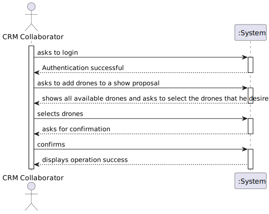

# US311 - Add Drones to a Proposal

## 1. Requirements Engineering

### 1.1. User Story Description

**As a CRM Collaborator, I want to configure the list of drone models (number of drones and model) of a show proposal.**

### 1.2. Customer Specifications and Clarifications

**From the specifications document:**

- The CRM Collaborator is responsible for selecting which drone models (and how many) are included in a show proposal.
- The number of drones of each model must not exceed the number of active drones of that type in Shodrone’s inventory.

**From the client clarifications:**

> **Question:**
Boa tarde,
Uma maneira de configurar a lista de drones num proposal seria, por exemplo, pedir ao utilizador o modelo do drone e em seguida pedir o número de drones para esse mesmo modelo, continuando assim para todos os modelos que ele quiser. Acha correto?
Cumprimentos,
Grupo 41.

>
>**Answer:**
Boa tarde,
Pode ser. Tenha em atenção que "the number of drones of a given type in a proposal cannot exceed the total number of active drones of that type in the inventory."
Cumprimentos,
Angelo Martins

> **Question:**
Boa tarde,
Queria confirmar algo, para não estar a assumir erradamente, sobre uma relação entre a US310 e a US311.
Na US310, é referido que um número total de drones será incluído no show proposal, e que todas as figuras irão utilizar esses drones. Assim, ao configurar a lista de modelos de drones num show proposal, devo ter em atenção que a soma do número de drones de cada modelo não deve ultrapassar o número total de drones associado ao show proposal, correto?
Cumprimentos,
Grupo 41.

>
>**Answer:**
Boa tarde,
Claro...
Cumprimentos,
Angelo Martins

### 1.3. Business Rules

- Only active drones can be considered when checking availability. **(Document specification)**
- The number of drones added for a given model must not exceed the number of active drones of that model in the inventory. **(Client clarifications)**
- Only CRM Collaborators are allowed to perform this action. **(Document specification)**

---

### 1.4. Acceptance Criteria

- The CRM Collaborator is able to:
 - View drone models and respective number of active drones in inventory.
 - Assign a valid number of drones of each model to a specific proposal.
 - Receive an error when the requested quantity exceeds the available active drones.
 - Changes are saved successfully to the proposal if validation passes.

---

### 1.5. Found Out Dependencies

- Dependency on **US210 - Authentication and Authorization**, to ensure only authenticated CRM Collaborators can perform the action.
- Dependency on **Show Proposal domain model** and its lifecycle.
- Dependency on **Drone Inventory**, particularly access to active drones by model.

---

### 1.6. Input and Output Data

**Input Data:**

- Proposal ID
- List of drone models and desired quantities
- CRM Collaborator credentials (authorization)

**Output Data:**

- Updated list of drone models and quantities associated with the proposal
- Validation error if quantities exceed availability

---

### 1.7. System Sequence Diagram (SSD)

System Sequence Diagram

> Other alternatives might exist.

---

### 1.8. Other Relevant Remarks

- There is no need to verify scheduling conflicts or check drone availability on a specific date.
- Drone selection is abstract and quantity-based—specific drones are not selected.

