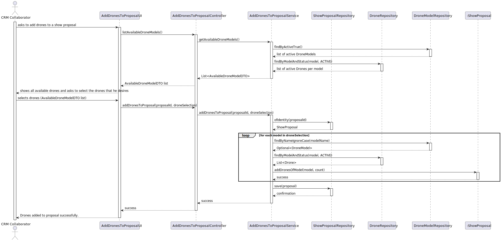
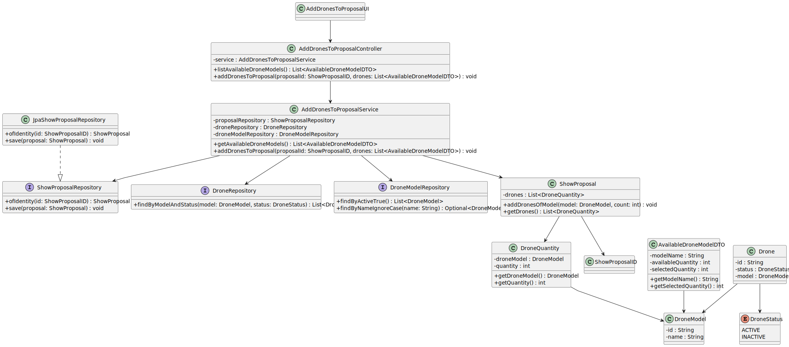

# US311 - Add Drones to a Proposal

## 3. Design

### 3.1. Rationale

| Step | Question: Which class is responsible for...                                  | Answer                            | Justification (with patterns)                                                                                   |
| :--- | :--------------------------------------------------------------------------- | :-------------------------------- | :-------------------------------------------------------------------------------------------------------------- |
| 1    | ... interacting with the actor?                                              | AddDronesToProposalUI             | **Pure Fabrication**: created solely to interact with the user (CRM Collaborator).                             |
| 2    | ... coordinating the drone selection and confirmation flow?                 | AddDronesToProposalController     | **Controller**: coordinates the flow, receives input from UI and delegates to service.                         |
| 3    | ... encapsulating the business logic of adding drones?                      | AddDronesToProposalService        | **Controller + Creator**: implements business rules, and calls domain and persistence layers.                 |
| 4    | ... retrieving and persisting proposal data?                                 | JpaShowProposalRepository         | **Pure Fabrication**: abstracts data access and persistence.                                                   |
| 5    | ... encapsulating the list of drones and validating addition?                | ShowProposal                      | **Information Expert (IE)**: owns the drone data and ensures consistency.                                      |
| 6    | ... representing the drone type and quantity added to the proposal?          | DroneQuantity                     | **IE**: value object that encapsulates both the drone model and quantity.                                      |
| 7    | ... providing available drones for selection?                                | DroneInventoryService             | **IE / External System**: provides available drones, separate from internal domain.                           |
| 8    | ... displaying available drones and result back to the user?                 | AddDronesToProposalUI             | **IE**: user interface is responsible for rendering drone options and showing final outcome to the user.      |

---

### Systematization

The following conceptual classes were promoted to software classes:

- `ShowProposal`
- `DroneQuantity`
- `DroneModel`
- `ShowProposalID`

Other software classes (Pure Fabrication or infrastructure):

- `AddDronesToProposalUI`
- `AddDronesToProposalController`
- `AddDronesToProposalService`
- `JpaShowProposalRepository`
- `DroneInventoryService`

---

## 3.2. Sequence Diagram (SD)

### Full Diagram

This diagram shows the full sequence of interactions between the classes involved in the realization of this user story.

---

## 3.3. Class Diagram (CD)

