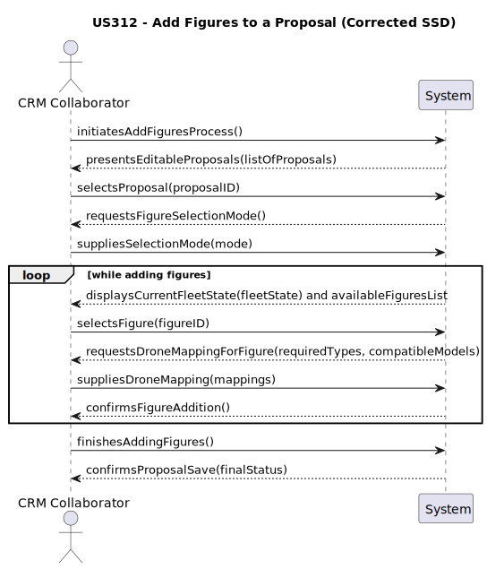

US312 – Add figures to a proposal
==============================
---
# Business Rules

    -   A proposta deve estar num estado que permita a sua edição (ex: `CREATED`).
    -   A lista de figuras disponíveis para seleção deve conter apenas figuras com estado **ativo**.
    -   É possível adicionar a mesma `Figure` mais do que uma vez, mas **nunca em duas posições consecutivas**.
    -   Cada tipo de drone (`DroneType`) especificado nos requisitos da figura deve ser mapeado para um modelo de drone (`DroneModel`) que:
        1.  Exista na frota pré-definida da proposta.
        2.  Seja compatível com o `DroneType` requerido.
    -   Validação de Quantidade: O sistema deve validar que existem drones em quantidade suficiente do `DroneModel` escolhido na frota da proposta para executar a figura.

---
# Acceptance Criteria 

Perguntas ao Cliente:

> É possível adicionar a mesma Figure mais do que uma vez numa proposta?
> 
> Resposta: Sim, desde que não estejam em posições consecutivas.

> O sistema deve impedir automaticamente duas Figures repetidas lado a lado?
>
> Resposta: Sim, é uma regra obrigatória.
  
> E se o CRM quiser que duas Figures iguais apareçam lado a lado?
>
> Resposta: Terá de intercalar com outra figure.
    
> Cada Figure tem tipos de drones. Estes têm de ser compatíveis com os modelos definidos na proposta?
>
> Resposta: Sim, deve ser feita uma associação explícita.

> O sistema deve validar estas associações automaticamente?
> 
> Resposta: Sim.

Critérios de aceitação:

    -   O sistema deve validar e impedir a adição de uma figura numa posição imediatamente a seguir a uma instância da mesma figura.
    -   O sistema deve obrigar o utilizador a criar um mapeamento explícito entre os tipos de drone requeridos pela figura e os modelos de drone disponíveis na proposta.
    -   O sistema deve validar que o modelo de drone selecionado para o mapeamento tem **quantidade disponível suficiente** na frota da proposta.
    -   A lista de figuras disponíveis para seleção deve conter apenas figuras ativas.

Justificação: Estas regras foram validadas com base nas respostas fornecidas acima.

---
#  SSD – System Sequence Diagram

---
# Design

O design segue o padrão MVC:

- A `UI` recolhe os dados do utilizador (figura, posição, mapeamentos).
- O `Controller` valida o estado da proposta, consulta repositórios e orquestra o serviço.
- O `Service` (`AddFiguresToProposalService`) aplica as regras de negócio e invoca o método `addFigureToShow(...)` no agregado `ShowProposal`.

|   Componente   |        Classe(s) na US312         |                                                              Responsabilidade                                                               |
|:--------------:|:---------------------------------:|:-------------------------------------------------------------------------------------------------------------------------------------------:|
|   **Model**    |  `ShowProposal`, `FigureVersion`  | Contém as entidades, agregados e a lógica de domínio. ShowProposal é responsável por validar e aplicar as alterações ao seu estado interno. |
|    **View**    |      `AddFigureToProposalUI`      |                  Interage com o utilizador: apresenta dados, recolhe seleções (proposta, figura) e o mapeamento de drones.                  |
| **Controller** |  `AddFigureToProposalController`  |           Recebe pedidos da UI, coordena o acesso a repositórios e serviços, e prepara os dados para serem apresentados na View.            |
|  **Service**   |   `AddFiguresToProposalService`   |                 Orquestra a execução da regra de negócio, invocando os objetos de domínio para garantir a sua consistência.                 |
|    **DTO**     |       `DroneTypeMappingDTO`       |         Transfere os dados do mapeamento de drones (um Map<String, String>) entre a UI e o Controller/Service de forma encapsulada.         |

---
#  SD – Service Description

Porque usar o DroneTypeMappingDTO?

Na US312, o DroneTypeMappingDTO é utilizado para transportar um conjunto específico de dados: o mapeamento entre os nomes dos tipos de drone e os nomes dos modelos de drone (Map<String, String>).

Vantagens:

    Encapsulamento: Agrupa o mapa de mapeamentos, tornando as assinaturas dos métodos no Controller e no Service mais limpas, em vez de passar um Map<String, String> diretamente.
    Intenção Clara: O nome da classe, DroneTypeMappingDTO, comunica claramente o propósito dos dados que estão a ser transferidos, melhorando a legibilidade do código.
    Flexibilidade Futura: Se no futuro o mapeamento necessitar de dados adicionais (ex: um comentário), apenas a classe DTO precisa de ser alterada, sem impactar as assinaturas dos métodos existentes.

Ao contrário do que foi descrito, o DTO atual não agrupa o ID da proposta, da figura ou a posição; esses são passados como parâmetros separados. O DTO serve exclusivamente para o transporte dos mapeamentos.

---

#  Princípios SOLID aplicados

- **S – Single Responsibility**  
  Cada classe tem uma responsabilidade clara: UI recolhe input, Controller orquestra, Service aplica lógica.

- **O – Open/Closed**  
  O `ProposalFigureService` permite validar novas regras (ex: limite máximo de figures por show) sem alteração da classe base.

- **L – Liskov Substitution**  
  Repositórios e serviços respeitam contratos de interfaces, como `FigureRepository` e `ShowProposalRepository`.

- **I – Interface Segregation**  
  Os repositórios e serviços expõem apenas os métodos necessários.

- **D – Dependency Inversion**  
  A lógica de negócio no AddFiguresToProposalController e AddFiguresToProposalService depende de abstrações (interfaces) 
- como ShowProposalRepository e FigureRepository, e não das suas implementações concretas (ex: JpaShowProposalRepository). 
- Isto permite trocar a tecnologia de persistência sem alterar a lógica da aplicação.

---

# Domain-Driven Design (DDD)

## Tests

A entidade `ShowProposal` foi testada com cobertura sobre criação, estados e identidade.

### Casos testados:

| Categoria                    | Verificação                                                                         |
|------------------------------|-------------------------------------------------------------------------------------|
| Criação válida               | O espetáculo é criado com sucesso com todos os parâmetros válidos.                  |
| Validação de estado          | O método `updateStatus` altera corretamente o estado; valores nulos lançam exceção. |
| Identidade                   | O método `sameAs()` devolve `true` para instâncias com o mesmo `ShowProposalID`.    |
| Representação textual        | O método `toString()` inclui ID, estado e referência ao pedido associado.           |
| Argumentos nulos             | Construtor lança exceção se `ShowProposalID` ou `ShowRequest` forem nulos.          |

### Ferramentas de teste:
- `JUnit 5` (`org.junit.jupiter.api`)
- Uso de mocks (`Mockito`) para `SystemUser` e `CustomerRepresentative`.

### Objetivo dos testes:
Confirmar que a classe `ShowProposal` cumpre os invariantes e restrições de negócio exigidas pela US312,
permitindo gerar propostas válidas, com estados controlados, e seguras para envio ao cliente final.
