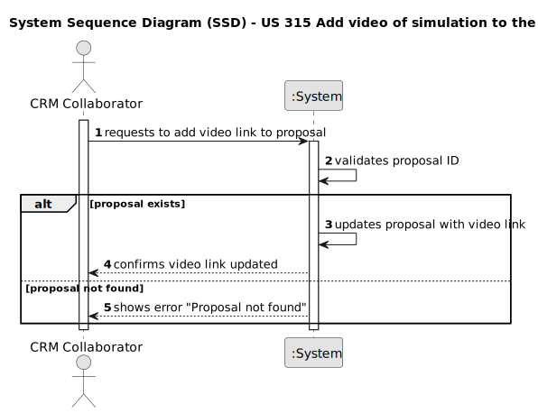

# US 315 Add video of simulation to the proposal

## 1. Requirements Engineering

### 1.1. User Story Description
As CRM Collaborator, I want to add a video of the simulated show so the customer can have a preview
of the show.

### 1.2. Customer Specifications and Clarifications 

**From the specifications document:**

In the scope of LAPR4, the team does not need to actually generate the video and can use any suitable video
file.

**From the client clarifications:**
      
Pergunta:
      
        Segundo a US315, o objetivo é adicionar um vídeo à proposta.
        Citando a nota de rodapé: "6 In the scope of LAPR4, the team does not need 
        to actually generate the video and can use any suitable video file. " -> 
        para confirmar, será efetivamente um ficheiro de vídeo, ou é suficiente um 
        link para um vídeo? Assumindo que terá de ser efetivamente um ficheiro de 
        vídeo, qual é o limite de tamanho desejado?

Resposta:

        Boa tarde,
        É um link...
        Cumprimentos,
        Angelo Martins

### 1.3. Acceptance Criteria

Not yet defined.

### 1.4. Found out Dependencies

  * Dependencies on user story 310 Create Show Proposal

### 1.5 Input and Output Data

**Input Data:**

    

**Output Data:**

### 1.6. System Sequence Diagram (SSD)

