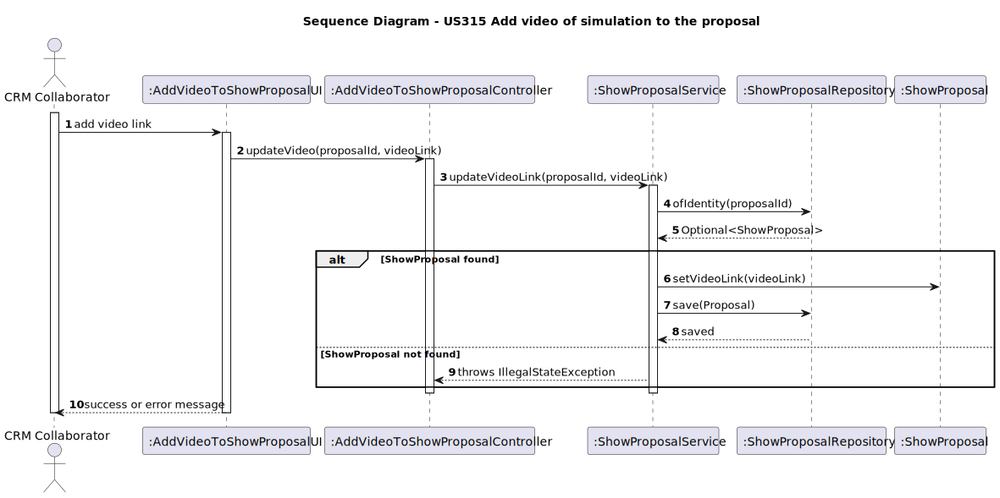
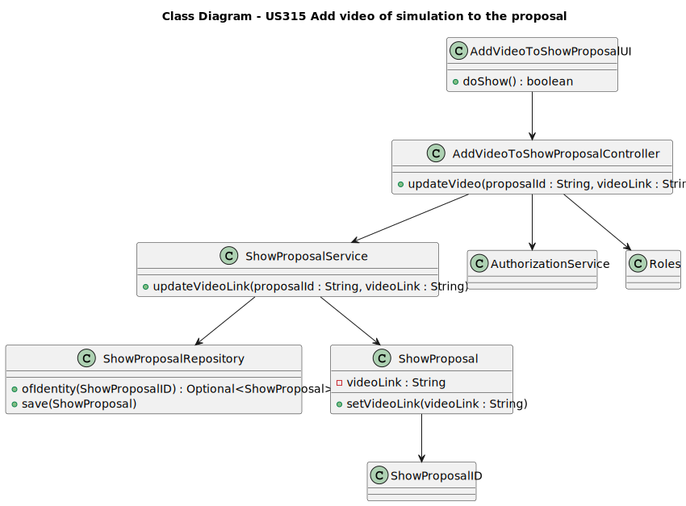

# US 315 Add video of simulation to the proposal

## 3. Design - User Story Realization

### 3.1. Rationale

| Interaction ID | Question: Which class is responsible for...                      | Answer                             | Justification (with patterns)                                                    |
| -------------- | ---------------------------------------------------------------- | ---------------------------------- | -------------------------------------------------------------------------------- |
| Step 1         | ... interacting with the actor?                                  | `AddVideoToShowProposalUI`         | **Pure Fabrication**: Handles user input/output, separated from domain logic.    |
| Step 2         | ... coordinating the application logic?                          | `AddVideoToShowProposalController` | **Controller**: Manages the flow between UI and domain/service logic.            |
| Step 3         | ... verifying and updating the ShowProposal with the video link? | `ShowProposalService`              | **Information Expert**: Knows how to retrieve and update a `ShowProposal`.       |
| Step 4         | ... fetching the existing proposal and persisting the update?    | `ShowProposalRepository`           | **Repository**: Manages the persistence layer for `ShowProposal` entities.       |
| Step 5         | ... displaying success or error messages to the user?            | `AddVideoToShowProposalUI`         | **Pure Fabrication**: Responsible for user feedback based on controller outcome. |

### Systematization ##

According to the rationale, the conceptual classes promoted to software classes are:

 * ShowProposal

Other software classes (i.e. Pure Fabrication) identified:

 * AddVideoToShowProposalUI

 * AddVideoToShowProposalController

 * ShowProposalService

 * ShowProposalRepository

### 3.2. SOLID Principles Applied

* S – Single Responsibility,each class has a clear role:

    * UI handles user interaction,

    * Controller coordinates the flow,

    * Service contains business logic,

* O – Open/Closed
    * The system allows adding new rules  without changing existing classes.

* L – Liskov Substitution
    * Repositories follow interface contracts and can be replaced without breaking functionality.

* I – Interface Segregation
    * Interfaces expose only the necessary methods, keeping them focused.

* D – Dependency Inversion
    * Classes depend on abstractions not concrete implementations.

## 3.3. Sequence Diagram (SD)

## 3.4. Class Diagram (CD)

