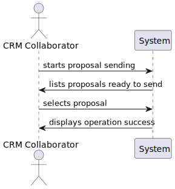
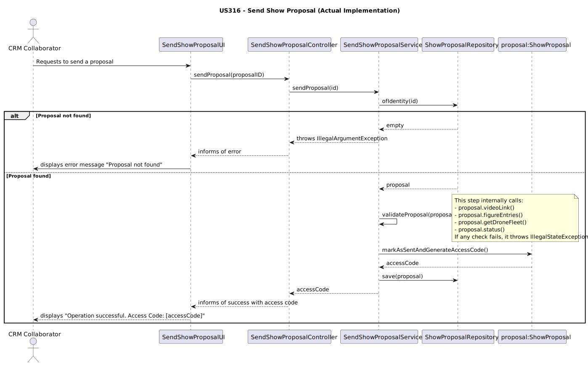
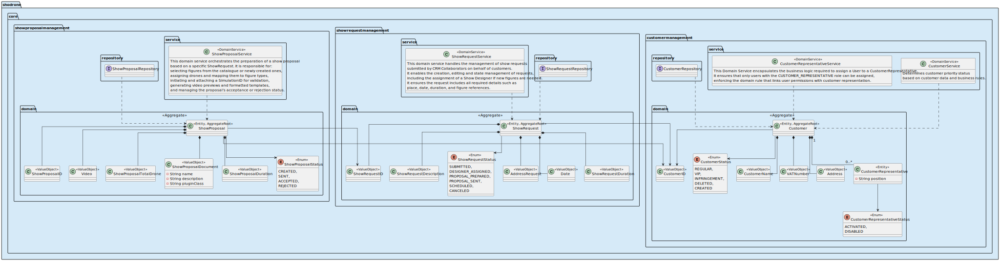

US316 – Send Show Proposal to the Customer
==============================
---
## Business Rules

- Uma proposta só pode ser marcada como "enviada" se o seu estado atual for READY_TO_SEND.
- Para que uma proposta seja considerada pronta para envio, ela deve conter um link de vídeo de simulação válido, pelo menos uma figura, e uma frota de drones definida.
- Quando uma proposta é enviada, o seu estado é alterado para SENT e um código de acesso único é gerado para o cliente.
- O sistema não gera nem envia um ficheiro físico; a "entrega" é feita através da disponibilização do código de acesso.

---

## Acceptance Criteria

**Perguntas ao Cliente:**

> Como o cliente acede à proposta depois de enviada?
>
>Resposta: O cliente recebe um código de acesso. Com esse código, ele poderá consultar os detalhes da proposta numa aplicação dedicada (Customer App).

> A proposta pode ser enviada antes da simulação?
> 
>Resposta: Não, é obrigatório que a simulação do espetáculo tenha sido validada com sucesso.

> É necessário validar o formato do documento da proposta?
>
>Resposta: Sim, o sistema deve garantir que o plugin usado para gerar a proposta está registado e válido.

Critérios de aceitação:

    - O sistema valida se a proposta está num estado permitido para envio.
    - O sistema verifica se o espectáculo da proposta foi testado com sucesso.
    - O documento da proposta é gerado com base num template previamente registado.
    - O link do vídeo é incluído automaticamente no documento.
    - A proposta é enviada via `CustomerAppServer` ao cliente.

Justificação: Estas regras foram validadas com base nas respostas fornecidas acima.

---

## SSD – System Sequence Diagram

---

## Design

A funcionalidade segue o padrão MVC, com as seguintes responsabilidades:

| Componente     | Classe(s)                    | Responsabilidade                                                                                                                                                                |
|----------------|------------------------------|---------------------------------------------------------------------------------------------------------------------------------------------------------------------------------|
| **Model**      | `ShowProposal`               | Aggregate Root que encapsula o estado e a lógica de negócio, como a alteração do seu próprio estado e a geração do código de acesso.                                            |
| **View**       | `SendShowProposalUI`         | Interface que permite ao utilizador selecionar uma proposta e iniciar o processo de envio.                                                                                      |
| **Controller** | `SendShowProposalController` | Recebe o pedido da UI e invoca o serviço de aplicação correspondente, tratando as respostas (sucesso ou erro) e comunicando-as de volta à UI.                                   |
| **Service**    | `SendShowProposalService`    | Orquestra o caso de uso: carrega a entidade ShowProposal do repositório, realiza as validações e invoca o método de negócio na entidade para alterar o estado e gerar o código. |

---

## SD – Service Description

---

## SOLID Principles

- **S – Single Responsibility:**  
  Cada classe tem uma responsabilidade bem definida. O SendShowProposalService orquestra o caso de uso, enquanto a entidade ShowProposal contém a lógica de negócio central (mudar de estado e gerar o código).

- **O – Open/Closed:**  
  O design é aberto a extensões. Por exemplo, se no futuro for necessário notificar outros sistemas, poder-se-ia adicionar um publicador de eventos de domínio sem alterar o SendShowProposalService.

- **L – Liskov Substitution:**  
  O design depende de abstrações como o ShowProposalRepository, permitindo que diferentes implementações de persistência sejam usadas sem quebrar o serviço.

- **I – Interface Segregation:**  
  As interfaces são focadas. O repositório expõe apenas os métodos necessários para a persistência, e o serviço expõe apenas o método sendProposal.

- **D – Dependency Inversion:**  
  O serviço de aplicação depende de abstrações (o repositório), não de implementações concretas, o que promove o baixo acoplamento.

---

## Domain-Driven Design (DDD)

- Aggregate Root: ShowProposal é o Aggregate Root, garantindo a consistência das suas informações internas e controlando todas as alterações de estado.
- Application Service: SendShowProposalService atua como um serviço de aplicação.
Ele não contém lógica de negócio; a sua função é coordenar a execução do caso de uso, carregando o agregado e chamando os seus métodos.
- Repository: ShowProposalRepository abstrai a camada de persistência, permitindo que o serviço de aplicação se concentre na orquestração sem se preocupar com os detalhes de armazenamento de dados.

---

## Tests

A entidade `ShowProposal` foi testada com cobertura sobre criação, estados e identidade.

### Casos testados:

| Categoria                    | Verificação                                                                         |
|------------------------------|-------------------------------------------------------------------------------------|
| Criação válida               | O espetáculo é criado com sucesso com todos os parâmetros válidos.                  |
| Validação de estado          | O método `updateStatus` altera corretamente o estado; valores nulos lançam exceção. |
| Identidade                   | O método `sameAs()` devolve `true` para instâncias com o mesmo `ShowProposalID`.    |
| Representação textual        | O método `toString()` inclui ID, estado e referência ao pedido associado.           |
| Argumentos nulos             | Construtor lança exceção se `ShowProposalID` ou `ShowRequest` forem nulos.          |

### Ferramentas de teste:
- `JUnit 5` (`org.junit.jupiter.api`)
- Uso de mocks (`Mockito`) para `SystemUser` e `CustomerRepresentative`.

### Objetivo dos testes:
Confirmar que a classe `ShowProposal` cumpre os invariantes e restrições de negócio exigidas pela US316,
permitindo gerar propostas válidas, com estados controlados, e seguras para envio ao cliente final.
