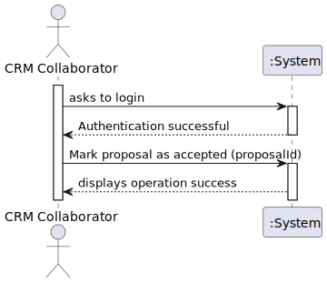

# US317 - Mark Show Proposal as accepted

## 1. Requirements Engineering

### 1.1. User Story Description

**As CRM Collaborator, I want to mark the proposal as accepted by the customer after it has been accepted by a Customer Representative in the Customer App.**

### 1.2. Customer Specifications and Clarifications

**From the specifications document:**

- The CRM Collaborator wants to mark a proposal as accepted when it has been confirmed by the representative

**From the client clarifications:**

> **Question:**
Boa tarde,
Gostaria de obter, se possível, alguns esclarecimentos:
 US317 Mark show proposal as accepted
O acceptance email é um email gerado automaticamente assim que o cliente aceita a proposta no Customer App?
 US316 Send show proposal to the customer
Quando se refere a enviar a proposta ao cliente, significa: Ficar disponível na aplicação do cliente ou enviar um email?
Cumprimentos
>
>**Answer:**
Bom dia,
Aceitar é na App. Não há email. 
Tem de ficar disponível na App, como é possível ver na figura 3. Se quiserem também enviar um email ao cliente há um problema: para quem o enviam? Para todos os Customer Representatives?
Princípio KISS. Sempre KISS... não inventem!
Cumprimentos,
Angelo Martins

> **Question:**
Olá novamente,
Ainda em relação à US317, o cliente indica que não há email mas, no enunciado diz:
As CRM Collaborator, I want to mark the proposal as accepted by the customer by attaching the customer’s acceptance email.
Assim sendo não é necessário esta parte de anexar?
Obrigado
>
>**Answer:**
Boa tarde,
O ficheiro dos requisitos foi atualizado para a versão v3b, que é mais clara neste aspeto.
Cumprimentos,
Angelo Martins

### 1.3. Business Rules

- A proposal can only be marked as accepted if it has been previously accepted in the Customer App.
- Only authorized CRM Collaborators can perform the operation.
- The status of the proposal must be updated system-wide once marked as accepted.

### 1.4. Acceptance Criteria

- The proposal is successfully marked as accepted if:
 - It was previously accepted by the Customer Representative in the Customer App.
 - The user performing the action is authenticated and has CRM Collaborator permissions.
 - The proposal status is updated in the CRM system.

### 1.5. Found Out Dependencies

- Dependency on **US210 - Authentication and Authorization** to ensure only authenticated CRM Collaborators can mark proposals as accepted.
- Dependency on **US316 - Send Show Proposal to the Customer**, since acceptance only happens after a proposal has been sent and viewed in the Customer App.

### 1.6. Input and Output Data

**Input Data:**

Typed data:
- Proposal ID
- CRM Collaborator authentication (to check if its collaborator that is making that action)

**Output Data:**
- Updated proposal status in the system

### 1.7. System Sequence Diagram (SSD)

System Sequence Diagram

> Other alternatives might exist.

### 1.8. Other Relevant Remarks

- The feature must follow the KISS principle as emphasized by the client (not making it more complex than needed).
- No email attachments or notifications are involved in the acceptance process.