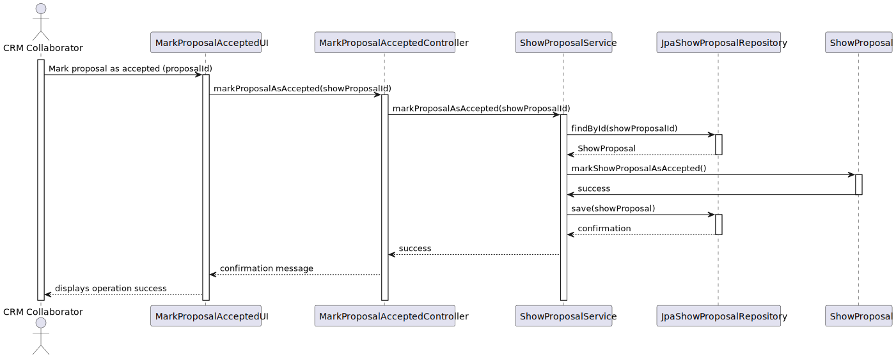
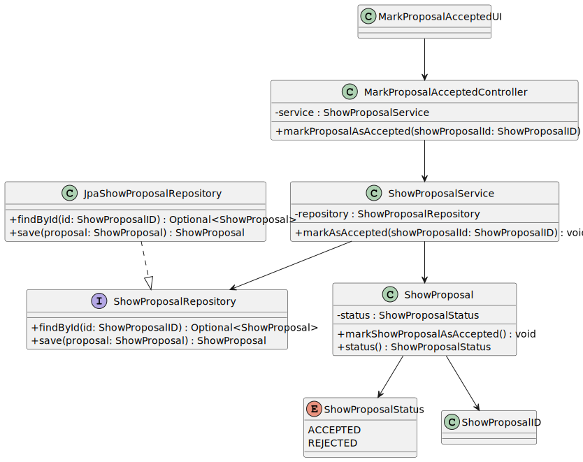

# US317 - Mark Proposal as Accepted

## 3. Design

### 3.1. Rationale

| Step | Question: Which class is responsible for...                         | Answer                       | Justification (with patterns)                                                                                     |
|-------|---------------------------------------------------------------------|------------------------------|------------------------------------------------------------------------------------------------------------------|
| 1     | ... interacting with the actor (CRM Collaborator)?                  | `MarkProposalAcceptedUI`     | **Pure Fabrication**: UI class handles user interactions, input collection, and feedback display.               |
| 2     | ... coordinating the use case and forwarding the request?           | `MarkProposalAcceptedController` | **Controller**: Acts as the coordinator of the use case logic, receiving user input and invoking the service.   |
| 3     | ... implementing the business logic to mark a proposal as accepted? | `ShowProposalService`        | **Service Layer / Application Logic**: Encapsulates business rules and domain logic for proposal state changes.  |
| 4     | ... retrieving and persisting the `ShowProposal` entity?            | `JpaShowProposalRepository`  | **Repository Pattern + IE**: Handles data retrieval and persistence, abstracting database operations.            |
| 5     | ... encapsulating the domain logic for marking a proposal accepted?  | `ShowProposal`                | **Entity (IE)**: Encapsulates domain behavior, ensuring state changes are valid and consistent.                   |
| 6     | ... displaying confirmation messages to the user?                   | `MarkProposalAcceptedUI`     | **IE / UI**: Responsible for feedback to the user confirming the operation's success.                            |

---

### Systematization

According to the rationale above, the following conceptual classes were promoted to software classes:

* `ShowProposal`
* `MarkProposalAcceptedUI`
* `MarkProposalAcceptedController`
* `ShowProposalService`
* `JpaShowProposalRepository`

---

## 3.2. Sequence Diagram (SD)

### Full Diagram

This diagram shows the full sequence of interactions between the classes involved in marking a proposal as accepted.

---

## 3.3. Class Diagram (CD)

