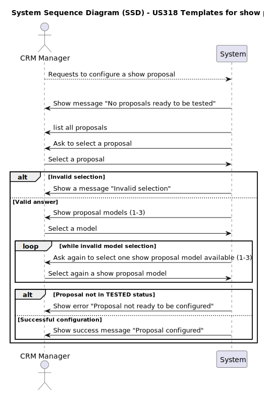
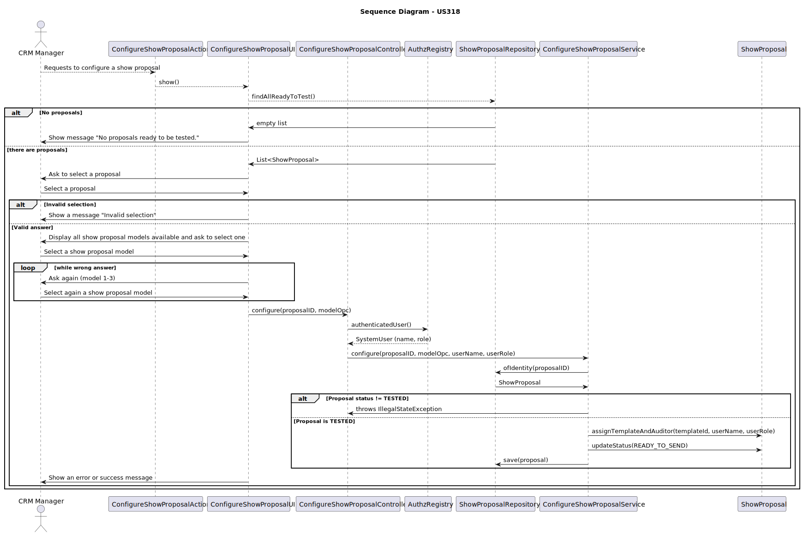

# US318 Templates for show proposals

## 1. Requirements Engineering

### 1.1. User Story Description

As CRM Manager, I want to be able to configure the template that formats the document to be sent to the customer. The plugin used to validate the proposal document must be previously registered in the system.

### 1.2. Customer Specifications and Clarifications

**From the client clarifications:**

    Question:
    
        Bom dia, na us318 diz que o plugin do template a ser adicionado tem de já estar registado no sistema. O plugin é registado por um utilizador ou desenvolvido juntamente com o programa do backoffice?

    Answer:
    
        ... (for now no answer from the customer)

---

    Question:

        Boa tarde caro Professor,
        
        Utilizando o enunciado para dar contexto à nossa questão:
        "As CRM Manager, I want to be able to configure the template that formats the document to be sent to the customer. The plugin used to validate the proposal document must be previously registered in the system."
        
        
        
        É necessário implementar regras para validar o conteúdo de uma template?
        
        No caso de existir um campo desconhecido no template qual pretende que seja o comportamento do sistema?
        
        
        Boa tarde e Muito Obrigado,
        Grupo 88

    Answer:

        Bom dia,
        
        Devo ficar com a ideia que o senhor quer validar uma nova template? Quer dizer que o CRM Manager cria uma nova template de proposta e esta é verificada pelo sistema? Como? Quais são as regras?
        
        Cumprimentos,
        Angelo Martins

---

    Question:

        Boa tarde,
        
        "As CRM Manager, I want to be able to configure the template that formats the document to be sent to the customer. The plugin used to validate the proposal template must be previously registered in the system."
        
        
        
        Relativamente a esta US, o template que está a ser referido é o mesmo usado num show proposal?
        
        E o plugin referido é o criado na US347?
        
        Cumprimentos.

    Answer:

        Bom dia,
        
        Estamos a falar da template de show proposal.
        Não creio que a US347 aborde a criação de plugins. Aborda a geração do documento da proposta e a respetiva validação.
        
        Cumprimentos,
        Angelo Martins

---

    Question:
    
        Boa tarde,
    
        US318 Templates for show proposals
        
        De que forma o CRM Manager pretende configurar um novo template?
        
        Através da submissão de um ficheiro de texto com o novo template ou preencher diretamente em console?
        
        Obrigado
    
    Answer:

        Bom dia,
        
        A template de uma Show Proposal é um ficheiro de texto.
        
        Cumprimentos,
        Angelo Martins

### 1.3. Acceptance Criteria

- The plugin used to validate the proposal document template must be previously registered in the system.

### 1.4. System Sequence Diagram (SSD)

### 1.5 Sequence Diagram (SD)

