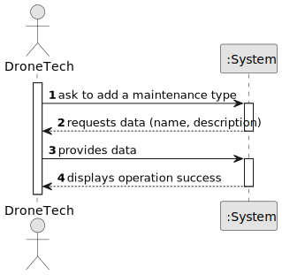

# US321 - Add maintenance type

## 1. Requirements Engineering

### 1.1. User Story Description

As a Drone Tech, I want to add a maintenance type.

The maintenance types apply to all drone models.

### 1.2. Customer Specifications and Clarifications

**From the specifications document:**

> The maintenance types apply to all drone models

**From the client clarifications:**

n/a.

### 1.3. Business Rules

- The maintenance types registered in the system must apply to all drones.
- The name of the type of maintenance must not include numbers.
- The name of the type of maintenance can include special characters like accent marks.
- Only auhtorized users can register the types of maintenances available in the system.

### 1.4 Acceptance Criteria

- A Maintenance Type is succcesfully added if it's name is unique.
- The Maintenance's types must be available for all drone models.

### 1.5. Found out Dependencies

* There is a dependency on "US210 - Authentication and authorization" as the user must be authenticated as admin or drone
tech in order to register a maintenance type in the system.

### 1.5 Input and Output Data

**Input Data:**

* Typed data:
    * Maintenance Type name
    * Maintenance Type description

**Output Data:**

* (In)Success of the operation

### 1.6. System Sequence Diagram (SSD)

**_Other alternatives might exist._**

### 1.7 Other Relevant Remarks

n/a.

### 1.8 Applied patterns

- *Factory Pattern* - Implemented in the RepositoryFactory class to create instances of MaintenanceTypeRepository.
  This pattern abstracts the creation of repository instances, allowing for flexibility in repository management and promoting loose coupling between the
  service layer and repository implementations.

- *Service Pattern* - Used to encapsulate the business logic related to the creation of show proposals.

- *Controller Pattern* - Processes user requests and coordinates services. It separates the UI from business logic.

- *Repository Pattern* - Provides a consistent interface for accessing data and encapsulates filtering.

- *Single Responsibility* - Each class should have only one job.

