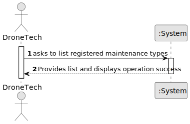

# US322 - List maintenance types

## 1. Requirements Engineering

### 1.1. User Story Description

As a Drone Tech, I want to list all maintenance types in the system.

### 1.2. Customer Specifications and Clarifications

**From the specifications document:**

> The maintenance types apply to all drone models

**From the client clarifications:**

n/a.

### 1.3. Business Rules

- The list must display all registered maintenance types, whether they have records or not.
- The list must display the name and the description registered.

### 1.4 Acceptance Criteria

- All maintenance types registered must be displayed.

### 1.5. Found out Dependencies

* There is a dependency on "US210 - Authentication and authorization" as the user must be authenticated as admin or drone
tech in order to register a maintenance type in the system.
* There is a dependenyc on "US321 - Add a maintenance type", as there needs to be maintenance types registered in the system
in order for it to display the maintenance types.

### 1.5 Input and Output Data

**Input Data:**

  * n/a.

**Output Data:**

* List of a maintenance types, including name and description
* (In)Success of the operation

### 1.6. System Sequence Diagram (SSD)

**_Other alternatives might exist._**

### 1.7 Other Relevant Remarks

n/a.

### 1.8 Applied patterns

- *Factory Pattern* - Implemented in the RepositoryFactory class to create instances of MaintenanceTypeRepository.
  This pattern abstracts the creation of repository instances, allowing for flexibility in repository management and promoting loose coupling between the
  service layer and repository implementations.

- *Service Pattern* - Used to encapsulate the business logic related to the creation of show proposals.

- *Controller Pattern* - Processes user requests and coordinates services. It separates the UI from business logic.

- *Repository Pattern* - Provides a consistent interface for accessing data and encapsulates filtering.

- *Single Responsibility* - Each class should have only one job.

