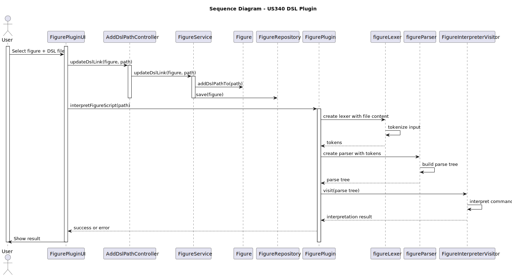

# US340 DSL Plugin

## 1. Requirements Engineering

### 1.1. User Story Description
  As a Drone Tech, I want to deploy and configure a plugin to be used by the system to analyse the figure
  high-level description.

### 1.2. Customer Specifications and Clarifications 

**From the client clarifications:**
      
Pergunta:
      
      Boa noite, o sistema apenas suporta um plugin para a DSL?

Resposta:

      Boa tarde,
      Precisa de um plugin para cada versão da DSL.
      Cumprimentos,
      Angelo Martins

### 1.3. Acceptance Criteria

- The system supports selecting one of multiple available DSL plugin versions.
- The user can associate a DSL script file with a public figure.
- The system parses the DSL file and interprets it correctly.
- The interpreted output is shown in the console.

### 1.4. System Sequence Diagram (SSD)

### 1.5 Sequence Diagram (SD)

