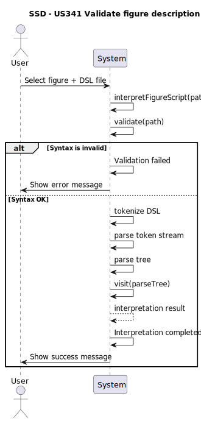
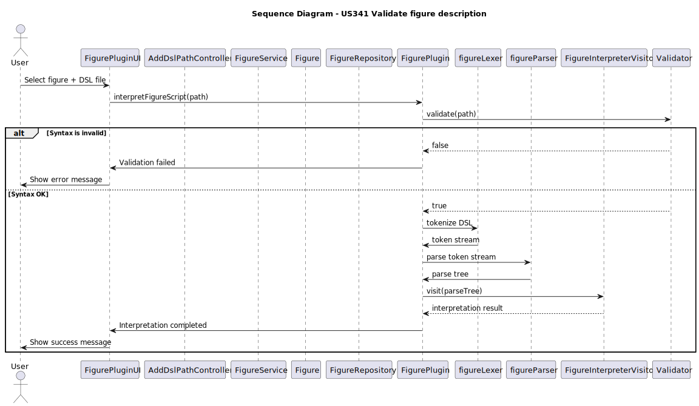

# US341 - Validate figure description

## 1. Requirements Engineering

### 1.1. User Story Description

As a Show Designer, I want to validate the syntax of the figure description (DSL), so that I can register the figure in the system.

### 1.2. Customer Specifications and Clarifications

No questions.

### 1.3. Acceptance Criteria

- The system supports selecting one of multiple available Drone plugin versions.

### 1.4. System Sequence Diagram (SSD)

### 1.5 Sequence Diagram (SD)

