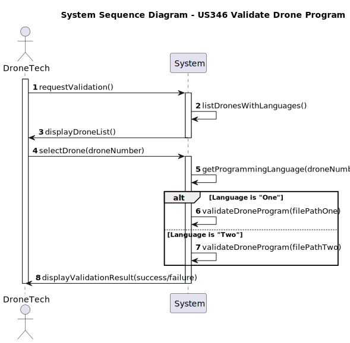

# US345 - Validation of a drone program

## 1. Requirements Engineering

### 1.1. User Story Description

As a Drone Tech, I want to validate the syntax of the code for a specific drone in a given show/figure, so that I can 
later test the figure/show.

### 1.2. Customer Specifications and Clarifications

**From the client clarifications:**

    Question:
    
          Boa tarde cliente,
    
        "As a Drone Tech, I want to deploy and configure a plugin to be used by the system to analyse/validate a drone program."
        
        Caso, na validação do drone program, esta der inválida, é necessário guardar quais os erros presentes nele?
        
        Cumprimentos,
        
        Grupo 041

    Answer:
    
        Bom dia,
        
        Não. Não quer isso dizer que não seja vantajoso mostrá-los ao utilizador. Tal como faz o seu compilador de Java, por exemplo.
        
        Cumprimentos,
        Angelo Martins

---

    Question:

        Boa tarde,
        
        "As a Drone Tech, I want to deploy and configure a plugin to be used by the system to analyse/validate a drone program. There must be a plugin for each different drone language."
        
        A dúvida que espero esclarecer é se, uma vez inserido o plugin para uma drone language, é possível removê-lo ou ele ficará para sempre no sistema?
        
        Cumprimentos,
        
        Grupo 041

    Answer:

        Boa tarde,
        
        Lamento, mas não estou a ver em que aspeto o que pergunta tem a ver com os requisitos dados.
        
        Cumprimentos,
        Angelo Martins

### 1.3. Acceptance Criteria

- The system supports selecting one of multiple available Drone plugin versions.

### 1.4. System Sequence Diagram (SSD)

### 1.5 Sequence Diagram (SD)

### 1.6 Class Diagram 

