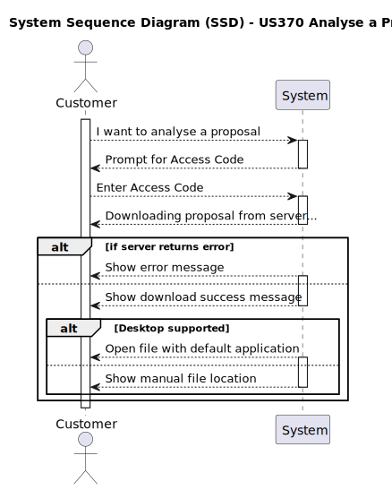
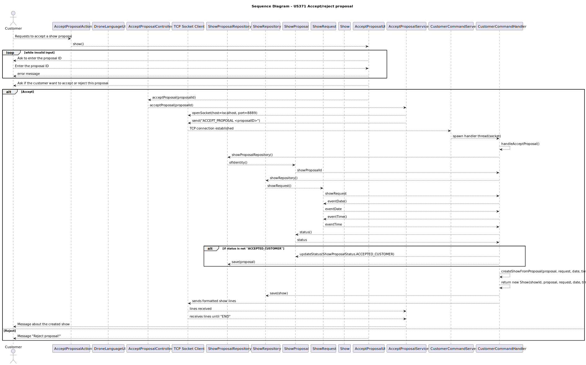

# US370  Analyse a Proposal

## 1. Requirements Engineering

### 1.1. User Story Description

As a Customer Representative, I want to have access to a show proposal of mine in the App. I received a link/code to download the file.

### 1.2. Customer Specifications and Clarifications

**From the client clarifications:**
Yet to be defined.

### 1.3. Acceptance Criteria

- The system supports selecting one of multiple available Drone plugin versions.
- The system provides access to download or view the proposal within the app.
- The user must be authenticated before accessing the proposal.

### 1.4. System Sequence Diagram (SSD)

### 1.5 Sequence Diagram (SD)

