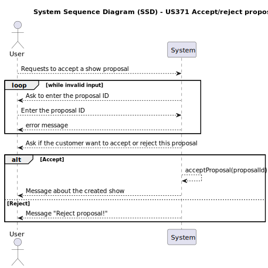
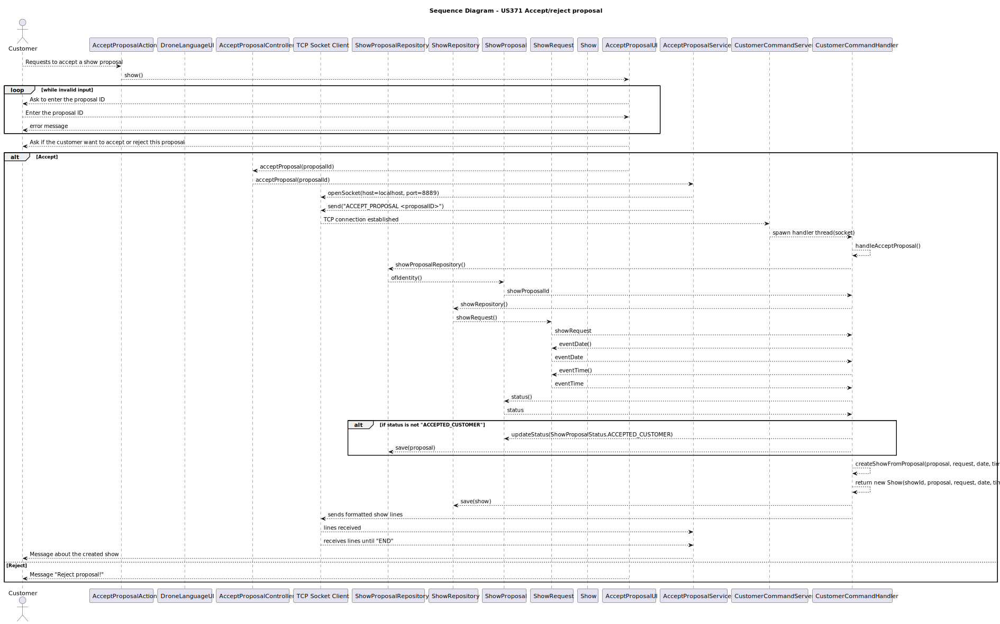

# US371  Accept/reject proposal

## 1. Requirements Engineering

### 1.1. User Story Description

As a Customer, I want to accept/reject a proposal using the Customer App. I may provide feedback.

### 1.2. Customer Specifications and Clarifications

**From the client clarifications:**

    Question:
        
        Boa tarde,
        
        Em relação à User Story US371 – Accept/Reject Proposal, gostaríamos de confirmar o seguinte ponto:
        
        Quando o cliente rejeita uma proposta e fornece feedback, gostaríamos de entender o que deve acontecer com essa informação:
        
        O feedback fornecido deve ser enviado para alguém em específico?
        
        O feedback deve ficar associado à proposta no sistema como parte do seu change log?

        Cumprimentos.

    Answer:

        Bom dia,
        
        O feedback fica associado à proposta.
        
        Cumprimentos,
        Angelo Martins

### 1.3. Acceptance Criteria

- The system supports selecting one of multiple available Drone plugin versions.

### 1.4. System Sequence Diagram (SSD)

### 1.5 Sequence Diagram (SD)

