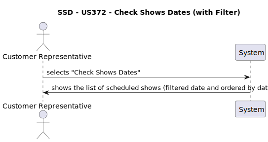
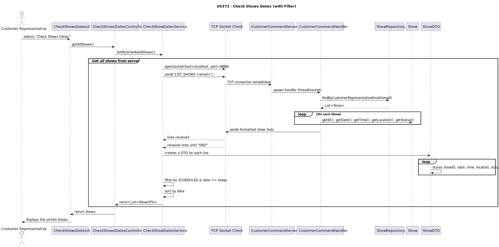
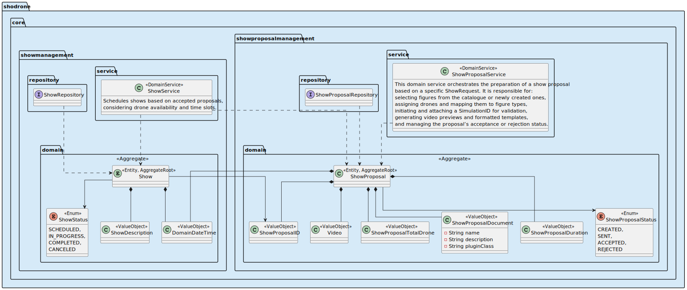

# US372 – Check Shows Dates

---

## Business Rules

- A aplicação Customer App deve permitir ao representante do cliente consultar a lista dos espectáculos agendados para os quais é responsável.
- Os espetáculos apresentados devem estar organizados por data.
- A aplicação apenas mostra espetáculos que estejam realmente agendados no sistema.
- O acesso à informação é restrito ao representante autenticado.
- A aplicação deve comunicar com o Customer App Server via socket TCP, enviando o comando LIST_SHOWS <email>.

---

## Acceptance Criteria

**Perguntas ao Cliente:**

>Que espetáculos devem aparecer na lista?
>
>Resposta: Apenas os espetáculos agendados associados ao representante autenticado.

>Como deve ser feito o acesso à lista?
>
>Resposta: Através da opção “Check Shows Dates” da Customer App, que comunica com o servidor por socket TCP.

>A ordem de apresentação é importante?
>
>Resposta: Sim, deve ser ordenado por data do espetáculo.

Critérios de aceitação:

    - A Customer App envia correctamente o comando com o email do utilizador autenticado.
    - O servidor devolve uma lista formatada dos espectáculos.
    - A lista é apresentada ao utilizador de forma legível.
    - A lista inclui: ID, data, hora, local e estado.
    - A lista está ordenada por data ascendente.

---

## SSD – System Sequence Diagram

---

## Design

A funcionalidade segue o padrão MVC com separação de responsabilidades:

| Componente     | Classe(s)                   | Responsabilidade                                               |
|----------------|-----------------------------|----------------------------------------------------------------|
| **Model**      | `ShowDTO`, `Show`           | Representação dos dados do espetáculo                          |
| **View**       | `CheckShowsDatesUI`         | Apresenta ao utilizador os espetáculos agendados               |
| **Controller** | `CheckShowsDatesController` | Encaminha o pedido para o serviço                              |
| **Service**    | `CheckShowDatesService`     | Comunica via socket TCP com o servidor e trata resposta        |
| **Server**     | `CustomerCommandHandler`    | Recebe comando LIST_SHOWS, consulta ShowRepository e responde  |

---

## SD – Service Description

---

## SOLID Principles

- **S – Single Responsibility:**  
    Cada classe tem uma responsabilidade clara: apresentação, lógica de negócio ou comunicação.

- **O – Open/Closed:**
  O serviço de consulta está aberto à adição de novos critérios de ordenação sem alterar o código base.

- **L – Liskov Substitution:**
    Os DTOs e interfaces respeitam substituição por especializações que mantenham o contrato.

- **I – Interface Segregation:**  
    Apenas os métodos necessários estão expostos ao cliente (listMyScheduledShows()).

- **D – Dependency Inversion:**  
    O serviço depende apenas da abstração do socket, desacoplado da camada de dados.

---

## Domain-Driven Design (DDD)

- Show é a entidade do domínio que representa o espetáculo.
- ShowDTO é um DTO usado para transportar dados até à camada de apresentação.
- CheckShowDatesService faz parte da Application Layer e comunica com a infrastructure TCP.
- CustomerCommandHandler pertence à Infrastructure Layer (CustomerAppServer), sendo o ponto de entrada para pedidos externos.

---

## Tests

A entidade `Show` foi completamente testada com testes unitários, garantindo a robustez dos seus comportamentos no domínio. Os testes cobrem:

### Casos testados:

| Categoria                     | Verificação                                                                 |
|------------------------------|------------------------------------------------------------------------------|
| Criação válida               | O espectáculo é criado com sucesso com todos os parâmetros válidos.         |
| Validações obrigatórias      | Lançamento de exceções quando `ShowID`, `ShowProposal`, `ShowRequest`, `Date` ou `Time` são nulos. |
| Acesso a atributos           | Métodos `customer()` e `representative()` retornam os dados correctos.      |
| Alterações de estado         | Métodos `markAsCompleted()` e `cancel()` alteram correctamente o estado do espectáculo. |
| Identidade e igualdade       | `identity()` devolve o `ShowID`; `sameAs()` verifica igualdade lógica entre instâncias. |
| Representação textual        | `toString()` devolve string com ID, data e hora formatados correctamente.   |

### Ferramenta de teste:
- `JUnit 5` (`org.junit.jupiter`)
- Uso de *stubs* controlados para `Customer`, `CustomerRepresentative`, `ShowRequest`, `ShowProposal`, `Date` e `Time`.

### Objetivo dos testes:
Garantir que a classe `Show` respeita os invariantes do domínio e se comporta corretamente perante situações válidas e inválidas,
sendo uma base sólida para listar espetáculos agendados associados ao representante autenticado.
