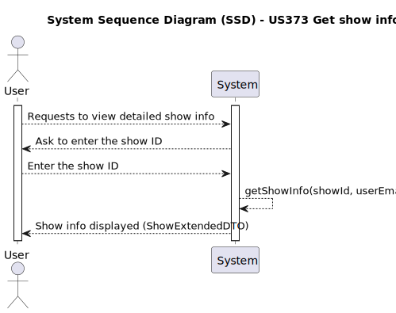

# US373 Get show info

## 1. Requirements Engineering

### 1.1. User Story Description

As a Customer, I want to get the details of a show (scheduled or in the past), including the drone models, figures, duration, etc.

### 1.2. Customer Specifications and Clarifications

**From the client clarifications:**

    Question:
        
        Boa tarde,

        Gostaria de pedir um esclarecimento relativamente à US373 – Get show info, onde se refere que o cliente pode consultar os detalhes de um espetáculo (agendado ou já realizado), incluindo os modelos de drones, figuras, duração, etc.
        
        Ao analisar o enunciado completo, não encontrei nenhum caso de uso que peça explicitamente a funcionalidade de agendar um show. A única referência ao agendamento está na página 10, linhas 39–40, onde é referido: “Upon acceptance of the show proposal by the customer, the show is scheduled by the CRM team. This probably involves some negotiation with the customer. The date and time are stored in the system.”
        
        Com base nesta indicação, podemos assumir que o agendamento do espetáculo ocorre imediatamente após a aceitação da proposta? Ou pretende-se que exista uma funcionalidade separada e explícita para o agendamento do Show, com possibilidade de alteração da data e hora por parte do CRM Collaborator?
        
        Atenciosamente,

    Answer:

        Boa tarde,

        Leu mal o documento dos requisitos. Figura 1, segundo caso de uso a contar de cima.
        Pode-se concluir que o agendamento ocorre após a aceitação pelo cliente. A alteração do agendamento não é referida em lado algum.
        
        Cumprimentos,
        Angelo Martins

### 1.3. Acceptance Criteria

- The system must prompt the user to enter the ID of the show they want to view. 
- The system must validate if the show belongs to the currently authenticated user.
-  Upon valid input, the system must display full details of the show.
- If the show is not found or the user is not authorized to access it, an error message must be shown.

### 1.4. System Sequence Diagram (SSD)

### 1.5 Sequence Diagram (SD)

